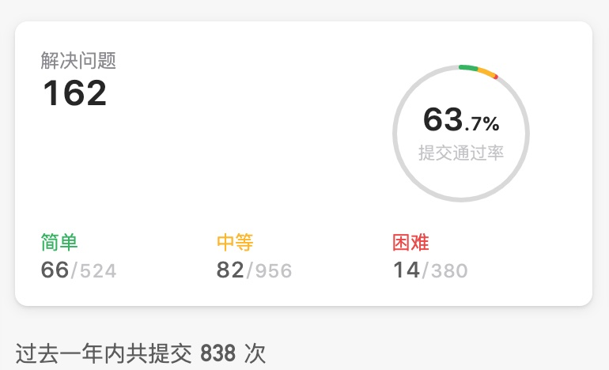

# Leetcode Top Javascript

👨‍💻‍👨‍💻‍ Leetcode 上一些热门题目的 JavaScript 题解和代码

<a href="https://leetcode-cn.com/u/yoweixi/" target="_blank"></a>

## 关于数据结构与算法的想法

记得自己是15年开始自学 iOS 开发，在学校把黑马程序员的iOS盗版视频看了 80% 左右，后面又做了一年左右 iOS 开发，等到 16 年因工作需要转 Web 前端开发。

现在回想起来，那接近一年半的时间，只记住了一些 API 的调用，如果用来学习计算机基础相关的课程，那不管做前端或其他软件工程的工作，这辈子都有机会用得到。

举个前端中使用了数据结构与算法的例子。前端的 JS 模块化，从 RequireJS、CommonJS、ES6 到 Webpack5的模块联邦的实现，只要涉及到 JS 模块之间的相互引用，就会遇到相同的子问题，需要进行递归地处理，更深入的理解，那就涉及到深度优先遍历，而通过 JS 模块之间的依赖关系，推导出全局的编译顺序，今天学习才发现，这个是属于拓扑排序的问题。

虽然自己平时能挤出来的时间也不多，只能断断续续地学和做题，但亡羊补牢，为时不晚！ 

小伙伴们一起加油💪吧！


2020.07.15

> License: 自由转载-非商用-非衍生-保持署名

## 题目
### 1.两数之和<a href="./src/1.两数之和.js" style="float:right;opacity:0.5;" target="_blank">📝</a>

<details>
<summary>展开代码、题解</summary>

```js
/*
 * @lc app=leetcode.cn id=1 lang=javascript
 *
 * [1] 两数之和
 *
 * https://leetcode-cn.com/problems/two-sum/description/
 *
 * algorithms
 * Easy (48.03%)
 * Likes:    7986
 * Dislikes: 0
 * Total Accepted:    956.1K
 * Total Submissions: 2M
 * Testcase Example:  '[2,7,11,15]\n9'
 *
 * 给定一个整数数组 nums 和一个目标值 target，请你在该数组中找出和为目标值的那 两个 整数，并返回他们的数组下标。
 * 
 * 你可以假设每种输入只会对应一个答案。但是，你不能重复利用这个数组中同样的元素。
 * 
 * 示例:
 * 
 * 给定 nums = [2, 7, 11, 15], target = 9
 * 
 * 因为 nums[0] + nums[1] = 2 + 7 = 9
 * 所以返回 [0, 1]
 * 
 * 
 */
/*
  题解：Set && Map

  一、暴力. [x, y] => x+y=9 O(N^2)
  
  二、Set x + y = 9 => y = 9 - x （记得把用过的 x remove）

    复杂度分析：

    时间复杂度：O(n)， 我们只遍历了包含有 n 个元素的列表一次。在表中进行的每次查找只花费 O(1)的时间。(Map 由于浏览器不同，底层实现也不同，不一定是 O(1))

    空间复杂度：O(n)， 所需的额外空间取决于哈希表中存储的元素数量，该表最多需要存储 n 个元素。


 */
// @lc code=start
/**
 * @param {number[]} nums
 * @param {number} target
 * @return {number[]}
 */
var twoSum = function(nums, target) {
    const map = new Map(); // <value, index>
    for (let i = 0; i < nums.length; i++) {
      if (map.has(nums[i])) {
        return [map.get(nums[i]), i];
      } else {
        map.set(target - nums[i], i);
      }
    }
};
// @lc code=end


```
</details>

### 2.两数相加<a href="./src/2.两数相加.js" style="float:right;opacity:0.5;" target="_blank">📝</a>

<details>
<summary>展开代码、题解</summary>

```js
/*
 * @lc app=leetcode.cn id=2 lang=javascript
 *
 * [2] 两数相加
 *
 * https://leetcode-cn.com/problems/add-two-numbers/description/
 *
 * algorithms
 * Medium (38.86%)
 * Likes:    5228
 * Dislikes: 0
 * Total Accepted:    618.2K
 * Total Submissions: 1.6M
 * Testcase Example:  '[2,4,3]\n[5,6,4]'
 *
 * 给出两个 非空 的链表用来表示两个非负的整数。其中，它们各自的位数是按照 逆序 的方式存储的，并且它们的每个节点只能存储 一位 数字。
 * 
 * 如果，我们将这两个数相加起来，则会返回一个新的链表来表示它们的和。
 * 
 * 您可以假设除了数字 0 之外，这两个数都不会以 0 开头。
 * 
 * 示例：
 * 
 * 输入：(2 -> 4 -> 3) + (5 -> 6 -> 4)
 * 输出：7 -> 0 -> 8
 * 原因：342 + 465 = 807
 * 
 * 
 */

// @lc code=start
/**
 * Definition for singly-linked list.
 * function ListNode(val) {
 *     this.val = val;
 *     this.next = null;
 * }
 */
/**
 * @param {ListNode} l1
 * @param {ListNode} l2
 * @return {ListNode}
 */
var addTwoNumbers = function (l1, l2) {
    const sum = l1.val + l2.val;
    let res = cur = new ListNode(sum % 10);
    let append = Math.floor(sum / 10);

    while ((l1 && l1.next) || (l2 && l2.next)) {
        l1 = l1 && l1.next || { val: 0 };
        l2 = l2 && l2.next || { val: 0 };
        const sum = l1.val + l2.val + append;
        cur.next = new ListNode(sum % 10);
        cur = cur.next;
        append = Math.floor(sum / 10);
    }

    if (append !== 0) {
        cur.next = new ListNode(append % 10);
        cur = cur.next;
    }

    return res;
};
// @lc code=end


```
</details>

### 3.无重复字符的最长子串<a href="./src/3.无重复字符的最长子串.js" style="float:right;opacity:0.5;" target="_blank">📝</a>

<details>
<summary>展开代码、题解</summary>

```js
/*
 * @lc app=leetcode.cn id=3 lang=javascript
 *
 * [3] 无重复字符的最长子串
 *
 * https://leetcode-cn.com/problems/longest-substring-without-repeating-characters/description/
 *
 * algorithms
 * Medium (35.80%)
 * Likes:    4553
 * Dislikes: 0
 * Total Accepted:    716.7K
 * Total Submissions: 2M
 * Testcase Example:  '"abcabcbb"'
 *
 * 给定一个字符串，请你找出其中不含有重复字符的 最长子串 的长度。
 * 
 * 示例 1:
 * 
 * 输入: "abcabcbb"
 * 输出: 3 
 * 解释: 因为无重复字符的最长子串是 "abc"，所以其长度为 3。
 * 
 * 
 * 示例 2:
 * 
 * 输入: "bbbbb"
 * 输出: 1
 * 解释: 因为无重复字符的最长子串是 "b"，所以其长度为 1。
 * 
 * 
 * 示例 3:
 * 
 * 输入: "pwwkew"
 * 输出: 3
 * 解释: 因为无重复字符的最长子串是 "wke"，所以其长度为 3。
 * 请注意，你的答案必须是 子串 的长度，"pwke" 是一个子序列，不是子串。
 * 
 * 
 */
/**
    题解：
    解一：暴力法
            暴力解法 O(n^3)  i j indexOf
            
    解二：滑动窗口
        1. 用 Set.prototype.has 代替 O(n) 的 String.prototype.indexOf

            Set 的实现： HashMap 是 O(1), BST 是 O(log(n))， Array 是 O(n)

        2. 双层 for 可以用 O(2n) 化解为 O(n)，在最糟糕的情况下，每个字符将被 i 和 j 访问两次。
            1. 举例1： abcdce 当走到 abcd 的下一个 c, a 后面的 bcd 已经无需再走了, 直接从 abcd 的 d 开始走。 
            2. 不需要走的原因： abcdc... 中第一个 c， 相当于划分了两个时代
                1. 包含第一个 c 的， abcd bcd cd d, 肯定是 abcd 最大。
                2. 包含第一个 c 的，即 从 d 开始

            3. 举例2：在最糟糕的情况下，每个字符将被访问接近两次， 如abab, 6次
    参考资料：
        [滑动窗口](https://leetcode-cn.com/problems/longest-substring-without-repeating-characters/solution/wu-zhong-fu-zi-fu-de-zui-chang-zi-chuan-by-leetcod/)
 */
// @lc code=start
/* 
    解一：暴力法
        暴力解法 O(n^3)  i j indexOf
 */ 
var lengthOfLongestSubstring = function(s) {
    let max = 0;
    const arr = s.split('');
    for (let i = 0; i < arr.length; i++) {
        const target = [];
        for (let j = i; j < arr.length; j++) {
            const char = arr[j];
            if (target.indexOf(char) !== -1) {
                break;
            }
            target.push(char);
        }
        const len = target.length;
        max = max > len ? max : len;
    }
    return max;  
};
/**
    解二：滑动窗口  T(n) = O(n)
    1. 用 Set.prototype.has 代替 O(n) 的 String.prototype.indexOf

        Set 的实现： HashMap 是 O(1), BST 是 O(log(n))， Array 是 O(n)

    2. 双层 for 可以用 O(2n) 化解为 O(n)，在最糟糕的情况下，每个字符将被 i 和 j 访问两次。
        1. 举例1： abcdce 当走到 abcd 的下一个 c, a 后面的 bcd 已经无需再走了, 直接从 abcd 的 d 开始走。 
        2. 不需要走的原因： abcdc... 中第一个 c， 相当于划分了两个时代
            1. 包含第一个 c 的， abcd bcd cd d, 肯定是 abcd 最大。
            2. 包含第一个 c 的，即 从 d 开始

        3. 举例2：在最糟糕的情况下，每个字符将被访问接近两次， 如abab, 6次
 */
/**  
 * @param {string} s
 * @return {number}
 */
var lengthOfLongestSubstring = function(s) {
    let max = 0;
    let map = new Map();    // <出现过的字符, 对应 i 出现的位置>
    for (let i = 0, j = 0; j < s.length; j++) { // j 快指针，i 慢指针
        const char = s[j];
        i = Math.max(map.get(char) || 0, i);
        map.set(char, j + 1);
        max = Math.max(max, j - i + 1);        
    }
    return max;
};
// @lc code=end


```
</details>

### 4.寻找两个正序数组的中位数<a href="./src/4.寻找两个正序数组的中位数.js" style="float:right;opacity:0.5;" target="_blank">📝</a>

<details>
<summary>展开代码、题解</summary>

```js
/*
 * @lc app=leetcode.cn id=4 lang=javascript
 *
 * [4] 寻找两个正序数组的中位数
 *
 * https://leetcode-cn.com/problems/median-of-two-sorted-arrays/description/
 *
 * algorithms
 * Hard (38.57%)
 * Likes:    3069
 * Dislikes: 0
 * Total Accepted:    241.4K
 * Total Submissions: 625.8K
 * Testcase Example:  '[1,3]\n[2]'
 *
 * 给定两个大小为 m 和 n 的正序（从小到大）数组 nums1 和 nums2。
 * 
 * 请你找出这两个正序数组的中位数，并且要求算法的时间复杂度为 O(log(m + n))。
 * 
 * 你可以假设 nums1 和 nums2 不会同时为空。
 * 
 * 
 * 
 * 示例 1:
 * 
 * nums1 = [1, 3]
 * nums2 = [2]
 * 
 * 则中位数是 2.0
 * 
 * 
 * 示例 2:
 * 
 * nums1 = [1, 2]
 * nums2 = [3, 4]
 * 
 * 则中位数是 (2 + 3)/2 = 2.5
 * 
 * 
 */
/**
    
 */
// @lc code=start
/**
 * @param {number[]} nums1
 * @param {number[]} nums2
 * @return {number}
 */
var findMedianSortedArrays = function(nums1, nums2) {
    /**
        解一：暴力法
        原理：
            将两个数组合并，再进行排序，假设是快排，则 T(n) = O(nlogn)
     */
    const nums = [...nums1, ...nums2];
    nums.sort((n1, n2) => (n1 - n2));
    if (nums.length % 2 === 0) {
        const mid = nums.length>>1;
        return (nums[mid] + nums[mid-1])/2; // 中位数要除以2
    } else {
        return nums[(nums.length>>1)]
    }
    /**
        解二：二分查找法
        例子：
      nums1  1   2   3   4   8
            l1              r1
                mid1

      nums2  6       7       9
            l2              r2       
                mid2

            进行二分查找:

                1   2   3   4   8
                l1              r1
                    mid1
            第一轮：
                            l1  r1
                            mid1

                6       7       9
                l2              r2      
                        mid2
            第一轮：
                l2r2
                mid2

            4、6 将两个数组划分为：
            1 2 3 和 7 8 9
     */
};
// @lc code=end


```
</details>

### 5.最长回文子串<a href="./src/5.最长回文子串.js" style="float:right;opacity:0.5;" target="_blank">📝</a>

<details>
<summary>展开代码、题解</summary>

```js
/*
 * @lc app=leetcode.cn id=5 lang=javascript
 *
 * [5] 最长回文子串
 *
 * https://leetcode-cn.com/problems/longest-palindromic-substring/description/
 *
 * algorithms
 * Medium (32.20%)
 * Likes:    2872
 * Dislikes: 0
 * Total Accepted:    411.8K
 * Total Submissions: 1.3M
 * Testcase Example:  '"babad"'
 *
 * 给定一个字符串 s，找到 s 中最长的回文子串。你可以假设 s 的最大长度为 1000。
 * 
 * 示例 1：
 * 
 * 输入: "babad"
 * 输出: "bab"
 * 注意: "aba" 也是一个有效答案。
 * 
 * 
 * 示例 2：
 * 
 * 输入: "cbbd"
 * 输出: "bb"
 * 
 * 
 */

// @lc code=start
/**
 * @param {string} s
 * @return {string}
 */
var longestPalindrome = function(s) {
    let maxSub = '';
    for (let i = 0; i < s.length; i++) {
        const oddSpreadLength = Math.min(
            s.length - 1 - i,
            i
        );
        for (let spread = 0; spread <= oddSpreadLength; spread++) {
            if (s[i + spread] !== s[i - spread]) {
                break;
            }
            if ((1 + spread * 2) > maxSub.length) {
                maxSub = s.slice(i - spread, i + spread + 1);
            }
        }
        const evenSpreadLength = Math.min(
            s.length - i,
            i
        );
        for (let spread = 0; spread <= evenSpreadLength; spread++) {
            if (s[i + 1 + spread] !== s[i - spread]) {
                break;
            }
            if ((2 + spread * 2) > maxSub.length) {
                maxSub = s.slice(i - spread, i + spread + 2);
            }
        }
    }
    return maxSub;
};
// @lc code=end


```
</details>

### 6.z-字形变换<a href="./src/6.z-字形变换.js" style="float:right;opacity:0.5;" target="_blank">📝</a>

<details>
<summary>展开代码、题解</summary>

```js
/*
 * @lc app=leetcode.cn id=6 lang=javascript
 *
 * [6] Z 字形变换
 *
 * https://leetcode-cn.com/problems/zigzag-conversion/description/
 *
 * algorithms
 * Medium (49.00%)
 * Likes:    898
 * Dislikes: 0
 * Total Accepted:    187.3K
 * Total Submissions: 382.4K
 * Testcase Example:  '"PAYPALISHIRING"\n3'
 *
 * 将一个给定字符串根据给定的行数，以从上往下、从左到右进行 Z 字形排列。
 * 
 * 比如输入字符串为 "LEETCODEISHIRING" 行数为 3 时，排列如下：
 * 
 * L   C   I   R
 * E T O E S I I G
 * E   D   H   N
 * 
 * 
 * 之后，你的输出需要从左往右逐行读取，产生出一个新的字符串，比如："LCIRETOESIIGEDHN"。
 * 
 * 请你实现这个将字符串进行指定行数变换的函数：
 * 
 * string convert(string s, int numRows);
 * 
 * 示例 1:
 * 
 * 输入: s = "LEETCODEISHIRING", numRows = 3
 * 输出: "LCIRETOESIIGEDHN"
 * 
 * 
 * 示例 2:
 * 
 * 输入: s = "LEETCODEISHIRING", numRows = 4
 * 输出: "LDREOEIIECIHNTSG"
 * 解释:
 * 
 * L     D     R
 * E   O E   I I
 * E C   I H   N
 * T     S     G
 * 
 */
/**
    参考资料：> [画解算法：6. Z 字形变换](https://leetcode-cn.com/problems/zigzag-conversion/solution/hua-jie-suan-fa-6-z-zi-xing-bian-huan-by-guanpengc/)
 */
// @lc code=start
/**
 * @param {string} s
 * @param {number} numRows
 * @return {string}
 */
/**
 * @param {string} s
 * @param {number} numRows
 * @return {string}
 */
var convert = function(s, numRows) {    
    if (numRows === 1) { return s;}
    const groupNums = numRows + numRows - 2;
    const rows = new Array(numRows).fill('');
    let rowIndex = 0;
    let isDown = true;
    for (let i = 0; i < s.length; i++) {
        rows[rowIndex] += s[i];
        if ((i % groupNums) + 1 === numRows) {
            isDown = false;
        } else if ((i % groupNums) === 0) {
            isDown = true;
        }
        isDown ? rowIndex++ : rowIndex--;
    }
    return rows.reduce((acc, cur) => (acc + cur), '');    
};
// @lc code=end


```
</details>

### 7.整数反转<a href="./src/7.整数反转.js" style="float:right;opacity:0.5;" target="_blank">📝</a>

<details>
<summary>展开代码、题解</summary>

```js
/*
 * @lc app=leetcode.cn id=7 lang=javascript
 *
 * [7] 整数反转
 *
 * https://leetcode-cn.com/problems/reverse-integer/description/
 *
 * algorithms
 * Easy (34.72%)
 * Likes:    2374
 * Dislikes: 0
 * Total Accepted:    523.1K
 * Total Submissions: 1.5M
 * Testcase Example:  '123'
 *
 * 给出一个 32 位的有符号整数，你需要将这个整数中每位上的数字进行反转。
 * 
 * 示例 1:
 * 
 * 输入: 123
 * 输出: 321
 * 
 * 
 * 示例 2:
 * 
 * 输入: -123
 * 输出: -321
 * 
 * 
 * 示例 3:
 * 
 * 输入: 120
 * 输出: 21
 * 
 * 
 * 注意:
 * 
 * 假设我们的环境只能存储得下 32 位的有符号整数，则其数值范围为 [−2^31,  2^31 − 1]。请根据这个假设，如果反转后整数溢出那么就返回
 * 0。
 * 
 */
/**
    知识点：取余与整除
    // 特殊考虑 0、末尾0、-号
     * x = 123
     * radix = 10
     * rev = 0
     * 阶段一
     * pop = x % radix = 3
     * rev = rev * radix + pop = 3
     * x = Math.floor(x / radix) = 12
     * 阶段二
     * pop = x % radix = 2
     * rev = rev * radix + pop = 32
     * x = Math.floor(x / radix) = 1
     * 阶段三
     * pop = x % radix = 1
     * rev = rev * radix + pop = 321
     * x = Math.floor(x / radix) = 0
     * 
     * if (x === 0) {
     * }
     > 这个答案并不对，因为 `if (rev > MAX_VAL || rev < MIN_VAL) {` 已经超出了范围。 
     > 正确的解法请参考 [画解算法：7. 整数反转](https://leetcode-cn.com/problems/reverse-integer/solution/hua-jie-suan-fa-7-zheng-shu-fan-zhuan-by-guanpengc/)
 */
// @lc code=start
/**
 * @param {number} x
 * @return {number}
 */
var reverse = function(x) {
    let rev = 0;
    const radix = 10;
    const MAX_VAL = Math.pow(2, 31) - 1;
    const MIN_VAL = - Math.pow(2, 31);
    while (x !== 0) {
        rev = rev * radix + x % radix;
        x = ~~(x / radix);
    }
    if (rev > MAX_VAL || rev < MIN_VAL) {
        return 0;
    }
    return rev;
};
// @lc code=end
/**
    解二. 数组反转
    var reverse = function (x) {
        let arr = (x + '').split('').reverse();    
        if (arr[arr.length - 1] === '-') {
            arr.unshift(arr.pop());
        }
        const rev = Number(arr.join('')); 
        if (rev > Math.pow(2, 31) - 1 || rev < - Math.pow(2, 31)) {
            return 0;
        }
        return rev;
    };


    #### 3. 栈
    栈实际上是为了实现 Array.prototype.reverse


    #### 4. 相关知识

    > 原码、补码、反码 有时间复习下

    > JS `Math.floor` `Math.ceil` `~~` `parseInt(String/Number) // Number 自动转 String` `ES6 Math.trunc` 参考链接 [stackoverflow - convert a float number to a whole number ](https://stackoverflow.com/questions/596467/how-do-i-convert-a-float-number-to-a-whole-number-in-javascript)
 */


```
</details>

### 9.回文数<a href="./src/9.回文数.js" style="float:right;opacity:0.5;" target="_blank">📝</a>

<details>
<summary>展开代码、题解</summary>

```js
/*
 * @lc app=leetcode.cn id=9 lang=javascript
 *
 * [9] 回文数
 *
 * https://leetcode-cn.com/problems/palindrome-number/description/
 *
 * algorithms
 * Easy (58.36%)
 * Likes:    1160
 * Dislikes: 0
 * Total Accepted:    402K
 * Total Submissions: 688.2K
 * Testcase Example:  '121'
 *
 * 判断一个整数是否是回文数。回文数是指正序（从左向右）和倒序（从右向左）读都是一样的整数。
 * 
 * 示例 1:
 * 
 * 输入: 121
 * 输出: true
 * 
 * 
 * 示例 2:
 * 
 * 输入: -121
 * 输出: false
 * 解释: 从左向右读, 为 -121 。 从右向左读, 为 121- 。因此它不是一个回文数。
 * 
 * 
 * 示例 3:
 * 
 * 输入: 10
 * 输出: false
 * 解释: 从右向左读, 为 01 。因此它不是一个回文数。
 * 
 * 
 * 进阶:
 * 
 * 你能不将整数转为字符串来解决这个问题吗？
 * 
 */

// @lc code=start
/**
 * @param {number} x
 * @return {boolean}
 */
var isPalindrome = function(x) {
    if (x < 0 || (x % 10 == 0 && x !== 0)) return false;
    let reverse = 0;
    while (x > reverse) {
        reverse = reverse * 10 + x % 10;
        x = Math.floor(x / 10);
    }
    return x === reverse 
        || Math.floor(reverse / 10) === x;
};
// console.assert(isPalindrome(1221) === true);
// console.assert(isPalindrome(12321) === true);
// console.assert(isPalindrome(10) === false); // if (x < 0 || (x % 10 == 0 && x !== 0)) return false;
// @lc code=end


```
</details>

### 10.正则表达式匹配<a href="./src/10.正则表达式匹配.js" style="float:right;opacity:0.5;" target="_blank">📝</a>

<details>
<summary>展开代码、题解</summary>

```js
/*
 * @lc app=leetcode.cn id=10 lang=javascript
 *
 * [10] 正则表达式匹配
 *
 * https://leetcode-cn.com/problems/regular-expression-matching/description/
 *
 * algorithms
 * Hard (29.68%)
 * Likes:    1413
 * Dislikes: 0
 * Total Accepted:    102.1K
 * Total Submissions: 341K
 * Testcase Example:  '"aa"\n"a"'
 *
 * 给你一个字符串 s 和一个字符规律 p，请你来实现一个支持 '.' 和 '*' 的正则表达式匹配。
 * 
 * '.' 匹配任意单个字符
 * '*' 匹配零个或多个前面的那一个元素
 * 
 * 
 * 所谓匹配，是要涵盖 整个 字符串 s的，而不是部分字符串。
 * 
 * 说明:
 * 
 * 
 * s 可能为空，且只包含从 a-z 的小写字母。
 * p 可能为空，且只包含从 a-z 的小写字母，以及字符 . 和 *。
 * 
 * 
 * 示例 1:
 * 
 * 输入:
 * s = "aa"
 * p = "a"
 * 输出: false
 * 解释: "a" 无法匹配 "aa" 整个字符串。
 * 
 * 
 * 示例 2:
 * 
 * 输入:
 * s = "aa"
 * p = "a*"
 * 输出: true
 * 解释: 因为 '*' 代表可以匹配零个或多个前面的那一个元素, 在这里前面的元素就是 'a'。因此，字符串 "aa" 可被视为 'a' 重复了一次。
 * 
 * 
 * 示例 3:
 * 
 * 输入:
 * s = "ab"
 * p = ".*"
 * 输出: true
 * 解释: ".*" 表示可匹配零个或多个（'*'）任意字符（'.'）。
 * 
 * 
 * 示例 4:
 * 
 * 输入:
 * s = "aab"
 * p = "c*a*b"
 * 输出: true
 * 解释: 因为 '*' 表示零个或多个，这里 'c' 为 0 个, 'a' 被重复一次。因此可以匹配字符串 "aab"。
 * 
 * 
 * 示例 5:
 * 
 * 输入:
 * s = "mississippi"
 * p = "mis*is*p*."
 * 输出: false
 * 
 */

// @lc code=start
/**
 * @param {string} s
 * @param {string} p
 * @return {boolean}
 */
var isMatch = function(s, p) {
    // 1. 初始化
    s = '#' + s;
    p = '#' + p;
    const DP = new Array(s.length);
    for (let i = 0; i < DP.length; i++) {
        DP[i] = [];
    }
    // 2. 边界处理 （因为递推边界 j - 2，i - 1，要先准备好, undefined的 可以后面 !! 处理）
    DP[0][0] = true;
    for (let j = 2; j < p.length; j++) {
        DP[0][j] = p[j] === '*' ? DP[0][j-2] : false;
    }
    // 3. 递推公式
    for (let i = 1; i < s.length; i++) {
        for (let j = 1; j < p.length; j++) {
            if (p[j] !== '*') {
                DP[i][j] = equal(s[i], p[j]) && DP[i-1][j-1];
            } else {
                DP[i][j] = DP[i][j-2] || DP[i][j-1] || (DP[i-1][j] && equal(s[i], p[j-1]));
            }
        }
    }
    return !!DP[s.length - 1][p.length - 1];
};

const equal = (sChar, pChar) => (
    (sChar === pChar) || (
        pChar === '.' && sChar != null
    )
);

// console.assert(!isMatch('aa', 'a'), 'aa, a');
// console.assert(isMatch('aa', 'a*'), 'aa, a*');
// console.assert(isMatch('ab', '.*'), 'ab, .*');
// console.assert(isMatch('aab', 'c*a*b*'), 'aab, c*a*b*');
// console.assert(isMatch('mississippi', 'mis*is*ip*.'), 'mississippi mis*is*ip*.');
// console.assert(isMatch('', '.*'));

// @lc code=end


```
</details>

### 11.盛最多水的容器<a href="./src/11.盛最多水的容器.js" style="float:right;opacity:0.5;" target="_blank">📝</a>

<details>
<summary>展开代码、题解</summary>

```js
/*
 * @lc app=leetcode.cn id=11 lang=javascript
 *
 * [11] 盛最多水的容器
 *
 * https://leetcode-cn.com/problems/container-with-most-water/description/
 *
 * algorithms
 * Medium (64.38%)
 * Likes:    1984
 * Dislikes: 0
 * Total Accepted:    318.5K
 * Total Submissions: 494.5K
 * Testcase Example:  '[1,8,6,2,5,4,8,3,7]'
 *
 * 给你 n 个非负整数 a1，a2，...，an，每个数代表坐标中的一个点 (i, ai) 。在坐标内画 n 条垂直线，垂直线 i 的两个端点分别为
 * (i, ai) 和 (i, 0) 。找出其中的两条线，使得它们与 x 轴共同构成的容器可以容纳最多的水。
 * 
 * 说明：你不能倾斜容器。
 * 
 * 
 * 
 * 示例 1：
 * 
 * 
 * 
 * 
 * 输入：[1,8,6,2,5,4,8,3,7]
 * 输出：49 
 * 解释：图中垂直线代表输入数组 [1,8,6,2,5,4,8,3,7]。在此情况下，容器能够容纳水（表示为蓝色部分）的最大值为 49。
 * 
 * 示例 2：
 * 
 * 
 * 输入：height = [1,1]
 * 输出：1
 * 
 * 
 * 示例 3：
 * 
 * 
 * 输入：height = [4,3,2,1,4]
 * 输出：16
 * 
 * 
 * 示例 4：
 * 
 * 
 * 输入：height = [1,2,1]
 * 输出：2
 * 
 * 
 * 
 * 
 * 提示：
 * 
 * 
 * n = height.length
 * 2 
 * 0 
 * 
 * 
 */
/**
     解一：暴力法
       T(n) = O()
       S(n) = O()

    解二：双指针
    这道题进阶版：接雨水            
*/
// @lc code=start
/**
 * @param {number[]} height
 * @return {number}
 */
var maxArea = function(height) {
    let maxArea = 0;
    for (let i = 0, j = height.length - 1; i < j; ) {
        if (height[i] > height[j]) {
            const area = height[j] * (j - i);
            if (area > maxArea) {
                maxArea = area;
            }
            j--;
        } else {
            const area = height[i] * (j - i);
            if (area > maxArea) {
                maxArea = area;
            }
            i++;
        }
    }
    return maxArea;
};
// @lc code=end


```
</details>

### 13.罗马数字转整数<a href="./src/13.罗马数字转整数.js" style="float:right;opacity:0.5;" target="_blank">📝</a>

<details>
<summary>展开代码、题解</summary>

```js
/*
 * @lc app=leetcode.cn id=13 lang=javascript
 *
 * [13] 罗马数字转整数
 *
 * https://leetcode-cn.com/problems/roman-to-integer/description/
 *
 * algorithms
 * Easy (62.12%)
 * Likes:    1132
 * Dislikes: 0
 * Total Accepted:    287.4K
 * Total Submissions: 462.3K
 * Testcase Example:  '"III"'
 *
 * 罗马数字包含以下七种字符: I， V， X， L，C，D 和 M。
 * 
 * 字符          数值
 * I             1
 * V             5
 * X             10
 * L             50
 * C             100
 * D             500
 * M             1000
 * 
 * 例如， 罗马数字 2 写做 II ，即为两个并列的 1。12 写做 XII ，即为 X + II 。 27 写做  XXVII, 即为 XX + V +
 * II 。
 * 
 * 通常情况下，罗马数字中小的数字在大的数字的右边。但也存在特例，例如 4 不写做 IIII，而是 IV。数字 1 在数字 5 的左边，所表示的数等于大数
 * 5 减小数 1 得到的数值 4 。同样地，数字 9 表示为 IX。这个特殊的规则只适用于以下六种情况：
 * 
 * 
 * I 可以放在 V (5) 和 X (10) 的左边，来表示 4 和 9。
 * X 可以放在 L (50) 和 C (100) 的左边，来表示 40 和 90。 
 * C 可以放在 D (500) 和 M (1000) 的左边，来表示 400 和 900。
 * 
 * 
 * 给定一个罗马数字，将其转换成整数。输入确保在 1 到 3999 的范围内。
 * 
 * 
 * 
 * 示例 1:
 * 
 * 输入: "III"
 * 输出: 3
 * 
 * 示例 2:
 * 
 * 输入: "IV"
 * 输出: 4
 * 
 * 示例 3:
 * 
 * 输入: "IX"
 * 输出: 9
 * 
 * 示例 4:
 * 
 * 输入: "LVIII"
 * 输出: 58
 * 解释: L = 50, V= 5, III = 3.
 * 
 * 
 * 示例 5:
 * 
 * 输入: "MCMXCIV"
 * 输出: 1994
 * 解释: M = 1000, CM = 900, XC = 90, IV = 4.
 * 
 * 
 * 
 * 提示：
 * 
 * 
 * 题目所给测试用例皆符合罗马数字书写规则，不会出现跨位等情况。
 * IC 和 IM 这样的例子并不符合题目要求，49 应该写作 XLIX，999 应该写作 CMXCIX 。
 * 关于罗马数字的详尽书写规则，可以参考 罗马数字 - Mathematics 。
 * 
 * 
 */

// @lc code=start
/**
 * @param {string} s
 * @return {number}
 */
var romanToInt = function(s) {
    const ruleMap = {
        'I': 1,
        'V': 5,
        'X': 10,
        'L': 50,
        'C': 100,
        'D': 500,
        'M': 1000,
        'IV': 4,
        'IX': 9,
        'XL': 40,
        'XC': 90,
        'CD': 400,
        'CM': 900,
    }
    let result = 0;
    const chars = s.split('');
    for (let i = 0; i < chars.length; i++) {
        const specialMatch = ruleMap[chars[i] + chars[i + 1]];  // ruleMap[xx + undefined]
        if (specialMatch) {
            result += specialMatch;
            i++;
        } else {
            const match = ruleMap[chars[i]];
            result += match;
        }
    }
    return result;
};
// @lc code=end


```
</details>

### 14.最长公共前缀<a href="./src/14.最长公共前缀.js" style="float:right;opacity:0.5;" target="_blank">📝</a>

<details>
<summary>展开代码、题解</summary>

```js
/*
 * @lc app=leetcode.cn id=14 lang=javascript
 *
 * [14] 最长公共前缀
 *
 * https://leetcode-cn.com/problems/longest-common-prefix/description/
 *
 * algorithms
 * Easy (38.88%)
 * Likes:    1363
 * Dislikes: 0
 * Total Accepted:    404.1K
 * Total Submissions: 1M
 * Testcase Example:  '["flower","flow","flight"]'
 *
 * 编写一个函数来查找字符串数组中的最长公共前缀。
 * 
 * 如果不存在公共前缀，返回空字符串 ""。
 * 
 * 示例 1:
 * 
 * 输入: ["flower","flow","flight"]
 * 输出: "fl"
 * 
 * 
 * 示例 2:
 * 
 * 输入: ["dog","racecar","car"]
 * 输出: ""
 * 解释: 输入不存在公共前缀。
 * 
 * 
 * 说明:
 * 
 * 所有输入只包含小写字母 a-z 。
 * 
 */
/**
    题解：[最长公共前缀](https://leetcode-cn.com/problems/longest-common-prefix/)
    #### 解一：LCP(S1...Sn) = LCP(LCP(LCP(S1, S2), S3),...Sn) 代码如下

    #### 解二：Trie
        > 相关资料： [LeetCode 最长公共前缀-更进一步](https://leetcode-cn.com/problems/longest-common-prefix/solution/zui-chang-gong-gong-qian-zhui-by-leetcode/)
        > 相关题目： [实现 Trie](https://leetcode-cn.com/problems/implement-trie-prefix-tree/solution/)
 */
// @lc code=start
/**
 * @param {string[]} strs
 * @return {string}
 */
var longestCommonPrefix = function(strs) {
    if(strs.length === 0) 
        return "";
    let ans = strs[0];
    for(let i = 1; i < strs.length; i++) {
        let j = 0;
        while (j < ans.length || j < strs[i].length) {
            if(ans[j] !== strs[i][j]) {
                break;
            }                
            j++;
        }
        ans = ans.slice(0, j);
        if(ans === "")
            return ans;
    }
    return ans;
};
// @lc code=end


```
</details>

### 15.三数之和<a href="./src/15.三数之和.js" style="float:right;opacity:0.5;" target="_blank">📝</a>

<details>
<summary>展开代码、题解</summary>

```js
/*
 * @lc app=leetcode.cn id=15 lang=javascript
 *
 * [15] 三数之和
 *
 * https://leetcode-cn.com/problems/3sum/description/
 *
 * algorithms
 * Medium (28.78%)
 * Likes:    2458
 * Dislikes: 0
 * Total Accepted:    294.2K
 * Total Submissions: 1M
 * Testcase Example:  '[-1,0,1,2,-1,-4]'
 *
 * 给你一个包含 n 个整数的数组 nums，判断 nums 中是否存在三个元素 a，b，c ，使得 a + b + c = 0
 * ？请你找出所有满足条件且不重复的三元组。
 * 
 * 注意：答案中不可以包含重复的三元组。
 * 
 * 
 * 
 * 示例：
 * 
 * 给定数组 nums = [-1, 0, 1, 2, -1, -4]
 * 
 * 满足要求的三元组集合为：
 * [
 * ⁠ [-1, 0, 1],
 * ⁠ [-1, -1, 2]
 * ]
 * 
 * 
 */

/**
题解:
    0. 选与不选 0 和 1  T(n) = O(2^n)
        每个数都有两个选择

    1. 暴力法 T(n) = O(n^3)
        三重for循环，得到的是包含重复的三元组
        
    2. Map法 T(n) = O(n) + O(n^2) S(n) = O(n),
        可以得到包含重复的三元组
        题目要求是不可以包含重复的三元组，将重复三元组去重 Map(num1, num2, num3),会占用更多的空间,更复杂 

    3. 排序法+双指针 T(n) = O(nlogn) + O(n^2)
        代码如下:
        Ref: https://leetcode-cn.com/problems/3sum/solution/3sumpai-xu-shuang-zhi-zhen-yi-dong-by-jyd/            

        排序法用的目的在于去重

        -1 -1 -1 -1 -1 0 0 0 0 0 1 1 1 1 1
               -1          0         1
               
难点:
    需要去重的情况有哪些？
    
    第一种情况: 对nums[L]的去重
        [-1 0 0 0 0 0 1]
         i  L         R
        因为第一次出现的时候，已经加入，ans.push([nums[i],nums[L],nums[R]])
        所以剩余 相邻相同的nums[L]，可以直接去重，关键代码如下:    
        while (nums[L] === nums[L+1]) L++; // 去重2

    第二种情况: 对nums[R]的去重
        [-1 0 1 1 1 1]
        i   L       R
        因为第一次出现的时候，已经加入，ans.push([nums[i],nums[L],nums[R]])
        所以剩余 相邻相同的nums[R]，可以直接去重，关键代码如下:
        while (nums[R] === nums[R-1]) R--; // 去重3

    第三种情况: 对nums[i]的去重
        如果不去重，会过不了下面用例    
            Case: [-1,0,1,2,-1,-4]        
            Answer: [[-1,-1,2],[-1,0,1],[-1,0,1]]
            Expected Answer: [[-1,-1,2],[-1,0,1]]
        
        解析:
            Sorted: [-4,-1,-1,0,1,2] 
            简化Case: [-1,-1,0,1]
            出现重复答案的关键，在于有两个 -1 进行计算
            去重的方法是: 第一个 -1 出现后，后面就不需要考虑了

        关键代码如下:
            if(nums[i] === nums[i-1]) continue; // 去重3

注意点：
    nums.[sort] 注意不能用 n1 > n2，因为是和 0 比较的，不是 true false
 */
// @lc code=start
/**
 * @param {number[]} nums
 * @return {number[][]}
 */
var threeSum = function(nums) {
    let ans = [];
    const len = nums.length;
    if(nums == null || len < 3) return ans;
    nums.sort((a, b) => a - b); // 排序
    for (let i = 0; i < len ; i++) {
        if(nums[i] === nums[i-1]) continue; // 去重3
        let L = i+1;
        let R = len-1;
        while(L < R){
            const sum = nums[i] + nums[L] + nums[R];
            if (sum === 0) {
                ans.push([nums[i],nums[L],nums[R]]);
                while (nums[L] === nums[L+1]) L++; // 去重1
                while (nums[R] === nums[R-1]) R--; // 去重2
                L++;
                R--;
            } else if (sum < 0) {
                L++;
            } else if (sum > 0) {
                R--;
            }
        }
    }        
    return ans;
};
// @lc code=end


```
</details>

### 16.最接近的三数之和<a href="./src/16.最接近的三数之和.js" style="float:right;opacity:0.5;" target="_blank">📝</a>

<details>
<summary>展开代码、题解</summary>

```js
/*
 * @lc app=leetcode.cn id=16 lang=javascript
 *
 * [16] 最接近的三数之和
 *
 * https://leetcode-cn.com/problems/3sum-closest/description/
 *
 * algorithms
 * Medium (45.83%)
 * Likes:    606
 * Dislikes: 0
 * Total Accepted:    161.6K
 * Total Submissions: 352.3K
 * Testcase Example:  '[-1,2,1,-4]\n1'
 *
 * 给定一个包括 n 个整数的数组 nums 和 一个目标值 target。找出 nums 中的三个整数，使得它们的和与 target
 * 最接近。返回这三个数的和。假定每组输入只存在唯一答案。
 * 
 * 
 * 
 * 示例：
 * 
 * 输入：nums = [-1,2,1,-4], target = 1
 * 输出：2
 * 解释：与 target 最接近的和是 2 (-1 + 2 + 1 = 2) 。
 * 
 * 
 * 
 * 
 * 提示：
 * 
 * 
 * 3 <= nums.length <= 10^3
 * -10^3 <= nums[i] <= 10^3
 * -10^4 <= target <= 10^4
 * 
 * 
 */
/**
    参考资料 https://github.com/NeoYo/leetcode-top-javascript/blob/master/15.%E4%B8%89%E6%95%B0%E4%B9%8B%E5%92%8C.js    

    这道题主要与三数之和类似，分析过程也和三数之和相同
    分析结果采用排序+双指针，降低到 T(n) = O(nlogn) + O(n^2)
    
    相对还简单了一点，这道题不需要去重，不需要分析去重的情况

    具体代码如下：
 */

// @lc code=start
/**
 * @param {number[]} nums
 * @param {number} target
 * @return {number}
 */
var threeSumClosest = function(nums, target) {
    let ans = NaN;                     // let ans = [];
    const len = nums.length;
    // if(nums == null || len < 3) return ans;
    nums.sort((a, b) => a - b);             // 排序
    for (let i = 0; i < len ; i++) {
        // if(nums[i] === nums[i-1]) continue; // 去重3
        let L = i+1;
        let R = len-1;
        while(L < R){
            const sum = nums[i] + nums[L] + nums[R];
            if (sum === target) {
                return target;      // ans.push([nums[i],nums[L],nums[R]]);
                // while (nums[L] === nums[L+1]) L++;  // 去重1
                // while (nums[R] === nums[R-1]) R--;  // 去重2
                // L++;
                // R--;
            } else if (target > sum) {      // } else if (target < 0) {
                L++;
            } else if (target < sum) {
                R--;
            }
            if (Math.abs(sum - target) < Math.abs(ans - target)) {
                ans = sum;
            }
        }
    }        
    return ans;
};
// @lc code=end


```
</details>

### 17.电话号码的字母组合<a href="./src/17.电话号码的字母组合.js" style="float:right;opacity:0.5;" target="_blank">📝</a>

<details>
<summary>展开代码、题解</summary>

```js
/*
 * @lc app=leetcode.cn id=17 lang=javascript
 *
 * [17] 电话号码的字母组合
 *
 * https://leetcode-cn.com/problems/letter-combinations-of-a-phone-number/description/
 *
 * algorithms
 * Medium (55.50%)
 * Likes:    1017
 * Dislikes: 0
 * Total Accepted:    197.3K
 * Total Submissions: 355.2K
 * Testcase Example:  '"23"'
 *
 * 给定一个仅包含数字 2-9 的字符串，返回所有它能表示的字母组合。
 * 
 * 给出数字到字母的映射如下（与电话按键相同）。注意 1 不对应任何字母。
 * 
 * 
 * 
 * 示例:
 * 
 * 输入："23"
 * 输出：["ad", "ae", "af", "bd", "be", "bf", "cd", "ce", "cf"].
 * 
 * 
 * 说明:
 * 尽管上面的答案是按字典序排列的，但是你可以任意选择答案输出的顺序。
 * 
 */
/**
    解一：树的 DFS 代码如下
        dfs([2, 3, 4], str) {
            // 由 2 得到 'abc'
           dfs([3, 4], 'a' + str)
           dfs([3, 4], 'b' + str)
           dfs([3, 4], 'c' + str)
        }

        2           a               b           c
                /   |   \
        3   d(ad) e(ae) f(af)   d   e   f   d   e   f
             /
        4   g(adg)

        代码优化：
        1. 用数组代替对象。数组也是一种 Map <index, elem>
        2. dfs(str, index) 使用 index 获取 letters，slice() 太耗内存

    

    解二：队列循环遍历

        其实就是铺平。一行一行地迭代
        > 参考：[通俗易懂+动画演示 17. 电话号码的字母组合](https://leetcode-cn.com/problems/letter-combinations-of-a-phone-number/solution/tong-su-yi-dong-dong-hua-yan-shi-17-dian-hua-hao-m/)

 */
// @lc code=start
/**
 * @param {string} digits
 * @return {string[]}
 */
var letterCombinations = function(digits) {
    const digitsMap = {
        2: 'abc',
        3: 'def',
        4: 'ghi',
        5: 'jkl',
        6: 'mno',
        7: 'pqrs',
        8: 'tuv',
        9: 'wxyz'
    }
    const result = [];    
    /**
     * @param {string[]} leftDigits
     * @param {string} prefixStr
     */
    function recursion(leftDigits, prefixStr) {
        leftDigits = leftDigits.slice();
        const digit = leftDigits.shift();
        if (digit == null) {
            prefixStr && result.push(prefixStr);
            return;
        }
        const letters = digitsMap[digit].split('');
        for (let i = 0; i < letters.length; i++) {
            recursion(
                leftDigits,
                prefixStr + letters[i]
            );
        }
    }
    recursion(digits.split(''), '');
    return result;
};
// @lc code=end
letterCombinations("23");


```
</details>

### 19.删除链表的倒数第n个节点<a href="./src/19.删除链表的倒数第n个节点.js" style="float:right;opacity:0.5;" target="_blank">📝</a>

<details>
<summary>展开代码、题解</summary>

```js
/*
 * @lc app=leetcode.cn id=19 lang=javascript
 *
 * [19] 删除链表的倒数第N个节点
 *
 * https://leetcode-cn.com/problems/remove-nth-node-from-end-of-list/description/
 *
 * algorithms
 * Medium (40.49%)
 * Likes:    1132
 * Dislikes: 0
 * Total Accepted:    288.4K
 * Total Submissions: 710.9K
 * Testcase Example:  '[1,2,3,4,5]\n2'
 *
 * 给定一个链表，删除链表的倒数第 n 个节点，并且返回链表的头结点。
 * 
 * 示例：
 * 
 * 给定一个链表: 1->2->3->4->5, 和 n = 2.
 * 
 * 当删除了倒数第二个节点后，链表变为 1->2->3->5.
 * 
 * 
 * 说明：
 * 
 * 给定的 n 保证是有效的。
 * 
 * 进阶：
 * 
 * 你能尝试使用一趟扫描实现吗？
 * 
 */
/**
    题解：找到第 N 个节点的 上一个节点（prev）

    步骤：
        1. 找到 linkedList.length
        2. 找到 prev
        3. 边界处理

    1. 基础：链表删除节点
 */
/**
 * Definition for singly-linked list.
 * function ListNode(val) {
 *     this.val = val;
 *     this.next = null;
 * }
 */
/**
 * @param {ListNode} head
 * @param {number} n
 * @return {ListNode}
 */
var removeNthFromEnd = function(head, n) {
    // 1. 计算链表长度 L
    let len = 0;
    let cursor = head;
    while(cursor) {
        cursor = cursor.next;
        len++;
    }
    cursor = head;
    if (len - n === 0) {
        // case: Input: [1,2] 2; Output: [1];
        // case: Input: [1] 1; Output: null;
        return head.next;
    }
    // 2. 找到被删节点的上一个
    for (let i = 1; i < len - n; i++) {        
        cursor = cursor.next;
    }
    const target = cursor.next;
    cursor.next = cursor.next.next;
    target.next = null;
    return head;
};
/**
    2. 优化：DummyHead

        代码优化

        上面代码中 删除头结点，需要做特殊处理，可以使用 dummyHead


        Diff 位置

        // 0. dummyHead
        const dummyHead = new ListNode(null);
        dummyHead.next = head;
        head = dummyHead;

        // if (len - n === 0) {
        //     // case: Input: [1,2] 2; Output: [1];
        //     // case: Input: [1] 1; Output: null;
        //     return head.next;
        // }    

        return head.next; // head.next 处理 dummyHead

    3. 优化2：前后指针

        1. fast 与 slow 距离为 N
        2. fast 走到最后一个节点

        满足以上条件，slow 刚好在 要删除节点的上一个
 */
// @lc code=start
/**
 * Definition for singly-linked list.
 * function ListNode(val, next) {
 *     this.val = (val===undefined ? 0 : val)
 *     this.next = (next===undefined ? null : next)
 * }
 */
/**
 * @param {ListNode} head
 * @param {number} n
 * @return {ListNode}
 */
var removeNthFromEnd = function(head, n) {
    // 0. dummyHead
    const dummyHead = new ListNode(null);
    dummyHead.next = head;
    head = dummyHead;
    // 1. 计算链表长度 L
    let len = 0;
    let cursor = head;
    while(cursor) {
        cursor = cursor.next;
        len++;
    }
    cursor = head;
    // if (len - n === 0) {
    //     // case: Input: [1,2] 2; Output: [1];
    //     // case: Input: [1] 1; Output: null;
    //     return head.next;
    // }
    // 2. 找到被删节点的上一个
    for (let i = 1; i < len - n; i++) {        
        cursor = cursor.next;
    }
    const target = cursor.next;
    cursor.next = cursor.next.next;
    target.next = null;
    return head.next; // head.next 处理 dummyHead
};
// @lc code=end


```
</details>

### 20.有效的括号<a href="./src/20.有效的括号.js" style="float:right;opacity:0.5;" target="_blank">📝</a>

<details>
<summary>展开代码、题解</summary>

```js
/*
 * @lc app=leetcode.cn id=20 lang=javascript
 *
 * [20] 有效的括号
 *
 * https://leetcode-cn.com/problems/valid-parentheses/description/
 *
 * algorithms
 * Easy (43.24%)
 * Likes:    2014
 * Dislikes: 0
 * Total Accepted:    468.6K
 * Total Submissions: 1.1M
 * Testcase Example:  '"()"'
 *
 * 给定一个只包括 '('，')'，'{'，'}'，'['，']' 的字符串，判断字符串是否有效。
 * 
 * 有效字符串需满足：
 * 
 * 
 * 左括号必须用相同类型的右括号闭合。
 * 左括号必须以正确的顺序闭合。
 * 
 * 
 * 注意空字符串可被认为是有效字符串。
 * 
 * 示例 1:
 * 
 * 输入: "()"
 * 输出: true
 * 
 * 
 * 示例 2:
 * 
 * 输入: "()[]{}"
 * 输出: true
 * 
 * 
 * 示例 3:
 * 
 * 输入: "(]"
 * 输出: false
 * 
 * 
 * 示例 4:
 * 
 * 输入: "([)]"
 * 输出: false
 * 
 * 
 * 示例 5:
 * 
 * 输入: "{[]}"
 * 输出: true
 * 
 */
/**
    题解：
        1. 左符号就入栈
        2. 不是左符号，就出栈匹配
        3. 检测 栈的length 
 */
// @lc code=start
/**
 * @param {string} s
 * @return {boolean}
 */
var isValid = function(s) {
    const stack = [];
    const map = {
        '(': ')',
        '{': '}',
        '[': ']',
    }

    for (let i = 0; i < s.length; i++) {
        if (s[i] in map) {
            stack.push(s[i]);
            continue;
        }
        if (map[stack.pop()] === s[i]) {
            continue;
        }
        return false;
    }
    return stack.length === 0;
};
// @lc code=end


```
</details>

### 22.括号生成<a href="./src/22.括号生成.js" style="float:right;opacity:0.5;" target="_blank">📝</a>

<details>
<summary>展开代码、题解</summary>

```js
/*
 * @lc app=leetcode.cn id=22 lang=javascript
 *
 * [22] 括号生成
 *
 * https://leetcode-cn.com/problems/generate-parentheses/description/
 *
 * algorithms
 * Medium (76.46%)
 * Likes:    1444
 * Dislikes: 0
 * Total Accepted:    202.9K
 * Total Submissions: 265.2K
 * Testcase Example:  '3'
 *
 * 数字 n 代表生成括号的对数，请你设计一个函数，用于能够生成所有可能的并且 有效的 括号组合。
 * 
 * 
 * 
 * 示例：
 * 
 * 输入：n = 3
 * 输出：[
 * ⁠      "((()))",
 * ⁠      "(()())",
 * ⁠      "(())()",
 * ⁠      "()(())",
 * ⁠      "()()()"
 * ⁠    ]
 * 
 * 
 */
/**
    解一：暴力法
        深度优先遍历，找到所有结果
        判断是否满足对称括号条件
        实现：使用递归

    解二：DFS (递归)
        其实是深度优先遍历的升级版， 回溯+剪枝；
        递归利用的是系统栈
        https://pic.leetcode-cn.com/7ec04f84e936e95782aba26c4663c5fe7aaf94a2a80986a97d81574467b0c513-LeetCode%20%E7%AC%AC%2022%20%E9%A2%98%EF%BC%9A%E2%80%9C%E6%8B%AC%E5%8F%B7%E7%94%9F%E5%87%BA%E2%80%9D%E9%A2%98%E8%A7%A3%E9%85%8D%E5%9B%BE.png
        解题思路：
            1. 举 n = 2 的例子，总结规律

            2. 规律如下
                1. 往左和往右次数都：n
                2. 左边继续递归条件：left < n
                3. 右边继续递归条件：right < left

    解三：BFS (队列)
        思路：就是将递归、扁平化。
        容器：队列。每个节点都要存储好 left、right、res。

    参考资料：
        https://leetcode-cn.com/problems/generate-parentheses/solution/hui-su-suan-fa-by-liweiwei1419/
 */
var generateParenthesis = function(n) {
    const dfs = function (str, left, right, result) {
        if (left === n && right === n) {
            result.push(str);
            return;
        }
        if (left > n) {
            return;
        }
        if (right > left) {
            return;
        }
        dfs(str + '(', left + 1, right, result);
        dfs(str + ')', left, right + 1, result);
    }
    const result = [];
    dfs('', 0, 0, result);
    return result;
};
// @lc code=start
/**
 * @param {number} n
 * @return {string[]}
 */
var generateParenthesis = function(n) {

};
// @lc code=end


```
</details>

### 26.删除排序数组中的重复项<a href="./src/26.删除排序数组中的重复项.js" style="float:right;opacity:0.5;" target="_blank">📝</a>

<details>
<summary>展开代码、题解</summary>

```js
/*
 * @lc app=leetcode.cn id=26 lang=javascript
 *
 * [26] 删除排序数组中的重复项
 *
 * https://leetcode-cn.com/problems/remove-duplicates-from-sorted-array/description/
 *
 * algorithms
 * Easy (52.16%)
 * Likes:    1731
 * Dislikes: 0
 * Total Accepted:    477.4K
 * Total Submissions: 912.3K
 * Testcase Example:  '[1,1,2]'
 *
 * 给定一个排序数组，你需要在 原地 删除重复出现的元素，使得每个元素只出现一次，返回移除后数组的新长度。
 * 
 * 不要使用额外的数组空间，你必须在 原地 修改输入数组 并在使用 O(1) 额外空间的条件下完成。
 * 
 * 
 * 
 * 示例 1:
 * 
 * 给定数组 nums = [1,1,2], 
 * 
 * 函数应该返回新的长度 2, 并且原数组 nums 的前两个元素被修改为 1, 2。 
 * 
 * 你不需要考虑数组中超出新长度后面的元素。
 * 
 * 示例 2:
 * 
 * 给定 nums = [0,0,1,1,1,2,2,3,3,4],
 * 
 * 函数应该返回新的长度 5, 并且原数组 nums 的前五个元素被修改为 0, 1, 2, 3, 4。
 * 
 * 你不需要考虑数组中超出新长度后面的元素。
 * 
 * 
 * 
 * 
 * 说明:
 * 
 * 为什么返回数值是整数，但输出的答案是数组呢?
 * 
 * 请注意，输入数组是以「引用」方式传递的，这意味着在函数里修改输入数组对于调用者是可见的。
 * 
 * 你可以想象内部操作如下:
 * 
 * // nums 是以“引用”方式传递的。也就是说，不对实参做任何拷贝
 * int len = removeDuplicates(nums);
 * 
 * // 在函数里修改输入数组对于调用者是可见的。
 * // 根据你的函数返回的长度, 它会打印出数组中该长度范围内的所有元素。
 * for (int i = 0; i < len; i++) {
 * print(nums[i]);
 * }
 * 
 * 
 */
/**
    题解：前后指针
        1. 把不重复的值往前挪，使得前面是排序好的
        2. 快指针j：探路，发现不重复的元素
        3. 慢指针i：已过滤重复项的索引
        https://pic.leetcode-cn.com/0039d16b169059e8e7f998c618b6c2b269c2d95b02f43415350bde1f661e503a-1.png

    参考资料：
        https://leetcode-cn.com/problems/remove-duplicates-from-sorted-array/solution/shuang-zhi-zhen-shan-chu-zhong-fu-xiang-dai-you-hu/
 */
// @lc code=start
/**
 * @param {number[]} nums
 * @return {number}
 */
var removeDuplicates = function(nums) {
    let i = 0;
    for (let j = 1; j < nums.length; j++) {
        if (nums[i] !== nums[j]) {
            nums[i + 1] = nums[j];
            i++;
        }
    }
    return i + 1;
};
// @lc code=end


```
</details>

### 34.在排序数组中查找元素的第一个和最后一个位置<a href="./src/34.在排序数组中查找元素的第一个和最后一个位置.js" style="float:right;opacity:0.5;" target="_blank">📝</a>

<details>
<summary>展开代码、题解</summary>

```js
/*
 * @lc app=leetcode.cn id=34 lang=javascript
 *
 * [34] 在排序数组中查找元素的第一个和最后一个位置
 *
 * https://leetcode-cn.com/problems/find-first-and-last-position-of-element-in-sorted-array/description/
 *
 * algorithms
 * Medium (40.01%)
 * Likes:    535
 * Dislikes: 0
 * Total Accepted:    118.1K
 * Total Submissions: 294.7K
 * Testcase Example:  '[5,7,7,8,8,10]\n8'
 *
 * 给定一个按照升序排列的整数数组 nums，和一个目标值 target。找出给定目标值在数组中的开始位置和结束位置。
 * 
 * 你的算法时间复杂度必须是 O(log n) 级别。
 * 
 * 如果数组中不存在目标值，返回 [-1, -1]。
 * 
 * 示例 1:
 * 
 * 输入: nums = [5,7,7,8,8,10], target = 8
 * 输出: [3,4]
 * 
 * 示例 2:
 * 
 * 输入: nums = [5,7,7,8,8,10], target = 6
 * 输出: [-1,-1]
 * 
 */

// @lc code=start
/**
 * @param {number[]} nums
 * @param {number} target
 * @return {number[]}
 */
var searchRange = function(nums, target) {
    // if (nums.length === 0) { return [-1, -1]; }
    // if (nums.length === 1) {
    //     return nums[0] === target ? [0, 0] : [-1, -1];
    // }
    /**    
    * 解一：暴力法 T(n) = O(n) S(n) = O(1)
    * 解二：二分查找法 T(n) = O(logn) S(n) = O(1)
    */
    let low = 0,
        high = nums.length - 1;
    const res = [-1, -1]; // [起始位置，终止位置]
    // 起始位置
    while (low <= high) {
        const mid = low + ((high - low)>>1);
        if (nums[mid] < target) {
            low = mid + 1;
        } else if (nums[mid] > target) {
            high = mid - 1;
        } else {
            // nums[mid] === target
            if (mid === 0 || nums[mid - 1] < target) {
                res[0] = mid;
                break;
            } else {
                high = mid - 1;
            }
        }
    }
    // 终止位置
    low = 0;
    high = nums.length - 1;
    while (low <= high) {
        const mid = low + ((high - low)>>1);
        if (nums[mid] < target) {
            low = mid + 1;
        } else if (nums[mid] > target) {
            high = mid - 1;
        } else {
            // nums[mid] === target
            if (mid === nums.length - 1 || nums[mid + 1] > target) {
                res[1] = mid;
                break;
            } else {
                low = mid + 1;
            }
        }
    }
    return res;
};
// @lc code=end
console.assert(searchRange([5,7,7,8,8,10], 8));

```
</details>

### 39.组合总和<a href="./src/39.组合总和.js" style="float:right;opacity:0.5;" target="_blank">📝</a>

<details>
<summary>展开代码、题解</summary>

```js
/*
 * @lc app=leetcode.cn id=39 lang=javascript
 *
 * [39] 组合总和
 *
 * https://leetcode-cn.com/problems/combination-sum/description/
 *
 * algorithms
 * Medium (69.70%)
 * Likes:    1002
 * Dislikes: 0
 * Total Accepted:    172.6K
 * Total Submissions: 241.4K
 * Testcase Example:  '[2,3,6,7]\n7'
 *
 * 给定一个无重复元素的数组 candidates 和一个目标数 target ，找出 candidates 中所有可以使数字和为 target 的组合。
 * 
 * candidates 中的数字可以无限制重复被选取。
 * 
 * 说明：
 * 
 * 
 * 所有数字（包括 target）都是正整数。
 * 解集不能包含重复的组合。 
 * 
 * 
 * 示例 1：
 * 
 * 输入：candidates = [2,3,6,7], target = 7,
 * 所求解集为：
 * [
 * ⁠ [7],
 * ⁠ [2,2,3]
 * ]
 * 
 * 
 * 示例 2：
 * 
 * 输入：candidates = [2,3,5], target = 8,
 * 所求解集为：
 * [
 * [2,2,2,2],
 * [2,3,3],
 * [3,5]
 * ]
 * 
 * 
 * 
 * 提示：
 * 
 * 
 * 1 <= candidates.length <= 30
 * 1 <= candidates[i] <= 200
 * candidate 中的每个元素都是独一无二的。
 * 1 <= target <= 500
 * 
 * 标签: 数组 回溯算法
 */

// @lc code=start
/**
 * @param {number[]} candidates
 * @param {number} target
 * @return {number[][]}
 */
var combinationSum = function(candidates, target) {
    const res = [];
    const recusion = (candidates, leftTarget, index, choosed) => {
        if (index >= candidates.length || leftTarget < 0) { return; }
        while (index <= candidates.length - 1) {
            const candidate = candidates[index];
            let cnt = 0;
            while (candidate * cnt <= leftTarget) {
                let newChoosed = choosed.slice();
                let copyCnt = cnt;
                while (copyCnt > 0) {
                    newChoosed.push(candidate);
                    copyCnt--;
                }
                const newLeftTarget = leftTarget - candidate * cnt;
                if (newLeftTarget === 0) {
                    res.push(newChoosed);
                }
                recusion(candidates, newLeftTarget, (index + 1), newChoosed);
                cnt++;
            }
            index++;
        }
    }
    recusion(candidates, target, 0, []);
    return res;
};
/**
    下面是 LeetCode 官方题解，https://leetcode-cn.com/problems/combination-sum/solution/zu-he-zong-he-by-leetcode-solution/
    与我上面题解相比
    相同点：
        整体思路是相同的，都是使用 0-1 选择与不选择，对 candidates 上的每个数，都有 1...n （n * num <= leftTarget）的可能性，然后进入下一个
    官方题解更巧妙的地方：
        在于把每个数的重复选择，也交给递归，不用自己处理

 */
var combinationSum = function(candidates, target) {
    const res = [];
    const dfs = (leftTarget, combine, idx) => {
        if (idx === candidates.length) {
            return;
        }
        if (leftTarget === 0) {
            // 直接跳过
            res.push(combine);
            return;
        }
        // 1. 跳过当前，游标 idx 需要后移一位
        dfs(leftTarget, combine, idx + 1);
        // 2. 选择当前数，游标 idx 不需要移动
        if (leftTarget - candidates[idx] >= 0) { // 剪枝
            dfs(leftTarget - candidates[idx], [...combine, candidates[idx]], idx);
        }
        // 3. 不跳过，也不选择，没有意义，舍弃
        // dfs(leftTarget, combine, idx)
    }

    dfs(target, [], 0);
    return res;
};
// @lc code=end


```
</details>

### 42.接雨水<a href="./src/42.接雨水.js" style="float:right;opacity:0.5;" target="_blank">📝</a>

<details>
<summary>展开代码、题解</summary>

```js
/*
 * @lc app=leetcode.cn id=42 lang=javascript
 *
 * [42] 接雨水
 *
 * https://leetcode-cn.com/problems/trapping-rain-water/description/
 *
 * algorithms
 * Hard (52.95%)
 * Likes:    1787
 * Dislikes: 0
 * Total Accepted:    161.5K
 * Total Submissions: 304.9K
 * Testcase Example:  '[0,1,0,2,1,0,1,3,2,1,2,1]'
 *
 * 给定 n 个非负整数表示每个宽度为 1 的柱子的高度图，计算按此排列的柱子，下雨之后能接多少雨水。
 * 
 * 
 * 
 * 示例 1：
 * 
 * 
 * 
 * 
 * 输入：height = [0,1,0,2,1,0,1,3,2,1,2,1]
 * 输出：6
 * 解释：上面是由数组 [0,1,0,2,1,0,1,3,2,1,2,1] 表示的高度图，在这种情况下，可以接 6 个单位的雨水（蓝色部分表示雨水）。 
 * 
 * 
 * 示例 2：
 * 
 * 
 * 输入：height = [4,2,0,3,2,5]
 * 输出：9
 * 
 * 
 * 
 * 
 * 提示：
 * 
 * 
 * n == height.length
 * 0 
 * 0 
 * 
 * 
 */
/**
   零、参考资料 https://leetcode-cn.com/problems/trapping-rain-water/solution/jie-yu-shui-by-leetcode/
   一、暴力法
       T(n) = O(n^2)
       S(n) = O(1)
       以每一个元素为中心，从左右扩散
       
        column[i] = Math.max(0, 
            Math.min(maxLeft, maxRight) − height[i]
        )

   二、单调栈
       T(n) = O(n)
       S(n) = O(n)
       代码如下，对应着参考资料的 动态编程


       leftMax     // 单调不减栈
                   // 记录左边数组的最大值


       rightMax
                   // 单调不增栈
                   // 记录右边数组的最大值
*/
// @lc code=start
/**
 * @param {number[]} height
 * @return {number}
 */
/**
 * @param {number[]} height
 * @return {number}
 */
var trap = function (height) {
    let n = height.length;
    if (n === 0) return 0;
    let res = 0;
    const test = [];

    let leftMax = [],  
        rightMax = [];
    //记录左边数组的最大值
    leftMax[0] = height[0];
    for (let i = 1; i < n; i++) {
        leftMax[i] = Math.max(leftMax[i - 1], height[i]);
    }
    console.log('leftMax: ', leftMax);    
    //记录右边数组的最大值
    rightMax[n - 1] = height[n - 1];
    for (let i = n - 2; i >= 0; i--) {
        rightMax[i] = Math.max(rightMax[i + 1], height[i]);
    }
    console.log('rightMax: ', rightMax);
    //统计每一列的面积之和
    for (let i = 0; i < n; i++) {
        res += Math.min(leftMax[i], rightMax[i]) - height[i];
        test[i] = Math.min(leftMax[i], rightMax[i]) - height[i];
    }
    console.log('test: ', test);
    return res;
};
// @lc code=end


```
</details>

### 43.字符串相乘<a href="./src/43.字符串相乘.js" style="float:right;opacity:0.5;" target="_blank">📝</a>

<details>
<summary>展开代码、题解</summary>

```js
/*
 * @lc app=leetcode.cn id=43 lang=javascript
 *
 * [43] 字符串相乘
 *
 * https://leetcode-cn.com/problems/multiply-strings/description/
 *
 * algorithms
 * Medium (44.49%)
 * Likes:    495
 * Dislikes: 0
 * Total Accepted:    108.7K
 * Total Submissions: 244.2K
 * Testcase Example:  '"2"\n"3"'
 *
 * 给定两个以字符串形式表示的非负整数 num1 和 num2，返回 num1 和 num2 的乘积，它们的乘积也表示为字符串形式。
 * 
 * 示例 1:
 * 
 * 输入: num1 = "2", num2 = "3"
 * 输出: "6"
 * 
 * 示例 2:
 * 
 * 输入: num1 = "123", num2 = "456"
 * 输出: "56088"
 * 
 * 说明：
 * 
 * 
 * num1 和 num2 的长度小于110。
 * num1 和 num2 只包含数字 0-9。
 * num1 和 num2 均不以零开头，除非是数字 0 本身。
 * 不能使用任何标准库的大数类型（比如 BigInteger）或直接将输入转换为整数来处理。
 * 
 * 标签：数学 字符串
 * 
 */
/**
    相似题目：字符串相加 https://github.com/NeoYo/leetcode-top-javascript/blob/master/415.%E5%AD%97%E7%AC%A6%E4%B8%B2%E7%9B%B8%E5%8A%A0.js

    题解：
        逐位相乘逐位累加
        以 '123' 和 '456' 为例，手算乘法
            123 与 6:  3和6  20和6  100和6
            123 与 5:  3和5  20和5  100和5
            123 与 4:  3和4  20和4  100和4
        相当于拆解成 两个个位数字相乘，再填充到对应的数组位置

    注意点：
        1. ['0', '0'] => '0'  处理：'' || '0' = '0'

    参考资料：
        官方题解 https://leetcode-cn.com/problems/multiply-strings/solution/zi-fu-chuan-xiang-cheng-by-leetcode-solution/
 */
/**
 * @param {string} num1
 * @param {string} num2
 * @return {string}
 */
var multiply = function(num1, num2) {
    const res = Array(num1.length + num2.length).fill(0); // res  从右边到左边；数值：最低位 -> 最高位；数组索引： 高 -> 低
    let num2Idx = num2.length - 1;                        // num2 从右边到左边；数值：最低位 -> 最高位；数组索引：高 -> 低
    while (num2Idx >= 0) {
        let num1Idx = num1.length - 1;                    // num1 从右边到左边；数值：最低位 -> 最高位；数组索引：高 -> 低
        while (num1Idx >= 0) {
            const cursor = num1Idx + num2Idx + 1;
            const sum = res[cursor] + parseInt(num1[num1Idx]) * parseInt(num2[num2Idx]); // 假设最大 9*9+9 = 90 不会超过两位
            res[cursor] = sum % 10;
            res[cursor - 1] += Math.floor(sum / 10);      // 进位
            num1Idx--;
        }
        num2Idx--;
    }
    return res.join('').replace(/^0*/, '') || '0';
};
// @lc code=end

multiply('123', '456');
/**
    错误实例如下，会出现大数溢出，使得结果错误

    Testcase
        "123456789"
        "987654321"
    Answer
        "121932631112635260"
    Expected Answer
        "121932631112635269"
 */
var multiply = function(num1, num2) {
    const num2L = num2.length - 1;
    let num2Idx = num2.length - 1;
    let res = 0;
    // 竖式乘法
    while (num2Idx >= 0) {
        res += num2[num2Idx] * num1 * Math.pow(10, num2L - num2Idx);
        // console.log(res);
        num2Idx--;
    }
    return String(res);
};
```
</details>

### 46.全排列<a href="./src/46.全排列.js" style="float:right;opacity:0.5;" target="_blank">📝</a>

<details>
<summary>展开代码、题解</summary>

```js
/*
 * @lc app=leetcode.cn id=46 lang=javascript
 *
 * [46] 全排列
 *
 * https://leetcode-cn.com/problems/permutations/description/
 *
 * algorithms
 * Medium (76.65%)
 * Likes:    853
 * Dislikes: 0
 * Total Accepted:    177.3K
 * Total Submissions: 231.1K
 * Testcase Example:  '[1,2,3]'
 *
 * 给定一个 没有重复 数字的序列，返回其所有可能的全排列。
 * 
 * 示例:
 * 
 * 输入: [1,2,3]
 * 输出:
 * [
 * ⁠ [1,2,3],
 * ⁠ [1,3,2],
 * ⁠ [2,1,3],
 * ⁠ [2,3,1],
 * ⁠ [3,1,2],
 * ⁠ [3,2,1]
 * ]
 * 
 */

// @lc code=start
/**
 * @param {number[]} nums
 * @return {number[][]}
 */
var permute = function(nums) {
    const dfs = (depth, res, leftNums, cur) => {
        if (depth === 0) {
            res.push(cur);
            return;
        }
        depth--;
        for (let i = 0; i < leftNums.length; i++) {
            const nextLeftNums = leftNums.slice();
            nextLeftNums.splice(i, 1);            
            dfs(
                depth,
                res,
                nextLeftNums,
                [...cur, leftNums[i]]
            )
        }
    }
    const res = [];
    dfs(nums.length, res, nums, []);
    return res;
    /**
    * 解二：回溯法
    * 这道题，其实用回溯算法，更好理解
    * Ref: https://labuladong.gitbook.io/algo/suan-fa-si-wei-xi-lie/hui-su-suan-fa-xiang-jie-xiu-ding-ban
    */
};
// @lc code=end
permute([1, 2, 3])

```
</details>

### 54.螺旋矩阵<a href="./src/54.螺旋矩阵.js" style="float:right;opacity:0.5;" target="_blank">📝</a>

<details>
<summary>展开代码、题解</summary>

```js
/*
 * @lc app=leetcode.cn id=54 lang=javascript
 *
 * [54] 螺旋矩阵
 *
 * https://leetcode-cn.com/problems/spiral-matrix/description/
 *
 * algorithms
 * Medium (41.15%)
 * Likes:    525
 * Dislikes: 0
 * Total Accepted:    87.3K
 * Total Submissions: 211.1K
 * Testcase Example:  '[[1,2,3],[4,5,6],[7,8,9]]'
 *
 * 给定一个包含 m x n 个元素的矩阵（m 行, n 列），请按照顺时针螺旋顺序，返回矩阵中的所有元素。
 * 
 * 示例 1:
 * 
 * 输入:
 * [
 * ⁠[ 1, 2, 3 ],
 * ⁠[ 4, 5, 6 ],
 * ⁠[ 7, 8, 9 ]
 * ]
 * 输出: [1,2,3,6,9,8,7,4,5]
 * 
 * 
 * 示例 2:
 * 
 * 输入:
 * [
 * ⁠ [1, 2, 3, 4],
 * ⁠ [5, 6, 7, 8],
 * ⁠ [9,10,11,12]
 * ]
 * 输出: [1,2,3,4,8,12,11,10,9,5,6,7]
 * 
 * 
 */
/*
    参考资料
        螺旋矩阵 https://leetcode-cn.com/problems/spiral-matrix/solution/shou-hui-tu-jie-liang-chong-bian-li-de-ce-lue-kan-/
 */

// @lc code=start
/**
 * @param {number[][]} matrix
 * @return {number[]}
 */
var spiralOrder = function(matrix) {
    // 0. 边界判断
    if (matrix.length === 0) { return []; }
    //              top
    // (x, y) left      right
    //            bottom
    const res = [];
    let left = 0,
        top = 0,
        bottom = matrix.length - 1,
        right = matrix[0].length - 1;
    while (left < right && top < bottom) {
        for (let i = left; i < right; i++) res.push(matrix[top][i])   // 向右
        for (let i = top; i < bottom; i++) res.push(matrix[i][right]) // 向下
        for (let i = right; i > left; i--) res.push(matrix[bottom][i])// 向左
        for (let i = bottom; i > top; i--) res.push(matrix[i][left])  // 向上
        // 缩小 “圈”
        left++;
        right--;
        top++;
        bottom--;
    }
    if (top === bottom) {
        // 剩下一行，从左到右依次添加
        for (let i = left; i <= right; i++) res.push(matrix[top][i])
    } else if (left === right) {
        // 剩下一列，从上到下依次添加
        for (let i = top; i <= bottom; i++) res.push(matrix[i][left]);
    }
    return res;
};
// @lc code=end
spiralOrder([[1,2,3],[4,5,6],[7,8,9]])

```
</details>

### 55.跳跃游戏<a href="./src/55.跳跃游戏.js" style="float:right;opacity:0.5;" target="_blank">📝</a>

<details>
<summary>展开代码、题解</summary>

```js
/*
 * @lc app=leetcode.cn id=55 lang=javascript
 *
 * [55] 跳跃游戏
 *
 * https://leetcode-cn.com/problems/jump-game/description/
 *
 * algorithms
 * Medium (41.01%)
 * Likes:    806
 * Dislikes: 0
 * Total Accepted:    151.4K
 * Total Submissions: 369.2K
 * Testcase Example:  '[2,3,1,1,4]'
 *
 * 给定一个非负整数数组，你最初位于数组的第一个位置。
 * 
 * 数组中的每个元素代表你在该位置可以跳跃的最大长度。
 * 
 * 判断你是否能够到达最后一个位置。
 * 
 * 示例 1:
 * 
 * 输入: [2,3,1,1,4]
 * 输出: true
 * 解释: 我们可以先跳 1 步，从位置 0 到达 位置 1, 然后再从位置 1 跳 3 步到达最后一个位置。
 * 
 * 
 * 示例 2:
 * 
 * 输入: [3,2,1,0,4]
 * 输出: false
 * 解释: 无论怎样，你总会到达索引为 3 的位置。但该位置的最大跳跃长度是 0 ， 所以你永远不可能到达最后一个位置。
 * 
 * 
 */
/*
              [2, 3, 1, 1, 4]
             /              \
           /+1                \+2
        [3, 1, 1, 4]        [1, 1, 4]
        /+1   |+2  \+3          |+1
[1, 1, 4]   [1, 4] [4]        [1, 4]
    |+1       |+1               |+1
  [1, 4]     [4]               [4]
    |+1
   [4]

    ∵ nums[4]    , DP[0] = true;
    ∵ nums[3] = 1, DP[1] = DP[0] = true;
    ∵ nums[2] = 1, DP[2] = DP[1] = true;
    ∵ nums[1] = 3, DP[3] = DP[2] || DP[1] || DP[0]] = true;
    ∵ nums[0] = 2, DP[4] = DP[3] || DP[2] = true;

    [3, 2, 1, 0, 4]
    ∵ nums[4],     DP[0] = true;
    ∵ nums[3] = 0, DP[1] = fale;
    ∵ nums[2] = 1, DP[2] = DP[1] = false;
    ∵ nums[1] = 2, DP[3] = DP[2] || DP[1]] = false;
    ∵ nums[0] = 3, DP[4] = DP[3] || DP[2] || DP[1]] = false;

    递推公式:
    const num = nums[nums.length - 1 - i]
    let DP[i] = [];
    for (let j = 1; j <= num; j++) {
        DP[i] = [...DP[i], ...DP[i-j]]
    }
     */
// @lc code=start
/**
 * @param {number[]} nums
 * @return {boolean}
 */
var canJump = function(nums) {
  const DP = Array(nums.length).fill(null).map(() => false);
  DP[0] = true;
  for (let i = 1; i < nums.length; i++) {
    const num = nums[nums.length - 1 - i];
    for (let j = 1; j <= num; j++) {
      DP[i] = DP[i] || DP[i-j];
      if (DP[i] === true) {
        break;
      }
    }
  }
  return DP[nums.length - 1];
};
// @lc code=end


```
</details>

### 56.合并区间<a href="./src/56.合并区间.js" style="float:right;opacity:0.5;" target="_blank">📝</a>

<details>
<summary>展开代码、题解</summary>

```js
/*
 * @lc app=leetcode.cn id=56 lang=javascript
 *
 * [56] 合并区间
 *
 * https://leetcode-cn.com/problems/merge-intervals/description/
 *
 * algorithms
 * Medium (43.02%)
 * Likes:    667
 * Dislikes: 0
 * Total Accepted:    157.3K
 * Total Submissions: 364K
 * Testcase Example:  '[[1,3],[2,6],[8,10],[15,18]]'
 *
 * 给出一个区间的集合，请合并所有重叠的区间。
 * 
 * 
 * 
 * 示例 1:
 * 
 * 输入: intervals = [[1,3],[2,6],[8,10],[15,18]]
 * 输出: [[1,6],[8,10],[15,18]]
 * 解释: 区间 [1,3] 和 [2,6] 重叠, 将它们合并为 [1,6].
 * 
 * 
 * 示例 2:
 * 
 * 输入: intervals = [[1,4],[4,5]]
 * 输出: [[1,5]]
 * 解释: 区间 [1,4] 和 [4,5] 可被视为重叠区间。
 * 
 * 注意：输入类型已于2019年4月15日更改。 请重置默认代码定义以获取新方法签名。
 * 
 * 
 * 
 * 提示：
 * 
 * 
 * intervals[i][0] <= intervals[i][1]
 * 
 * 
 */
/**
  题解：
       一、思路
           排序+双指针
           1. 排序，先根据每个区间起点进行排序
           2. 双指针，当前区间的起点，与上一个区间的终点作比较，比较后的处理，如下面代码所示
       二、注意点
           1. Math.max(intervals[i][1], intervals[i-1][1]) 这里是因为有一个用例没有通过
                输入：[[1,4],[2,3]]，输出应该是：[[1,4]]
*/
// @lc code=start
/**
 * @param {number[][]} intervals
 * @return {number[][]}
 */
var merge = function(intervals) {
    intervals.sort((i1, i2) => (i1[0] - i2[0]));    // 升序
    for (let i = 1; i < intervals.length; i++) {
        const prevLast = intervals[i - 1][1];
        const curStart = intervals[i][0];
        if (prevLast >= curStart) {
            intervals[i] = [intervals[i - 1][0], Math.max(intervals[i][1], intervals[i-1][1])];
            intervals[i-1] = null;  // 清空上一个区间
        }
    }
    return intervals.filter(interval => interval != null);
};
// @lc code=end


```
</details>

### 59.螺旋矩阵-ii<a href="./src/59.螺旋矩阵-ii.js" style="float:right;opacity:0.5;" target="_blank">📝</a>

<details>
<summary>展开代码、题解</summary>

```js
/*
 * @lc app=leetcode.cn id=59 lang=javascript
 *
 * [59] 螺旋矩阵 II
 *
 * https://leetcode-cn.com/problems/spiral-matrix-ii/description/
 *
 * algorithms
 * Medium (78.06%)
 * Likes:    254
 * Dislikes: 0
 * Total Accepted:    50.4K
 * Total Submissions: 64.3K
 * Testcase Example:  '3'
 *
 * 给定一个正整数 n，生成一个包含 1 到 n^2 所有元素，且元素按顺时针顺序螺旋排列的正方形矩阵。
 * 
 * 示例:
 * 
 * 输入: 3
 * 输出:
 * [
 * ⁠[ 1, 2, 3 ],
 * ⁠[ 8, 9, 4 ],
 * ⁠[ 7, 6, 5 ]
 * ]
 * 
 */
/**
    题解:
        神似的题目，54. 螺旋矩阵 是已知矩阵，求顺时针螺旋顺序，返回矩阵中的所有元素
        这一道题，59. 螺旋矩阵-ii 是已知正整数 n，实际上也是 “已知” 了矩阵，边长已经知道了

        根据题意，1, 2, 3, ... 是从外层往内层顺时针走一圈，走完往里收缩，进入下一圈
        思路跟 54. 螺旋矩阵 几乎是一样的，小小的差异是经过的每一个点的处理
            54. 螺旋矩阵 是收集走过点的值
            59. 螺旋矩阵-ii 是填充走过点的值
 */
// @lc code=start
/**
 * @param {number} n
 * @return {number[][]}
 */
var generateMatrix = function(n) {
    // 0. 边界判断
    if (n === 0) { return []; }
    //              top
    // (x, y) left      right
    //             bottom
    const matrix = Array(n).fill(null).map(_ => Array(n));
    let left = 0,
        top = 0,
        bottom = matrix.length - 1,
        right = matrix[0].length - 1;
    let cnt = 0;
    while (left < right && top < bottom) {
        for (let i = left; i < right; i++) matrix[top][i] = ++cnt;      // 向右
        for (let i = top; i < bottom; i++) matrix[i][right] = ++cnt;    // 向下
        for (let i = right; i > left; i--) matrix[bottom][i] = ++cnt;   // 向左
        for (let i = bottom; i > top; i--) matrix[i][left] = ++cnt;     // 向上
        // 缩小 “圈”
        left++;
        right--;
        top++;
        bottom--;
    }
    if (top === bottom) {
        // 剩下一行，从左到右依次添加
        for (let i = left; i <= right; i++) matrix[top][i] = ++cnt;
    } else if (left === right) {
        // 剩下一列，从上到下依次添加
        for (let i = top; i <= bottom; i++) matrix[i][left] = ++cnt;
    }
    return matrix;
};
// @lc code=end


```
</details>

### 61.旋转链表<a href="./src/61.旋转链表.js" style="float:right;opacity:0.5;" target="_blank">📝</a>

<details>
<summary>展开代码、题解</summary>

```js
/*
 * @lc app=leetcode.cn id=61 lang=javascript
 *
 * [61] 旋转链表
 *
 * https://leetcode-cn.com/problems/rotate-list/description/
 *
 * algorithms
 * Medium (40.52%)
 * Likes:    355
 * Dislikes: 0
 * Total Accepted:    92.1K
 * Total Submissions: 227.3K
 * Testcase Example:  '[1,2,3,4,5]\n2'
 *
 * 给定一个链表，旋转链表，将链表每个节点向右移动 k 个位置，其中 k 是非负数。
 * 
 * 示例 1:
 * 
 * 输入: 1->2->3->4->5->NULL, k = 2
 * 输出: 4->5->1->2->3->NULL
 * 解释:
 * 向右旋转 1 步: 5->1->2->3->4->NULL
 * 向右旋转 2 步: 4->5->1->2->3->NULL
 * 
 * 
 * 示例 2:
 * 
 * 输入: 0->1->2->NULL, k = 4
 * 输出: 2->0->1->NULL
 * 解释:
 * 向右旋转 1 步: 2->0->1->NULL
 * 向右旋转 2 步: 1->2->0->NULL
 * 向右旋转 3 步: 0->1->2->NULL
 * 向右旋转 4 步: 2->0->1->NULL
 * 
 */
/*
   题解
   一、找新起点
       以第一个例子做分析
           输入: 1->2->3->4->5->NULL, k = 2
           输出: 4->5->1->2->3->NULL

       根据题意, 以上面例子进行分析

           链表长度是 5
           k = 1，选最后一个节点作为起点
           k = 2，选倒数第二个节点作为起点
           ...
           k = 6，选最后一个节点作为起点 (6%5 = 1)

       由于是单向链表，就可以直接移到最后一个节点，从后往前，根据k去找起点

       这里我们对上面分析进行转换
           链表长度是 5
           k = 1，选最后一个节点作为起点，选第 4 个节点作为起点 （5-1 +1=5）
           k = 2，选倒数第二个节点作为起点，选第 3 个节点作为起点 (5-2 +1=4)
           ...
           k = 6，选最后一个节点作为起点 (6%5 = 1)，选第 4 个节点作为起点 (5-1 +1=5)

           k=1, 起点：Length-(k%Length) +1

       使用另一个例子用来验证我们的想法

           输入: 0->1->2->NULL, k = 4
           输出: 2->0->1->NULL

           Length-(k%Length) +1 = 3 - (4%3) + 1 = 3

           第 3 个节点是 Node(2)，看输出，果然以 2 作为起点。hhh~

       可以得出：

       新起点索引为：newHeadIndexLength-(k%Length) +1

   二、切与连
       连：将尾节点连上原始首节点
       切：找到新头结点（新起点索引对应的节点）的上一个节点，断开它对心头结点的指向

   三、边界考虑
       1. k=1, newHeadIndex=1，直接返回
*/
// @lc code=start
/**
 * Definition for singly-linked list.
 * function ListNode(val) {
 *     this.val = val;
 *     this.next = null;
 * }
 */
/**
 * @param {ListNode} head
 * @param {number} k
 * @return {ListNode}
 */
var rotateRight = function(head, k) {
    if (k === 0 || head == null || head.next == null) {
        return head;
    }
    let Length = 0;
    let cursor = head;
    let lastNode;
    while (cursor) {
        Length++;
        if (cursor.next == null) {
            lastNode = cursor;
        }
        cursor = cursor.next;
    }
    // 接上
    lastNode.next = head;
    // console.log('Length: ', Length)
    // Length - (k%Length) +1
    let newHeadIndex = Length - (k%Length) +1;
    if (newHeadIndex === 0 || newHeadIndex === 1) {
        return head;
    }
    cursor = head;
    for (let i = 2; i <= (newHeadIndex - 1); i++) {
        cursor = cursor.next;
    }
    const preNewHead = cursor;
    const newHead = preNewHead.next;
    // 断开
    preNewHead.next = null;
    return newHead;
};
// @lc code=end


```
</details>

### 62.不同路径<a href="./src/62.不同路径.js" style="float:right;opacity:0.5;" target="_blank">📝</a>

<details>
<summary>展开代码、题解</summary>

```js
/*
 * @lc app=leetcode.cn id=62 lang=javascript
 *
 * [62] 不同路径
 *
 * https://leetcode-cn.com/problems/unique-paths/description/
 *
 * algorithms
 * Medium (62.08%)
 * Likes:    681
 * Dislikes: 0
 * Total Accepted:    146K
 * Total Submissions: 234.9K
 * Testcase Example:  '3\n2'
 *
 * 一个机器人位于一个 m x n 网格的左上角 （起始点在下图中标记为“Start” ）。
 * 
 * 机器人每次只能向下或者向右移动一步。机器人试图达到网格的右下角（在下图中标记为“Finish”）。
 * 
 * 问总共有多少条不同的路径？
 * 
 * 
 * 
 * 例如，上图是一个7 x 3 的网格。有多少可能的路径？
 * 
 * 
 * 
 * 示例 1:
 * 
 * 输入: m = 3, n = 2
 * 输出: 3
 * 解释:
 * 从左上角开始，总共有 3 条路径可以到达右下角。
 * 1. 向右 -> 向右 -> 向下
 * 2. 向右 -> 向下 -> 向右
 * 3. 向下 -> 向右 -> 向右
 * 
 * 
 * 示例 2:
 * 
 * 输入: m = 7, n = 3
 * 输出: 28
 * 
 * 
 * 
 * 提示：
 * 
 * 
 * 1 <= m, n <= 100
 * 题目数据保证答案小于等于 2 * 10 ^ 9
 * 
 * 
 */
/*
    题解:
       如果求的是所有路径，可以使用 dfs 去求出所有解
       如果求的是一个结果，则可以使用动态规划

    解一：动态规划
        步骤:
        1. 画出递归树
            (m,n)
             /\
            /\/\
           /\/\/\
          /\/\/\/\
          \/\/\/\/
           \/\/\/
            \/\/
             \/
            (0,0)
        2. 找出DP的表示
              a  b 
               \/
               c
              假设 DP[n] 表示 n 的步数，有 DP[c] = DP[a] + DP[b]
        3. DP递推公式
            DP[y][x] = DP[y-1][x] + DP[y][x-1]


    解二：使用排列组合中的组合
        关键在于怎么看出这是组合问题
        由题意可知，总共要走的步数是 m + n - 2 步
        每一步可以选择向下↓或向→, 选择了 m-1 向右，剩下的 n - 1都是向下的。
        也就是说在  m + n - 2 步中，选出 m - 1 步，作为向右，先选和后选不影响结果

        换种表达，一个袋子里装了编号为 1 到 m+n-2 的小球，从中挑选出 m-1个小球， 这就是一个组合的问题^_^

        Cm+n-2 m-1
*/
// @lc code=start
/**
 * @param {number} m
 * @param {number} n
 * @return {number}
 */
var uniquePaths = function(m, n) {
    const all = m + n - 2;  // 3
    const picked = m - 1;   // 2
    let res = 1;
    for (let i = 0; i < picked; i++) {
        res = (all - i) * res;
    }
    for (let i = 1; i <= picked; i++) {
        res = res / i;
    }
    return res;
};
// @lc code=end


```
</details>

### 64.最小路径和<a href="./src/64.最小路径和.js" style="float:right;opacity:0.5;" target="_blank">📝</a>

<details>
<summary>展开代码、题解</summary>

```js
/*
 * @lc app=leetcode.cn id=64 lang=javascript
 *
 * [64] 最小路径和
 *
 * https://leetcode-cn.com/problems/minimum-path-sum/description/
 *
 * algorithms
 * Medium (67.50%)
 * Likes:    677
 * Dislikes: 0
 * Total Accepted:    147.1K
 * Total Submissions: 217.8K
 * Testcase Example:  '[[1,3,1],[1,5,1],[4,2,1]]'
 *
 * 给定一个包含非负整数的 m x n 网格，请找出一条从左上角到右下角的路径，使得路径上的数字总和为最小。
 * 
 * 说明：每次只能向下或者向右移动一步。
 * 
 * 示例:
 * 
 * 输入:
 * [
 *  [1,3,1],
 * ⁠ [1,5,1],
 * ⁠ [4,2,1]
 * ]
 * 输出: 7
 * 解释: 因为路径 1→3→1→1→1 的总和最小。
 * 
 * 
 */
/**
    题解：
        这道题与 62.不同路径，是非常相似的题目
        https://github.com/NeoYo/leetcode-top-javascript/blob/master/62.%E4%B8%8D%E5%90%8C%E8%B7%AF%E5%BE%84.js

    举例：
        输入:
            [
             [1,3,1],
            ⁠ [1,5,1],
            ⁠ [4,2,1]
            ]

    解题关键：
        推导转移方程，那么有两个问题：
        A. 状态是什么？
            1. 跟第 i 行和第 j 列有关
            2. 结果求总和最小，那么状态就是 第 i 行和第 j 列的最小和
        B. 选择是什么？
            每次状态转移可以选择 i+1 (向下) 或 j+1 (向右)
            
        

    二维DP, 最好画出转移表，再编写代码
        画转移表步骤如下:
        1. 初始化第一行和第一列
            1,4,5
            2,
            6,
        2. 根据转移方程 DP[i][j] = Math.min((DP[i-1][j] || 0), (DP[i][j-1] || 0)) + grid[i][j];
            确定每一个值
            1,4,5
            2,? = Math.min(4, 2) + 5 = 7
            6,
        3. 依此类推
            1,4,5
            2,7,6
            6,8,7


    拓展：
        转移表与递归树区别与作用：
            1. 转移表适合 二维DP
            2. 递归树适合 1~n 维DP
            3. 转移表适合用来编写和校验，DP代码
            4. 递归树适合用来编写 dfs 递归代码
 */
// @lc code=start
/**
 * @param {number[][]} grid
 * @return {number}
 */
var minPathSum = function(grid) {
    const DP = Array(grid.length).fill(null).map(_ => Array());
    const COL_CNT = grid[0].length;
    DP[0][0] = grid[0][0];
    for (let i = 1; i < grid.length; i++) {
        DP[i][0] = DP[i-1][0] + grid[i][0];
    }
    for (let j = 1; j < COL_CNT; j++) {
        DP[0][j] = DP[0][j-1] + grid[0][j];
    }
    for (let i = 1; i < DP.length; i++) {
        for (let j = 1; j < COL_CNT; j++) {
            DP[i][j] = Math.min((DP[i-1][j] || 0), (DP[i][j-1] || 0)) + grid[i][j];
        }
    }
    // console.log('DP: ', DP);
    return DP[DP.length-1][COL_CNT-1];
};
// @lc code=end
minPathSum([[1,3,1],[1,5,1],[4,2,1]]);


```
</details>

### 72.编辑距离<a href="./src/72.编辑距离.js" style="float:right;opacity:0.5;" target="_blank">📝</a>

<details>
<summary>展开代码、题解</summary>

```js
/*
 * @lc app=leetcode.cn id=72 lang=javascript
 *
 * [72] 编辑距离
 *
 * https://leetcode-cn.com/problems/edit-distance/description/
 *
 * algorithms
 * Hard (59.75%)
 * Likes:    1209
 * Dislikes: 0
 * Total Accepted:    89.9K
 * Total Submissions: 149.9K
 * Testcase Example:  '"horse"\n"ros"'
 *
 * 给你两个单词 word1 和 word2，请你计算出将 word1 转换成 word2 所使用的最少操作数 。
 * 
 * 你可以对一个单词进行如下三种操作：
 * 
 * 
 * 插入一个字符
 * 删除一个字符
 * 替换一个字符
 * 
 * 
 * 
 * 
 * 示例 1：
 * 
 * 输入：word1 = "horse", word2 = "ros"
 * 输出：3
 * 解释：
 * horse -> rorse (将 'h' 替换为 'r')
 * rorse -> rose (删除 'r')
 * rose -> ros (删除 'e')
 * 
 * 
 * 示例 2：
 * 
 * 输入：word1 = "intention", word2 = "execution"
 * 输出：5
 * 解释：
 * intention -> inention (删除 't')
 * inention -> enention (将 'i' 替换为 'e')
 * enention -> exention (将 'n' 替换为 'x')
 * exention -> exection (将 'n' 替换为 'c')
 * exection -> execution (插入 'u')
 * 
 * 
 */
/*
* 输入：word1 = "horse", word2 = "ros"
* 输出：3
* 解释：
* horse -> rorse (将 'h' 替换为 'r')
* rorse -> rose (删除 'r')
* rose -> ros (删除 'e')
*/
/*
    以题目中的 word1 = "horse", word2 = "ros" 分析
    一、暴力法
        先全删后完整增加
        horse -> orse -> rse -> se -> e -> (空) -> s -> os -> ros 需要 9 步

    二、题意理解
        如果随意地去更改 horse 到 ros，我们可能操作 horse 的每一位，每一位又对应着 26 个字母，有非常多的可能性

        从后往前推敲，更符合我们的思考方式，最终要得到 ros，那就盯紧 ros 这几个字母
        顺着题意去思考，我们相当于每一次操作都去做选择,从替换、编辑、删除里去做选择

        假设最后得到 ros，它的上一个呢，也是由3种情况得来的，替换、编辑、删除
            1. ros 由 替换 得来的，由于我们操作是从左往右的，最后一步是替换得到，说明上一步已经走到最右边了，roX -> ros
            2. ros 由 新增 得来的，那么上一个就是 ro, 最后一位增加一个 s, 就 ros
            3. ros 由 删除 得来的，那么上一个多了一位，是 rosX，删除 X，就是 ros
        这里还漏掉了一种情况，最后一位刚好命中
            4. ros 最后一位 s 刚好命中，已有值是 ros, 上一步走到 ro 时，这一步比对了下已有值最后一位，刚好命中~~~！！！
    三、递归与动态规划
        这里直接跳过递归推导到动态规划的过程
        根据上面分析，状态的定义是

        该题理解资料里的，状态转移表很重要

        最后，代码如下哈

    参考资料
        https://leetcode-cn.com/problems/edit-distance/solution/bian-ji-ju-chi-by-leetcode-solution/
        
 */
// @lc code=start
/**
 * @param {string} word1
 * @param {string} word2
 * @return {number}
 */
var minDistance = function(word1, word2) {
    const word1L = word1.length;
    const word2L = word2.length;

    // 零、边界值判断
    if (word1L == 0 || word2L == 0) {
        return word1L || word2L;
    }

    // 一、初始化 DP 数组
    const DP = Array(word1L + 1).fill(null).map(_ => Array(word2L + 1).fill(Infinity));

    // 二、初始化临界值
    for (let i = 0; i < word1L + 1; i++) {
        DP[i][0] = i;
    }
    for (let j = 0; j < word2L + 1; j++) {
        DP[0][j] = j;
    }

    // 三、状态转移
    for (let i = 1; i < word1L + 1; i++) {
        for (let j = 1; j < word2L + 1; j++) {
            let left = DP[i - 1][j] + 1;    // <- 新增
            let down = DP[i][j - 1] + 1;    // 删除
            let left_down = DP[i - 1][j - 1];   // 替换 || 跳过
            if (word1[i - 1] != word2[j - 1]) {
                left_down += 1; // 替换
            }
            DP[i][j] = Math.min(left, Math.min(down, left_down));
        }
    }
    return DP[word1L][word2L];
};
// @lc code=end


```
</details>

### 78.子集<a href="./src/78.子集.js" style="float:right;opacity:0.5;" target="_blank">📝</a>

<details>
<summary>展开代码、题解</summary>

```js
/*
 * @lc app=leetcode.cn id=78 lang=javascript
 *
 * [78] 子集
 *
 * https://leetcode-cn.com/problems/subsets/description/
 *
 * algorithms
 * Medium (77.77%)
 * Likes:    724
 * Dislikes: 0
 * Total Accepted:    124.6K
 * Total Submissions: 160.1K
 * Testcase Example:  '[1,2,3]'
 *
 * 给定一组不含重复元素的整数数组 nums，返回该数组所有可能的子集（幂集）。
 * 
 * 说明：解集不能包含重复的子集。
 * 
 * 示例:
 * 
 * 输入: nums = [1,2,3]
 * 输出:
 * [
 * ⁠ [3],
 * [1],
 * [2],
 * [1,2,3],
 * [1,3],
 * [2,3],
 * [1,2],
 * []
 * ]
 * 
 */

// @lc code=start
/**
 * @param {number[]} nums
 * @return {number[][]}
 */
var subsets = function(nums) {
    /**
        遍历 vs 回溯

        遍历：遍历所有值
        回溯算法：强调保存当前状态后，在下一层寻找过程中，失败了可以回来，拿到原来的状态
     */

    /*
    解一：深度优先遍历
        T(n) = O(n*2^n)
               x
           /        \
         1            x
       /    \       /   \
      2      x     2      x
     / \    / \   / \    /  \
    3   x  3   x  3  x   3   x

     进行二叉树的先序遍历， 会得到
     []
     [1], [1,2], [1,2,3], [1,2,x], [1,x], [1,x,3], [1,xx]
     [x], [x, 2], [x, 2, 3], [x, 2, x], [x, x], [x, x, 3], [x, x, x]

     对于这道题，可以用只取前序遍历的，根节点和左子树，后子树舍弃掉，代码如下：
    */
    const dfs = (res, leftNums, cur) => {
        // res.push(cur);
        if (leftNums.length === 0) {
            return;
        }
        res.push([...cur, leftNums[0]]);
        dfs(res, leftNums.slice(1), [...cur, leftNums[0]]);
        dfs(res, leftNums.slice(1), [...cur]);
    }
    const res = [[]];
    dfs(res, nums, [], 0);
    return res;
    /**
     * 解二：回溯法
     * 这道题，其实用回溯算法，更好理解
     * Ref: https://labuladong.gitbook.io/algo/suan-fa-si-wei-xi-lie/hui-su-suan-fa-xiang-jie-xiu-ding-ban
     */
};
// @lc code=end


```
</details>

### 88.合并两个有序数组<a href="./src/88.合并两个有序数组.js" style="float:right;opacity:0.5;" target="_blank">📝</a>

<details>
<summary>展开代码、题解</summary>

```js
/*
 * @lc app=leetcode.cn id=88 lang=javascript
 *
 * [88] 合并两个有序数组
 *
 * https://leetcode-cn.com/problems/merge-sorted-array/description/
 *
 * algorithms
 * Easy (48.89%)
 * Likes:    699
 * Dislikes: 0
 * Total Accepted:    236.1K
 * Total Submissions: 482.5K
 * Testcase Example:  '[1,2,3,0,0,0]\n3\n[2,5,6]\n3'
 *
 * 给你两个有序整数数组 nums1 和 nums2，请你将 nums2 合并到 nums1 中，使 nums1 成为一个有序数组。
 * 
 * 
 * 
 * 说明：
 * 
 * 
 * 初始化 nums1 和 nums2 的元素数量分别为 m 和 n 。
 * 你可以假设 nums1 有足够的空间（空间大小大于或等于 m + n）来保存 nums2 中的元素。
 * 
 * 
 * 
 * 
 * 示例：
 * 
 * 
 * 输入：
 * nums1 = [1,2,3,0,0,0], m = 3
 * nums2 = [2,5,6],       n = 3
 * 
 * 输出：[1,2,2,3,5,6]
 * 
 * 
 * 
 * 提示：
 * 
 * 
 * -10^9 
 * nums1.length == m + n
 * nums2.length == n
 * 
 * 
 */
/**
    题解
        1. nums1 最后往前移动 index
        2. nums1 最后 i 和 nums2 最后 j 两两比较

    参考图解：
        [画解算法：88. 合并两个有序数组](https://leetcode-cn.com/problems/merge-sorted-array/solution/hua-jie-suan-fa-88-he-bing-liang-ge-you-xu-shu-zu-/)


 */
// @lc code=start
/**
 * @param {number[]} nums1
 * @param {number} m
 * @param {number[]} nums2
 * @param {number} n
 * @return {void} Do not return anything, modify nums1 in-place instead.
 */
var merge = function(nums1, m, nums2, n) {
    for (
        let i = m - 1, j = n - 1, index = nums1.length -1;
        index >= 0;
        index--
    ) {
        if (nums1[i] > nums2[j] || j < 0) {
            nums1[index] = nums1[i];
            i--;
        } else {
            nums1[index] = nums2[j];
            j--;
        }
    }    
};
// @lc code=end


```
</details>

### 89.格雷编码<a href="./src/89.格雷编码.js" style="float:right;opacity:0.5;" target="_blank">📝</a>

<details>
<summary>展开代码、题解</summary>

```js
/*
 * @lc app=leetcode.cn id=89 lang=javascript
 *
 * [89] 格雷编码
 *
 * https://leetcode-cn.com/problems/gray-code/description/
 *
 * algorithms
 * Medium (68.83%)
 * Likes:    233
 * Dislikes: 0
 * Total Accepted:    35.7K
 * Total Submissions: 51.7K
 * Testcase Example:  '2'
 *
 * 格雷编码是一个二进制数字系统，在该系统中，两个连续的数值仅有一个位数的差异。
 * 
 * 给定一个代表编码总位数的非负整数 n，打印其格雷编码序列。即使有多个不同答案，你也只需要返回其中一种。
 * 
 * 格雷编码序列必须以 0 开头。
 * 
 * 
 * 
 * 示例 1:
 * 
 * 输入: 2
 * 输出: [0,1,3,2]
 * 解释:
 * 00 - 0
 * 01 - 1
 * 11 - 3
 * 10 - 2
 * 
 * 对于给定的 n，其格雷编码序列并不唯一。
 * 例如，[0,2,3,1] 也是一个有效的格雷编码序列。
 * 
 * 00 - 0
 * 10 - 2
 * 11 - 3
 * 01 - 1
 * 
 * 示例 2:
 * 
 * 输入: 0
 * 输出: [0]
 * 解释: 我们定义格雷编码序列必须以 0 开头。
 * 给定编码总位数为 n 的格雷编码序列，其长度为 2^n。当 n = 0 时，长度为 2^0 = 1。
 * 因此，当 n = 0 时，其格雷编码序列为 [0]。
 * 
 * 
 */
/**
    参考资料
        解法一：公式法
            资料：https://leetcode-cn.com/problems/gray-code/solution/xiang-xi-tong-su-de-si-lu-fen-xi-duo-jie-fa-by--12/
                解法三 二进制转成格雷码的公式。
        解法二：格雷码是反射码
            资料：https://baike.baidu.com/item/%E6%A0%BC%E9%9B%B7%E7%A0%81/6510858?fr=aladdin 里面介绍了递归，由递归，推导到了上面的 DP
 
 */
// @lc code=start
/**
 * @param {number} n
 * @return {number[]}
 */
var grayCode = function(n) {
    const res = [];
    const max = 1 << n;
    for(let binary = 0;binary < max; binary++) {
        res.push(binary ^ (binary >> 1));
    }
    return res;
};
// @lc code=end


```
</details>

### 91.解码方法<a href="./src/91.解码方法.js" style="float:right;opacity:0.5;" target="_blank">📝</a>

<details>
<summary>展开代码、题解</summary>

```js
/*
 * @lc app=leetcode.cn id=91 lang=javascript
 *
 * [91] 解码方法
 *
 * https://leetcode-cn.com/problems/decode-ways/description/
 *
 * algorithms
 * Medium (24.43%)
 * Likes:    502
 * Dislikes: 0
 * Total Accepted:    68.1K
 * Total Submissions: 277.9K
 * Testcase Example:  '"12"'
 *
 * 一条包含字母 A-Z 的消息通过以下方式进行了编码：
 * 
 * 'A' -> 1
 * 'B' -> 2
 * ...
 * 'Z' -> 26
 * 
 * 
 * 给定一个只包含数字的非空字符串，请计算解码方法的总数。
 * 
 * 示例 1:
 * 
 * 输入: "12"
 * 输出: 2
 * 解释: 它可以解码为 "AB"（1 2）或者 "L"（12）。
 * 
 * 
 * 示例 2:
 * 
 * 输入: "226"
 * 输出: 3
 * 解释: 它可以解码为 "BZ" (2 26), "VF" (22 6), 或者 "BBF" (2 2 6) 。
 * 
 * 
 */
/*
    动态规划思路：
        1. 先从后往前思考，再画出递归树
            1.1 递归树首先要包含所有情况
            1.2 再考虑根据所求值，从下到上传值
        3. 再得出动态规划方程
        4. 注意边界条件

    题解：
        满足条件的数字范围: [1, 26]

        用例： "12"

            括号内是index, (index)    

                        12(2)
                /-12              \-2
                (0)                 1(1)
                                   |-1
                                   (0)
            

        用例： "226"

                      226(3)=3
                 /-6        \-26
               22(2)=2      2(1)=1
              /-22 \-2       |-2
             (0)=2 2(1)=1    (0)=1
                    |
                    (0)=1
            
        DP[i] = DP[i-2] + DP[i-1]

        DP[i] = (s.slice(i-2, i) beyond [1, 26]) && DP[i-2]) ? 2 : 1   i 表示 游标

    注意点：
        注意异常情况。用例如下：
        
            用例： "10"

                        10
                    /-0   \-10
                    1       (0)=1

            用例： "01"

                    -01
                /-1    \-01
                0       空

        还有代码中的注释
*/
// @lc code=start
/**
 * @param {string} s
 * @return {number}
 */
var numDecodings = function(s) {
    if (s[0] === '0') { return 0; } // 排除 0 开头的...
    const DP = Array(s.length+1).fill(0);
    DP[0] = 1;
    DP[1] = 1;
    for (let i = 2; i <= s.length+1; i++) {
        const twoChar = s.slice(i-2, i);
        const curChar = s[i-1];
        let val = 0;
        if (curChar !== '0') { // 排除 0
            val += DP[i-1];
        }
        if (twoChar[0] !== '0') { //排除 01、02、...
            if (Number(twoChar) > 0 && Number(twoChar) <= 26) {
                val += DP[i-2];
            }
        }
        DP[i] = val;
    }
    // console.log(DP);
    return DP[s.length];
};
// @lc code=end


```
</details>

### 92.反转链表-ii<a href="./src/92.反转链表-ii.js" style="float:right;opacity:0.5;" target="_blank">📝</a>

<details>
<summary>展开代码、题解</summary>

```js
/*
 * @lc app=leetcode.cn id=92 lang=javascript
 *
 * [92] 反转链表 II
 *
 * https://leetcode-cn.com/problems/reverse-linked-list-ii/description/
 *
 * algorithms
 * Medium (51.37%)
 * Likes:    553
 * Dislikes: 0
 * Total Accepted:    81.3K
 * Total Submissions: 157.5K
 * Testcase Example:  '[1,2,3,4,5]\n2\n4'
 *
 * 反转从位置 m 到 n 的链表。请使用一趟扫描完成反转。
 * 
 * 说明:
 * 1 ≤ m ≤ n ≤ 链表长度。
 * 
 * 示例:
 * 
 * 输入: 1->2->3->4->5->NULL, m = 2, n = 4
 * 输出: 1->4->3->2->5->NULL
 * 
 */
/*
    题解：
        该题是在 206. 反转链表 的基础上进行拓展的 https://github.com/NeoYo/leetcode-top-javascript/blob/master/206.%E5%8F%8D%E8%BD%AC%E9%93%BE%E8%A1%A8.js

        思路是
            0. 准备 m-1 m n n+1 对应的节点
            1. 断开 [m, n] 以外的连接
            2. 反转 [m, n] 之间节点，套用 反转链表 的非递归解法模板
            3. 连接 [mPreNode, n ... m, nNextNode]
        注意点
            1. m-1、n+1 会有不存在的情况  mPreNode nNextNode 的存在判断
            2. m 和 n 会有相等的情况
            3. m-1 不存在的处理
            这几个注意点，会在以下代码中体现

    更详细的题解
        步步拆解：如何递归地反转链表的一部分 https://leetcode-cn.com/problems/reverse-linked-list-ii/solution/bu-bu-chai-jie-ru-he-di-gui-di-fan-zhuan-lian-biao/
            从反转全部 到 反转前几个，再到 反转 m 到 n
 */
// @lc code=start
/**
 * Definition for singly-linked list.
 * function ListNode(val) {
 *     this.val = val;
 *     this.next = null;
 * }
 */
/**
 * @param {ListNode} head
 * @param {number} m
 * @param {number} n
 * @return {ListNode}
 */
var reverseBetween = function(head, m, n) {
    function reverseList(head) {
        if (head == null || head.next == null) {
            return head;
        }
        let next = null;
        let pre = head.next;
        while (head != null) {
            pre = head.next;
            head.next = next;
            next = head;
            head = pre;
        }
        return next;
    };
    /*
       1 -> 2 -> 3 -> 4 -> 5 -> NULL
            m         n
    */
    let mPreNode,
        mNode,
        nNode,
        nNextNode;

    let cursor = head;
    for (let i = 1; i <= (n + 1); i++) {
        if (i == m - 1) {
            mPreNode = cursor;
        } else if (i == m) {
            mNode = cursor;
        }
        if (i == n) { // 注意点 2. m 和 n 相等的情况
            nNode = cursor;
        } else if (i == (n + 1)) {
            nNextNode = cursor;
        }
        if (cursor) {
            cursor = cursor.next;
        } else {
            break;
        }
    }
    // 1. 断开 [m, n] 以外的连接
    mPreNode && (mPreNode.next = null);
    nNode && (nNode.next = null);
    // 2. 反转 [m, n] 之间节点，套用 反转链表 的非递归解法模板
    const reversedList = reverseList(mNode);
    // 3. 连接 [mPreNode, n ... m, nNextNode]
    (mNode.next = nNextNode);
    if (mPreNode) {
        mPreNode.next = reversedList;
        return head;
    } else {
        // 注意点 3. m-1 节点不存在的处理
        return reversedList;
    }
};
// @lc code=end


```
</details>

### 96.不同的二叉搜索树<a href="./src/96.不同的二叉搜索树.js" style="float:right;opacity:0.5;" target="_blank">📝</a>

<details>
<summary>展开代码、题解</summary>

```js
/*
 * @lc app=leetcode.cn id=96 lang=javascript
 *
 * [96] 不同的二叉搜索树
 *
 * https://leetcode-cn.com/problems/unique-binary-search-trees/description/
 *
 * algorithms
 * Medium (69.13%)
 * Likes:    836
 * Dislikes: 0
 * Total Accepted:    87.3K
 * Total Submissions: 126.3K
 * Testcase Example:  '3'
 *
 * 给定一个整数 n，求以 1 ... n 为节点组成的二叉搜索树有多少种？
 * 
 * 示例:
 * 
 * 输入: 3
 * 输出: 5
 * 解释:
 * 给定 n = 3, 一共有 5 种不同结构的二叉搜索树:
 * 
 * ⁠  1         3     3      2      1
 * ⁠   \       /     /      / \      \
 * ⁠    3     2     1      1   3      2
 * ⁠   /     /       \                 \
 * ⁠  2     1         2                 3
 * 
 */

/**
    题解：
        根据题目意义，及二叉搜索树的性质，可分析出以下信息
        设 f(i, n) 表示以 i 为根节点，有 n 个节点的二叉搜索树的种类数
        设 G(n) 表示 整数 n，以 1 ... n 为节点组成的二叉搜索树的种类数
        它们存在如下关系：
            f(i, n) = G(i-1) * G(n-i)

        那么这个式子怎么得来的?
            下面以 n = 6 为例，当求 f(4, 6) 时，求 
                      i=4
                      f(4, 6)        1, 2, 3, 4, 5, 6
                     /        \
                    /          \
                [0, 1, 2, 3]   [5, 6]

            左边 [0, 1, 2, 3] 相当于求 G(4)，以 1 ... 4 为节点组成的二叉搜索树的种类数
            右边 [5, 6]，以 5，6 为节点组成的二叉搜索树的种类数，会等价于 以 0, 1, 2 为节点组成的二叉搜索树的种类数
                因为对于二叉搜索树的种类树来说，连续的 5，6 和 连续的 1，2 是相同的，图示如下
                   5           6       1         2
                    \         /         \       /     
                     6       5           2     1
                空的位置，相当于 G(0) = 1

            所以 f(4, 6) = G(4-1) * G(6-4)

    解零：递归法
        递归法的核心，是把未知的一部分（左子树、右子树），看成一个整体
        以 n = 6为例，G(6) 是由 以 1 为根节点，以 2 为根节点 ... 以 6 为根节点每种情况的种类数相加
        而每一种情况，是未知的，把它们看成一个整体，就可以得到
            G(6) = 0;
            for (let i = 1; i <=n; i++) {
                G(6) += f(i, 6);
            }
        而 f(i, 6) = G(i-1) * G(6-i)

        从特例到通用，核心代码如下
            G(n) = 0;
            for (let i = 1; i <=n; i++) {
                G(n) += G(i-1) * G(n-i);
            }

        完整代码：
            var numTrees = function(n) {
                if (n == 0 || n == 1) {
                    return 1;
                }
                let num = 0;
                for (let i = 1; i <= n; i++) {
                    num += numTrees(i - 1) * numTrees(n - i);
                }
                return num;
            };

        T(n) = O(n^n)

    解一：动态规划
        递归是自上而下的，含有大量重复计算 比如 [5, 6] 和 [1, 2]，都是 G(2)，只需计算一次就够了，备忘录的方式也可以
        根据上面的递归关系，可以得到递推公式，只是把 G 换成 DP，从下往上计算
        核心代码如下：
            const DP[n] = 0;
            for (let i = 1; i <=n; i++) {
                DP(n) += DP(i-1) * DP(n-i);
            }
        完整代码在最下面

    // 解二：卡塔兰数？
    //     百度百科：https://baike.baidu.com/item/catalan/7605685?fr=aladdin
    //     卡塔兰数，还没理解 ==

    注意点：
        为什么 G(0) = 1？是因为两个集合 A 和 B， A 是空的集合，没得选，也是一种选择
            比如 n = 1，求 numTrees(1)
                 1
              /    \
             G(0) G(0)
                1 = G(0) * G(0) = 1 * 1
            

            比如 n = 2，求 numTrees(2)
                2
            /    \
            G(0)   G(1)
            f(2) = G(0) * G(1)
            
 */

// @lc code=start
/**
 * @param {number} n
 * @return {number}
 */
var numTrees = function(n) {
    const G = new Array(n + 1).fill(0);
    G[0] = 1;
    G[1] = 1;

    for (let i = 2; i <= n; ++i) {
        for (let j = 1; j <= i; ++j) {
            G[i] += G[j - 1] * G[i - j];
        }
    }
    return G[n];
};
// @lc code=end


```
</details>

### 103.二叉树的锯齿形层次遍历<a href="./src/103.二叉树的锯齿形层次遍历.js" style="float:right;opacity:0.5;" target="_blank">📝</a>

<details>
<summary>展开代码、题解</summary>

```js
/*
 * @lc app=leetcode.cn id=103 lang=javascript
 *
 * [103] 二叉树的锯齿形层次遍历
 *
 * https://leetcode-cn.com/problems/binary-tree-zigzag-level-order-traversal/description/
 *
 * algorithms
 * Medium (54.78%)
 * Likes:    260
 * Dislikes: 0
 * Total Accepted:    69K
 * Total Submissions: 125.7K
 * Testcase Example:  '[3,9,20,null,null,15,7]'
 *
 * 给定一个二叉树，返回其节点值的锯齿形层次遍历。（即先从左往右，再从右往左进行下一层遍历，以此类推，层与层之间交替进行）。
 * 
 * 例如：
 * 给定二叉树 [3,9,20,null,null,15,7],
 * 
 * ⁠   3
 * ⁠  / \
 * ⁠ 9  20
 * ⁠   /  \
 * ⁠  15   7
 * 
 * 
 * 返回锯齿形层次遍历如下：
 * 
 * [
 * ⁠ [3],
 * ⁠ [20,9],
 * ⁠ [15,7]
 * ]
 * 
 * 
 */
/*
   题解:
       本题要求在层次遍历基础上，层与层之间交替反转。
       反转使用栈容器即可。
*/
// @lc code=start
/**
 * Definition for a binary tree node.
 * function TreeNode(val) {
 *     this.val = val;
 *     this.left = this.right = null;
 * }
 */
/**
 * @param {TreeNode} root
 * @return {number[][]}
 */
var zigzagLevelOrder = function(root) {
    if (root == null) { return []; }
    const res = [];
    const queue = [root];
    let level = 0;
    while (queue.length > 0) {
        let size = queue.length;
        res[level] = [];
        const stack = level % 2 === 1 ? [] : null; // 1 3 5 要反转，反转用栈存储
        while (size > 0) {
            const node = queue.shift();
            if (stack) {
                stack.push(node.val);
            } else {
                res[level].push(node.val);
            }
            node.left && queue.push(node.left);
            node.right && queue.push(node.right);
            size--;
        }
        if (stack) {
            // 将栈中元素推出
            while (stack.length > 0) {
                res[level].push(stack.pop());
            }
        }
        level++;
    }
    console.log(res);
    return res;
};
// @lc code=end


```
</details>

### 116.填充每个节点的下一个右侧节点指针<a href="./src/116.填充每个节点的下一个右侧节点指针.js" style="float:right;opacity:0.5;" target="_blank">📝</a>

<details>
<summary>展开代码、题解</summary>

```js
/*
 * @lc app=leetcode.cn id=116 lang=javascript
 *
 * [116] 填充每个节点的下一个右侧节点指针
 *
 * https://leetcode-cn.com/problems/populating-next-right-pointers-in-each-node/description/
 *
 * algorithms
 * Medium (62.14%)
 * Likes:    234
 * Dislikes: 0
 * Total Accepted:    46.8K
 * Total Submissions: 74.5K
 * Testcase Example:  '[1,2,3,4,5,6,7]'
 *
 * 给定一个完美二叉树，其所有叶子节点都在同一层，每个父节点都有两个子节点。二叉树定义如下：
 * 
 * struct Node {
 * ⁠ int val;
 * ⁠ Node *left;
 * ⁠ Node *right;
 * ⁠ Node *next;
 * }
 * 
 * 填充它的每个 next 指针，让这个指针指向其下一个右侧节点。如果找不到下一个右侧节点，则将 next 指针设置为 NULL。
 * 
 * 初始状态下，所有 next 指针都被设置为 NULL。
 * 
 * 
 * 
 * 示例：
 * 
 * 
 * 
 * 
 * 输入：{"$id":"1","left":{"$id":"2","left":{"$id":"3","left":null,"next":null,"right":null,"val":4},"next":null,"right":{"$id":"4","left":null,"next":null,"right":null,"val":5},"val":2},"next":null,"right":{"$id":"5","left":{"$id":"6","left":null,"next":null,"right":null,"val":6},"next":null,"right":{"$id":"7","left":null,"next":null,"right":null,"val":7},"val":3},"val":1}
 * 
 * 
 * 输出：{"$id":"1","left":{"$id":"2","left":{"$id":"3","left":null,"next":{"$id":"4","left":null,"next":{"$id":"5","left":null,"next":{"$id":"6","left":null,"next":null,"right":null,"val":7},"right":null,"val":6},"right":null,"val":5},"right":null,"val":4},"next":{"$id":"7","left":{"$ref":"5"},"next":null,"right":{"$ref":"6"},"val":3},"right":{"$ref":"4"},"val":2},"next":null,"right":{"$ref":"7"},"val":1}
 * 
 * 解释：给定二叉树如图 A 所示，你的函数应该填充它的每个 next 指针，以指向其下一个右侧节点，如图 B 所示。
 * 
 * 
 * 
 * 
 * 提示：
 * 
 * 
 * 你只能使用常量级额外空间。
 * 使用递归解题也符合要求，本题中递归程序占用的栈空间不算做额外的空间复杂度。
 * 
 * 
 */

// @lc code=start
/**
 * // Definition for a Node.
 * function Node(val, left, right, next) {
 *    this.val = val === undefined ? null : val;
 *    this.left = left === undefined ? null : left;
 *    this.right = right === undefined ? null : right;
 *    this.next = next === undefined ? null : next;
 * };
 */
/**
   思路:
       实际上是进行层次遍历，然后每一层的节点，next 指向它的下一个节点。
       层次遍历有两种解法： 1. 先序遍历+参数level  2. 每一层放进队列里
   解法1: 代码如下文所示
       T(n) = O(n)
       S(n) = O(n)
       它的空间复杂度不是常量级的

   解法2: 使用队列进行层次遍历
       T(n) = O(n)
       S(n) = O(n)
       它的空间复杂度也不是常量级的，但可以进行优化
       我们可以不用队列存储每一层，改用链表

   解法3: 使用链表进行层次遍历
       步骤1，同一层创建一个链表连结
       步骤2，遍历链表，组成一个新链表，记录下一层
*/
/**
 * @param {Node} root
 * @return {Node}
 */
var connect = function(root) {
    const res = [];
    const levelTraverse = (node, level) => {
        if (node == null) { return; }
        if (res[level] == null) {
            res[level] = [node];
        } else {
            res[level].push(node);
        }
        levelTraverse(node.left, level+1);
        levelTraverse(node.right, level+1);
    }
    // console.log(res);
    levelTraverse(root, 0);
    for (let i = 0; i < res.length; i++) {
        const nodes = res[i];
        for (let j = 0; j < nodes.length - 1; j++) {
            nodes[j].next = nodes[j + 1];
        }
    }
    return root;
};
// @lc code=end


```
</details>

### 124.二叉树中的最大路径和<a href="./src/124.二叉树中的最大路径和.js" style="float:right;opacity:0.5;" target="_blank">📝</a>

<details>
<summary>展开代码、题解</summary>

```js
/*
 * @lc app=leetcode.cn id=124 lang=javascript
 *
 * [124] 二叉树中的最大路径和
 *
 * https://leetcode-cn.com/problems/binary-tree-maximum-path-sum/description/
 *
 * algorithms
 * Hard (43.09%)
 * Likes:    758
 * Dislikes: 0
 * Total Accepted:    81.2K
 * Total Submissions: 188K
 * Testcase Example:  '[1,2,3]'
 *
 * 给定一个非空二叉树，返回其最大路径和。
 * 
 * 本题中，路径被定义为一条从树中任意节点出发，沿父节点-子节点连接，达到任意节点的序列。该路径至少包含一个节点，且不一定经过根节点。
 * 
 * 
 * 
 * 示例 1：
 * 
 * 输入：[1,2,3]
 * 
 * ⁠      1
 * ⁠     / \
 * ⁠    2   3
 * 
 * 输出：6
 * 
 * 
 * 示例 2：
 * 
 * 输入：[-10,9,20,null,null,15,7]
 * 
 * -10
 * / \
 * 9  20
 *   /  \
 *  15   7
 * 
 * 输出：42
 * 
 */
/**
    题解：
        这道题跟 [437] 路径总和 III 类似，可以参考那边的解题模板

        树的突破点关键在于:
            A. 选先序还是后序
            B. 目标值与传递值
            C. 递归过程中对传递值的处理 （递归过程是在每个节点间的转移）

        以下一边分析，一边解答这三个关键点

        该路径至少包含一个节点，这句话很重要
        也就是说，要求的是以每个节点，作为根节点，比较每个节点的贡献值，最大贡献值节点的贡献值就是所求

        问题转化为求 每个节点，作为根节点，该节点的最大贡献值, 就是 curMax = Math.max(b, 0) + Math.max(c, 0) + curNode.val
            这里适合用后序遍历，已知左右子树，再求当前节点
            a
           / \
          b   c
          把 b、c 当做一个已知最大共享值的节点树， 交给递归去解决。
*/
// @lc code=start
/**
 * Definition for a binary tree node.
 * function TreeNode(val, left, right) {
 *     this.val = (val===undefined ? 0 : val)
 *     this.left = (left===undefined ? null : left)
 *     this.right = (right===undefined ? null : right)
 * }
 */
/** 
 */
/**
 * @param {TreeNode} root
 * @return {number}
 */

var maxPathSum = function(root) {
/*
    [-10,9,20,null,null,15,7]
           -10
          /   \ 
        /       \
       9        20
      / \       / \
    null null  15  7

    Result: 41
    Expect: 42
 */
    let nodeMax = -Infinity;    // 记录共享值最大的节点的值
    const dfs = (root) => {
        if (root == null) { return 0; }
        const leftSum = Math.max(dfs(root.left), 0);    // 0 表示舍弃
        const rightSum = Math.max(dfs(root.right), 0);  // 0 表示舍弃
        const curMax = root.val + leftSum + rightSum;
        nodeMax = Math.max(curMax, nodeMax);
        // 返回当前节点的最大贡献值
        return root.val + Math.max(leftSum, rightSum);
    }
    dfs(root);
    return nodeMax;
};
// @lc code=end


```
</details>

### 125.验证回文串<a href="./src/125.验证回文串.js" style="float:right;opacity:0.5;" target="_blank">📝</a>

<details>
<summary>展开代码、题解</summary>

```js
/*
 * @lc app=leetcode.cn id=125 lang=javascript
 *
 * [125] 验证回文串
 *
 * https://leetcode-cn.com/problems/valid-palindrome/description/
 *
 * algorithms
 * Easy (46.56%)
 * Likes:    293
 * Dislikes: 0
 * Total Accepted:    177.2K
 * Total Submissions: 380.3K
 * Testcase Example:  '"A man, a plan, a canal: Panama"'
 *
 * 给定一个字符串，验证它是否是回文串，只考虑字母和数字字符，可以忽略字母的大小写。
 * 
 * 说明：本题中，我们将空字符串定义为有效的回文串。
 * 
 * 示例 1:
 * 
 * 输入: "A man, a plan, a canal: Panama"
 * 输出: true
 * 
 * 
 * 示例 2:
 * 
 * 输入: "race a car"
 * 输出: false
 * 
 * 
 */

// @lc code=start
/**
 * @param {string} s
 * @return {boolean}
 */
var isPalindrome = function(s) {
    for (let i = 0; i < (s.length >> 1); i++) {
        if (s[i] !== s[s.length - 1 - i]) {
            return false;
        }
    }
    return true;
};
/*
    解一: 头尾指针

    时间复杂度：O(n)

    空间复杂度：O(n)

    number >> 1 === Math.floor(number/2)
    解二: reverse

    var isPalindrome = function(s) {
        const arr = s.toLowerCase().match(/\w|\d/g) || [];
        const str = arr.join('');
        return arr.reverse().join('') === str;
    };

 */

/**
 * @param {string} s
 * @return {boolean}
 */
var isPalindrome = function(s) {
    for (let i = 0; i < (s.length >> 1); i++) {
        if (s[i] !== s[s.length - 1 - i]) {
            return false;
        }
    }
    return true;
};
/**
* @param {string} s
* @return {boolean}
*/
var isPalindrome = function(s) {
    const arr = s.toLowerCase().match(/\w|\d/g) || [];
    const str = arr.join('');
    return arr.reverse().join('') === str;
};
// @lc code=end


```
</details>

### 130.被围绕的区域<a href="./src/130.被围绕的区域.js" style="float:right;opacity:0.5;" target="_blank">📝</a>

<details>
<summary>展开代码、题解</summary>

```js
/*
 * @lc app=leetcode.cn id=130 lang=javascript
 *
 * [130] 被围绕的区域
 *
 * https://leetcode-cn.com/problems/surrounded-regions/description/
 *
 * algorithms
 * Medium (42.16%)
 * Likes:    361
 * Dislikes: 0
 * Total Accepted:    69.5K
 * Total Submissions: 164.7K
 * Testcase Example:  '[["X","X","X","X"],["X","O","O","X"],["X","X","O","X"],["X","O","X","X"]]'
 *
 * 给定一个二维的矩阵，包含 'X' 和 'O'（字母 O）。
 * 
 * 找到所有被 'X' 围绕的区域，并将这些区域里所有的 'O' 用 'X' 填充。
 * 
 * 示例:
 * 
 * X X X X
 * X O O X
 * X X O X
 * X O X X
 * 
 * 
 * 运行你的函数后，矩阵变为：
 * 
 * X X X X
 * X X X X
 * X X X X
 * X O X X
 * 
 * 
 * 解释:
 * 
 * 被围绕的区间不会存在于边界上，换句话说，任何边界上的 'O' 都不会被填充为 'X'。 任何不在边界上，或不与边界上的 'O' 相连的 'O'
 * 最终都会被填充为 'X'。如果两个元素在水平或垂直方向相邻，则称它们是“相连”的。
 * 
 */

// @lc code=start
/**
 * @param {character[][]} board
 * @return {void} Do not return anything, modify board in-place instead.
 */
/*
    题意理解:
        题目要求是，找到所有被 'X' 围绕的区域，并将这些区域里所有的 'O' 用 'X' 填充。
        有两种情况的 'O' 不能被填充:
        1. 边界上的 'O'
        2. 与边界上的 'O' 相连的 'O'

        其他情况下的 'O'，都会被填充成 'X'

    解题思路:
        根据上面的分析，如果把两种情形的 'O'，都标记为 '#'，其他 'O' 不管，
        等遍历完 board 后，就可以把 '0' 都标记为 'X'，
        被 '#' 标记的是， 不能被填充的'O'，再把它还原就可以了

        那么，问题的关键是，如何把不能被填充的 '0' 都找出来。
        边界上的 '0'，直接从边界出发就可以了，
        与边界上的 'O' 相连的 'O'，需要从边界上的 '0' 开始，上下左右不断进行遍历，
        下面代码使用 深度优先遍历

    注意点:
        1. 题目是 O ，不是 0
        2. 边界条件 [] 的处理
        
 */
var solve = function(board) {
    if (board.length === 0) {return board;}
    const rowCnt = board.length;
    const colCnt = board[0].length;

    const dfs = (i, j) => {
        board[i][j] = '#';
        if (board[i+1] && board[i+1][j] === 'O') {
            dfs(i+1, j);
        }
        if (board[i-1] && board[i-1][j] === 'O') {
            dfs(i-1, j);
        }
        if (board[i][j+1] === 'O') {
            dfs(i, j+1);
        }
        if (board[i][j-1] === 'O') {
            dfs(i, j-1);
        }
    }
    // 第一横行
    for (let j = 0; j < colCnt; j++) {
        if (board[0][j] === 'O') {
            dfs(0, j);
        }
    }
    // 最后横行
    for (let j = 0; j < colCnt; j++) {
        const last = rowCnt-1;
        if (board[last][j] === 'O') {
            dfs(last, j);
        }
    }
    // 第一竖行
    for (let i = 0; i < rowCnt; i++) {
        if (board[i][0] === 'O') {
            dfs(i, 0);
        }
    }
    // 最后竖行
    for (let i = 0; i < rowCnt; i++) {
        const last = colCnt-1;
        if (board[i][last] === 'O') {
            dfs(i, last);
        }
    }

    //  '0' 替换为 'X'，'#' 还原为 '0'
    for (let i = 0; i < rowCnt; i++) {
        for (let j = 0; j < colCnt; j++) {
            if (board[i][j] === '#') {
                board[i][j] = 'O';
            } else if (board[i][j] === 'O') {
                board[i][j] = 'X';
            }
        }
    }
    // console.log(board)
    return board;
};
// @lc code=end
// solve([["X","X","X","X"],["X","O","O","X"],["X","X","O","X"],["X","O","X","X"]]);
solve([["X","O","X","O","X","O"],["O","X","O","X","O","X"],["X","O","X","O","X","O"],["O","X","O","X","O","X"]]);

```
</details>

### 131.分割回文串<a href="./src/131.分割回文串.js" style="float:right;opacity:0.5;" target="_blank">📝</a>

<details>
<summary>展开代码、题解</summary>

```js
/*
 * @lc app=leetcode.cn id=131 lang=javascript
 *
 * [131] 分割回文串
 *
 * https://leetcode-cn.com/problems/palindrome-partitioning/description/
 *
 * algorithms
 * Medium (68.58%)
 * Likes:    350
 * Dislikes: 0
 * Total Accepted:    43.5K
 * Total Submissions: 63.2K
 * Testcase Example:  '"aab"'
 *
 * 给定一个字符串 s，将 s 分割成一些子串，使每个子串都是回文串。
 * 
 * 返回 s 所有可能的分割方案。
 * 
 * 示例:
 * 
 * 输入: "aab"
 * 输出:
 * [
 * ⁠ ["aa","b"],
 * ⁠ ["a","a","b"]
 * ]
 * 
 */

/**
回溯法

    第一步，先思考分割字符串的情况。如何分割

    举例：aab，3个字母，每两个字母之间可以进行一次分割，共有两条分割线，即 a\a|b
        每条分割线，都有使用和不使用的情况，即 两种情况，2*2 = 2^2，总共 4个情况。
                       aab
                     /     \
                 a|ab      aab
                 /  \     /   \
             a|a|b  a|ab aa|b  aab

        情况如下：
        1. a|a|b  [a, a, b]
        2. a|ab
        3. aa|b
        4. aab

        那么如果是 4 个字母呢，比如 aabb，3条分割线，每条分割线有 2种情况，总共有 2*2*2 = 2^3

        以此类推：
        如果有 n 个字母，总共的情况有，2^(n-1)

    第二步，分割字符串代码实现

        关于选择，在进行分割过程中，每一次分割都会面临两个选择，一个是分割，一个是不分割
        关于取值，从第一步分析可知，想得到的是图中在底层的数据（对应到树中，就是叶子节点）

        var partition = function (s) {
            const paths = [];
            const traceback = (splitIdx, path, start) => {
                if (splitIdx === s.length) {
                    // 判断是否是叶子节点
                    if (start != s.length) {
                        const subStr = s.slice(start);
                        path = [...path, subStr];
                    }
                    paths.push(path);
                    return;
                }
                // 选择一: 分割
                const subStr = s.slice(start, splitIdx);
                traceback(splitIdx + 1, [...path, subStr], splitIdx);
             
                // 选择二: 不分割
                traceback(splitIdx + 1, [...path], start);
            }
            return paths;
        }

    第三步，分割回文串，在上面第二步的基础上，判断分割得到的每个子串，是否是回文串
            只要出现子串不是回文串，那当前组合，就不可能期望的结果，就舍弃当前路径（剪枝）
        代码如下：
 */
// @lc code=start
var partition = function (s) {
    var isPalindrome = function (s) {
        const arr = s.toLowerCase().match(/\w|\d/g);
        for (let i = 0; i < (arr.length >> 1); i++) {
            if (arr[i] !== arr[arr.length - 1 - i]) {
                return false;
            }
        }
        return true;
    };

    const paths = [];
    const traceback = (splitIdx, path, start) => {
        if (splitIdx === s.length) {
            if (start != s.length) {
                const subStr = s.slice(start);
                if (!isPalindrome(subStr)) {
                    // 剪枝
                    return;
                }
                path = [...path, subStr];
            }
            paths.push(path);
            return;
        }
        // 选择一: 分割
        const subStr = s.slice(start, splitIdx);
        if (isPalindrome(subStr)) {
            traceback(splitIdx + 1, [...path, subStr], splitIdx);
        } else {
            // 不处理（剪枝）
        }

        // 选择二: 不分割
        traceback(splitIdx + 1, [...path], start);
    }
    traceback(1, [], 0);
    return paths;
};
// partition("aab");
// @lc code=end


```
</details>

### 134.加油站<a href="./src/134.加油站.js" style="float:right;opacity:0.5;" target="_blank">📝</a>

<details>
<summary>展开代码、题解</summary>

```js
/*
 * @lc app=leetcode.cn id=134 lang=javascript
 *
 * [134] 加油站
 *
 * https://leetcode-cn.com/problems/gas-station/description/
 *
 * algorithms
 * Medium (53.98%)
 * Likes:    388
 * Dislikes: 0
 * Total Accepted:    46.4K
 * Total Submissions: 85.9K
 * Testcase Example:  '[1,2,3,4,5]\n[3,4,5,1,2]'
 *
 * 在一条环路上有 N 个加油站，其中第 i 个加油站有汽油 gas[i] 升。
 * 
 * 你有一辆油箱容量无限的的汽车，从第 i 个加油站开往第 i+1 个加油站需要消耗汽油 cost[i] 升。你从其中的一个加油站出发，开始时油箱为空。
 * 
 * 如果你可以绕环路行驶一周，则返回出发时加油站的编号，否则返回 -1。
 * 
 * 说明: 
 * 
 * 
 * 如果题目有解，该答案即为唯一答案。
 * 输入数组均为非空数组，且长度相同。
 * 输入数组中的元素均为非负数。
 * 
 * 
 * 示例 1:
 * 
 * 输入: 
 * gas  = [1,2,3,4,5]
 * cost = [3,4,5,1,2]
 * 
 * 输出: 3
 * 
 * 解释:
 * 从 3 号加油站(索引为 3 处)出发，可获得 4 升汽油。此时油箱有 = 0 + 4 = 4 升汽油
 * 开往 4 号加油站，此时油箱有 4 - 1 + 5 = 8 升汽油
 * 开往 0 号加油站，此时油箱有 8 - 2 + 1 = 7 升汽油
 * 开往 1 号加油站，此时油箱有 7 - 3 + 2 = 6 升汽油
 * 开往 2 号加油站，此时油箱有 6 - 4 + 3 = 5 升汽油
 * 开往 3 号加油站，你需要消耗 5 升汽油，正好足够你返回到 3 号加油站。
 * 因此，3 可为起始索引。
 * 
 * 示例 2:
 * 
 * 输入: 
 * gas  = [2,3,4]
 * cost = [3,4,3]
 * 
 * 输出: -1
 * 
 * 解释:
 * 你不能从 0 号或 1 号加油站出发，因为没有足够的汽油可以让你行驶到下一个加油站。
 * 我们从 2 号加油站出发，可以获得 4 升汽油。 此时油箱有 = 0 + 4 = 4 升汽油
 * 开往 0 号加油站，此时油箱有 4 - 3 + 2 = 3 升汽油
 * 开往 1 号加油站，此时油箱有 3 - 3 + 3 = 3 升汽油
 * 你无法返回 2 号加油站，因为返程需要消耗 4 升汽油，但是你的油箱只有 3 升汽油。
 * 因此，无论怎样，你都不可能绕环路行驶一周。
 * 
 */

/**
题解：
    index= [0,  1,  2,  3,  4]
    gas  = [1,  2,  3,  4,  5]
  cost = [3,  4,  5,  1,  2]

一、不变的折线图

    第 i 个加油站有汽油 gas[i] 升，从第 i 个加油站开往第 i+1 个加油站需要消耗汽油 cost[i] 升

    这句话可画出折线图，从第 i 个加油站开始，在上往下，然后要到每一个加油站，都会经历先下后上

    不管从哪个加油站，曲线的上下规则是不变的，也就是折线图是不变的

                /\    /\
    \    /\    /  \  /  \
     \  /  \  /    \/    \
      \/    \/            \
    

二、最低点的意义

    题目说明中，如果题目有解，该答案即为唯一答案，即题目只存在两种情况，有唯一解和无解
    
    如果有唯一解，只能是最低点的下一个点

    那么想要做的是，找到下降的最低点

    这个“最低点”，不是 cost数组 的最小值，而是经过某一段距离的叠加，达到了最低点。

    比如 -7 和 -1，-7 虽然更小，但是 -1 在 -7 的基础上，叠加得到 -8

三、寻找 "最低点"

    实现代码如下
 */

// @lc code=start
/**
 * @param {number[]} gas
 * @param {number[]} cost
 * @return {number}
 */
var canCompleteCircuit = function(gas, cost) {
    let total = 0;
    let min = Infinity;
    let minIndex = 0;

    for (let i = 0; i < gas.length; i++) {
        total += gas[i] - cost[i];
        if (total < min) {
            min = total;
            minIndex = i;
        }
    }

    return total < 0 ? -1 : (minIndex + 1) % gas.length; // +1 会溢出，用 % 可以重置
};
// @lc code=end


```
</details>

### 136.只出现一次的数字<a href="./src/136.只出现一次的数字.js" style="float:right;opacity:0.5;" target="_blank">📝</a>

<details>
<summary>展开代码、题解</summary>

```js
/*
 * @lc app=leetcode.cn id=136 lang=javascript
 *
 * [136] 只出现一次的数字
 *
 * https://leetcode-cn.com/problems/single-number/description/
 *
 * algorithms
 * Easy (69.80%)
 * Likes:    1514
 * Dislikes: 0
 * Total Accepted:    276.8K
 * Total Submissions: 395.6K
 * Testcase Example:  '[2,2,1]'
 *
 * 给定一个非空整数数组，除了某个元素只出现一次以外，其余每个元素均出现两次。找出那个只出现了一次的元素。
 * 
 * 说明：
 * 
 * 你的算法应该具有线性时间复杂度。 你可以不使用额外空间来实现吗？
 * 
 * 
 * 示例 1:
 * 
 * 输入: [2,2,1]
 * 输出: 1
 * 
 * 
 * 示例 2:
 * 
 * 输入: [4,1,2,1,2]
 * 输出: 4
 * 
 * 标签: 位运算
 */
/**
    题解:
        解法一：
            题目中，除了某个元素只出现一次以外，其余每个元素均出现两次
            使用位运算的异或，可以消去相同数字，比如
                1^1 = 0b1 ^ 0b1 = 0
                2^2 = 0b10 ^ 0b10 = 0
                ...
            其余每个元素自己和自己进行异或，都消去之后就剩下要求的那个元素

        其他解法：
            1. 暴力法
                双层for循环，遍历每一个数字，再一个个搜索剩下的，有没有重复的
                T(n) = O(n*n)
            2. HashMap<数字, 次数>
                T(n) = O(n)
                S(n) = O(1)
                一次遍历，使用 HashMap 统计每个数字出现的次数
                再迭代 HashMap，找出出现次数为 1
            3. 排序
            
        参考资料
            精选题解 学算法，结果相对于过程不那么重要 https://leetcode-cn.com/problems/single-number/solution/xue-suan-fa-jie-guo-xiang-dui-yu-guo-cheng-bu-na-y/
        
 */

// @lc code=start
/**
 * @param {number[]} nums
 * @return {number}
 */
var singleNumber = function(nums) {
    let result = 0;
    for (let i = 0; i < nums.length; i++) {
        result = result ^ nums[i];
    }
    return result;
};

// @lc code=end


```
</details>

### 139.单词拆分<a href="./src/139.单词拆分.js" style="float:right;opacity:0.5;" target="_blank">📝</a>

<details>
<summary>展开代码、题解</summary>

```js
/*
 * @lc app=leetcode.cn id=139 lang=javascript
 *
 * [139] 单词拆分
 *
 * https://leetcode-cn.com/problems/word-break/description/
 *
 * algorithms
 * Medium (47.61%)
 * Likes:    680
 * Dislikes: 0
 * Total Accepted:    91.5K
 * Total Submissions: 191.7K
 * Testcase Example:  '"leetcode"\n["leet","code"]'
 *
 * 给定一个非空字符串 s 和一个包含非空单词的列表 wordDict，判定 s 是否可以被空格拆分为一个或多个在字典中出现的单词。
 * 
 * 说明：
 * 
 * 
 * 拆分时可以重复使用字典中的单词。
 * 你可以假设字典中没有重复的单词。
 * 
 * 
 * 示例 1：
 * 
 * 输入: s = "leetcode", wordDict = ["leet", "code"]
 * 输出: true
 * 解释: 返回 true 因为 "leetcode" 可以被拆分成 "leet code"。
 * 
 * 
 * 示例 2：
 * 
 * 输入: s = "applepenapple", wordDict = ["apple", "pen"]
 * 输出: true
 * 解释: 返回 true 因为 "applepenapple" 可以被拆分成 "apple pen apple"。
 * 注意你可以重复使用字典中的单词。
 * 
 * 
 * 示例 3：
 * 
 * 输入: s = "catsandog", wordDict = ["cats", "dog", "sand", "and", "cat"]
 * 输出: false
 * 
 * 
 */

/**
                applepenapple(13) (长度也是13)
                0       8   12
                      |
        /-e  |-le ... |-apple  s[8,12]
                    applepen(8)
                        |-pen s[5, 7]
                      apple(5)
                        |-apple s[0,4]
                        空（0）

                
                    catsandog

        输入: s = "catsandog", wordDict = ["cats", "dog", "sand", "and", "cat"]

                catsandog
                    |-dog
                  catsan


        for (let j = 0; i - j >= 0; j++) {
            if s.slice(i-j, i) in wordDict {
                DP[i] = DP[i-j]
                   13      13-5=8
            }
        }

           dogs
       /-s  |-gs

注意点：
    DP容器长度是: s.length + 1
    边界用例：
        Case: "" []     Expect: true
        Case: "a" []    Expect: false
 */

// @lc code=start
/**
 * @param {string} s
 * @param {string[]} wordDict
 * @return {boolean}
 */
var wordBreak = function(s, wordDict) {
    if (s.length === 0) {
        return true;
    }
    if (wordDict.length === 0) {
        return false;
    }
    const DP = Array(s.length + 1).fill(false);
    DP[0] = true;

    for (let i = 0; i < s.length + 1; i++) {
        for (let j = 0; i - j >= 0; j++) {
            if (wordDict.indexOf(s.slice(i - j, i)) !== -1) {
                if (DP[i-j] === true) {
                    // 只要找到 true, 就跳出计算下一个 DP[i], 避免被 false 覆盖掉
                    DP[i] = true;
                    continue;
                }
            }
        }
    }
    // console.log('DP: ', DP);
    return DP[s.length];
};
// @lc code=end


```
</details>

### 146.lru缓存机制<a href="./src/146.lru缓存机制.js" style="float:right;opacity:0.5;" target="_blank">📝</a>

<details>
<summary>展开代码、题解</summary>

```js
/*
 * @lc app=leetcode.cn id=146 lang=javascript
 *
 * [146] LRU缓存机制
 *
 * https://leetcode-cn.com/problems/lru-cache/description/
 *
 * algorithms
 * Medium (50.39%)
 * Likes:    831
 * Dislikes: 0
 * Total Accepted:    93K
 * Total Submissions: 184K
 * Testcase Example:  '["LRUCache","put","put","get","put","get","put","get","get","get"]\n' +
  '[[2],[1,1],[2,2],[1],[3,3],[2],[4,4],[1],[3],[4]]'
 *
 * 运用你所掌握的数据结构，设计和实现一个  LRU (最近最少使用) 缓存机制。它应该支持以下操作： 获取数据 get 和 写入数据 put 。
 * 
 * 获取数据 get(key) - 如果关键字 (key) 存在于缓存中，则获取关键字的值（总是正数），否则返回 -1。
 * 写入数据 put(key, value) -
 * 如果关键字已经存在，则变更其数据值；如果关键字不存在，则插入该组「关键字/值」。当缓存容量达到上限时，它应该在写入新数据之前删除最久未使用的数据值，从而为新的数据值留出空间。
 * 
 * 
 * 
 * 进阶:
 * 
 * 你是否可以在 O(1) 时间复杂度内完成这两种操作？
 * 
 * 
 * 
 * 示例:
 * LRUCache cache = new LRUCache(2);
 * // 2 缓存容量
 * 
 * cache.put(1, 1);
 * cache.put(2, 2);
 * cache.get(1);       // 返回  1
 * cache.put(3, 3);    // 该操作会使得关键字 2 作废
 * cache.get(2);       // 返回 -1 (未找到)
 * cache.put(4, 4);    // 该操作会使得关键字 1 作废
 * cache.get(1);       // 返回 -1 (未找到)
 * cache.get(3);       // 返回  3
 * cache.get(4);       // 返回  4
 */
/*
参考资料
    https://leetcode-cn.com/problems/lru-cache/solution/bu-yong-yu-yan-nei-jian-de-map-gua-dang-feng-zhuan/

零、笔记
    LRU Least Recently Used   最近最少使用
        解释
            容量不够时选择最近最少使用的数据进行删除
            这里的最少使用，是最久未使用的意思
            相当于选择最近最久未使用的数据进行删除

一、LRUCache.prototype.get => 哈希容器
    题目要求 LRUCache.prototype.get 时间复杂度是 O(1)， 那么哈希容器就是这样的数据结构
    由于考虑到移动端的兼容性，低端机型需要对 ES6 Map 做 polyfill 处理，会影响到 js 体积大小，从而影响到 js 加载速度    
    这里直接使用对象 模拟 ES6 Map，有没有更好的数据结构呢？
    我们看下这里 LRUCache.prototype.put 的 @param {number} key 是 number，这里我们可以直接使用数组作为 hash 容器
    但是数组不确定 V8 内核，是不是连续空间，是的话，内存碎片会比较多。
    （戏怎么这么多hhh~~~）
    综合考虑，这里我们使用 Object

二、LRUCache.prototype.put => 双向链表
    题目要求 LRUCache.prototype.put 的第一个参数 key 是任意的，时间复杂是 O(1)
    分析可知，put 实际上有两个功能，在 space 不够时删掉“任意”节点的元素再添加，在 space 够时添加元素，同时移到头部
    满足删除任意节点，时间复杂度是 O(1) 的数据结构是 双向链表（单向链表只做到了在任意已知元素新增节点是O(1)）

三、LRU
    LRU 意思是 最近最少使用的先删掉
    调用 put 时，会有以下步骤
        1. 判断新插入元素的 key 是否在 Map 已存在，存在就从链表里删掉 (Map 不用管） —— 删
        2. 将新元素放在链表的头部（表示最近一次刚使用），同时存进 Map —— 存
        3. 检查 space，将链表的尾元素删掉 （尾元素表示最近最少使用的元素）—— 净化

    调用 get 时，会有以下步骤
        1. 判断 get 的 key 是否在 Map 已存在，存在就从链表里删掉 (Map 不用管）—— 删
        2. 将 key 放在链表的头部（表示最近一次刚使用）(Map 不用管）—— 存

四、准备数据结构
    实现双向链表
        虽然我之前也实现过 TypeScirpt 版的 单向链表 https://github.com/NeoYo/typescript-datastructure/blob/master/src/linked-list/LinkedList.ts
        Em... TypeScirpt 在 LeetCode 上跑不通，那么我们就与国际接轨，参考 [狗头.jpg] github 上的开源库 https://github.com/trekhleb/javascript-algorithms/tree/master/src/data-structures/doubly-linked-list

五、相关资料
    Vue 的 LRU https://mp.weixin.qq.com/s?__biz=MzUzNjk5MTE1OQ==&mid=2247484265&idx=1&sn=7feafe63a80ce6371a1b6834884a6d05&chksm=faec87b1cd9b0ea7ea773e24341918cefa1df7ccbc2c12c0fee679fcf62d2603f86351f732d1&mpshare=1&scene=1&srcid=&sharer_sharetime=1586220604247&sharer_shareid=a2053bbb60dae640b6c9a685b4de3728#rd
 */
// @lc code=start
/**
 * Your LRUCache object will be instantiated and called as such:
 * var obj = new LRUCache(capacity)
 * var param_1 = obj.get(key)
 * obj.put(key,value)
 */
class ListNode {
    constructor(key, value) {
        this.key = key
        this.value = value
        this.next = null
        this.prev = null
    }
}

class LRUCache {
    constructor(capacity) {
        this.capacity = capacity
        this.hashTable = {}
        this.count = 0
        this.dummyHead = new ListNode()
        this.dummyTail = new ListNode()
        this.dummyHead.next = this.dummyTail
        this.dummyTail.prev = this.dummyHead
    }

    get(key) {
        let node = this.hashTable[key]
        if (node == null) return -1
        this.moveToHead(node)
        return node.value
    }

    put(key, value) {
        let node = this.hashTable[key]
        if (node == null) {
            let newNode = new ListNode(key, value)
            this.hashTable[key] = newNode
            this.addToHead(newNode)
            this.count++
            if (this.count > this.capacity) {
                this.removeLRUItem()
            }
        } else {
            node.value = value
            this.moveToHead(node)
        }
    }

    moveToHead(node) {
        this.removeFromList(node)
        this.addToHead(node)
    }

    removeFromList(node) {
        // 想实现的是 node.prev -> node.next 的双向
        const tempForPrev = node.prev
        const tempForNext = node.next
        node.prev.next = node.next
        tempForNext.prev = tempForPrev
    }

    addToHead(node) {
        node.prev = this.dummyHead
        node.next = this.dummyHead.next
        this.dummyHead.next.prev = node
        this.dummyHead.next = node
    }

    removeLRUItem() {
        let tail = this.popTail()
        delete this.hashTable[tail.key]
        this.count--
    }

    popTail() {
        let tailItem = this.dummyTail.prev
        this.removeFromList(tailItem)
        return tailItem
    }
}
// @lc code=end

var cache = new LRUCache(2);
// 2 缓存容量

cache.put(1, 1);
cache.put(2, 2);
cache.get(1);       // 返回  1
cache.put(3, 3);    // 该操作会使得关键字 2 作废
cache.get(2);       // 返回 -1 (未找到)

```
</details>

### 148.排序链表<a href="./src/148.排序链表.js" style="float:right;opacity:0.5;" target="_blank">📝</a>

<details>
<summary>展开代码、题解</summary>

```js
/*
 * @lc app=leetcode.cn id=148 lang=javascript
 *
 * [148] 排序链表
 *
 * https://leetcode-cn.com/problems/sort-list/description/
 *
 * algorithms
 * Medium (66.90%)
 * Likes:    784
 * Dislikes: 0
 * Total Accepted:    97.5K
 * Total Submissions: 145.2K
 * Testcase Example:  '[4,2,1,3]'
 *
 * 在 O(n log n) 时间复杂度和常数级空间复杂度下，对链表进行排序。
 * 
 * 示例 1:
 * 
 * 输入: 4->2->1->3
 * 输出: 1->2->3->4
 * 
 * 
 * 示例 2:
 * 
 * 输入: -1->5->3->4->0
 * 输出: -1->0->3->4->5
 * 
 */

// @lc code=start
/**
 * Definition for singly-linked list.
 * function ListNode(val, next) {
 *     this.val = (val===undefined ? 0 : val)
 *     this.next = (next===undefined ? null : next)
 * }
 */
/**
    学习资料
        Sort List （归并排序链表）https://leetcode-cn.com/problems/sort-list/solution/sort-list-gui-bing-pai-xu-lian-biao-by-jyd/
 */
/**
    解零：归并排序（递归法）
        T(n) = O(nlogn)
        S(n) = O(logn)  递归函数栈，不满足常数级空间复杂度

        思路
            一、分: 快慢指针分中点
            二、递归: 未知整体当已知，交给递归来处理
            三、合: left,right,cursor三指针串起排序链表

            其中第三步 (归：回来的意思，并：多合一，排序：处理方式)
               以
                   2   3   4   6
                   1   5   7   8
               为例
                       2——3 ——4 6
                       |     / /\
               null -> 1    5   7 —— 8
               cursor
/**
 * @param {ListNode} head
 * @return {ListNode}
 */
var sortList = function(head) {
    if (head == null || head.next == null)
        return head;
    // 一、分: 快慢指针分中点
    let fast = head.next, slow = head;
    while (fast != null && fast.next != null) {
        slow = slow.next;
        fast = fast.next.next;
    }
    let tmp = slow.next;
    slow.next = null;
    // 二、递归: 未知整体当已知，交给递归来处理
    let left = sortList(head);
    let right = sortList(tmp);
    // 三、合: left,right,cursor三指针串起排序链表
    let cursor = new ListNode();
    const res = cursor;
    while (left != null && right != null) {
        if (left.val < right.val) {
            cursor.next = left;
            left = left.next;
        } else {
            cursor.next = right;
            right = right.next;
        }
        cursor = cursor.next;
    }
    cursor.next = left != null ? left : right; // 把剩余的 left 或 right 接上
    return res.next;
};
/**
    解一：归并排序（非递归）
        T(n) = O(nlogn)
        S(n) = O(1) 满足常数级空间复杂度

        排序链表，归并排序非递归解法，是先分后合，假设已知合并后的子结果，自顶向下的思考方式
        实际上代码运行是自底向上的，我们把分那部分交给递归函数，实际上也可以我们自己来做
        递归解法，每次都一分为二：8-4-2-1
        实际代码运行是从最小的单位 1 和 1 对比，间隔 2；再 2 和 2 对比，间隔 4，即 1-2-4-8
        运行代码待补充
*/
/**
 * @param {ListNode} head
 * @return {ListNode}
 */
/* var sortList = function(head) {

}; */
// @lc code=end


```
</details>

### 150.逆波兰表达式求值<a href="./src/150.逆波兰表达式求值.js" style="float:right;opacity:0.5;" target="_blank">📝</a>

<details>
<summary>展开代码、题解</summary>

```js
/*
 * @lc app=leetcode.cn id=150 lang=javascript
 *
 * [150] 逆波兰表达式求值
 *
 * https://leetcode-cn.com/problems/evaluate-reverse-polish-notation/description/
 *
 * algorithms
 * Medium (50.38%)
 * Likes:    182
 * Dislikes: 0
 * Total Accepted:    52.8K
 * Total Submissions: 104.8K
 * Testcase Example:  '["2","1","+","3","*"]'
 *
 * 根据 逆波兰表示法，求表达式的值。
 * 
 * 有效的运算符包括 +, -, *, / 。每个运算对象可以是整数，也可以是另一个逆波兰表达式。
 * 
 * 
 * 
 * 说明：
 * 
 * 
 * 整数除法只保留整数部分。
 * 给定逆波兰表达式总是有效的。换句话说，表达式总会得出有效数值且不存在除数为 0 的情况。
 * 
 * 
 * 
 * 
 * 示例 1：
 * 
 * 输入: ["2", "1", "+", "3", "*"]
 * 输出: 9
 * 解释: 该算式转化为常见的中缀算术表达式为：((2 + 1) * 3) = 9
 * 
 * 
 * 示例 2：
 * 
 * 输入: ["4", "13", "5", "/", "+"]
 * 输出: 6
 * 解释: 该算式转化为常见的中缀算术表达式为：(4 + (13 / 5)) = 6
 * 
 * 
 * 示例 3：
 * 
 * 输入: ["10", "6", "9", "3", "+", "-11", "*", "/", "*", "17", "+", "5", "+"]
 * 输出: 22
 * 解释: 
 * 该算式转化为常见的中缀算术表达式为：
 * ⁠ ((10 * (6 / ((9 + 3) * -11))) + 17) + 5
 * = ((10 * (6 / (12 * -11))) + 17) + 5
 * = ((10 * (6 / -132)) + 17) + 5
 * = ((10 * 0) + 17) + 5
 * = (0 + 17) + 5
 * = 17 + 5
 * = 22
 * 
 * 
 */

/*
标签: 逆波兰

划重点：
    逆波兰表达式：
        逆波兰表达式是一种后缀表达式，所谓后缀就是指算符写在后面。
        平常使用的算式则是一种中缀表达式，如 ( 1 + 2 ) * ( 3 + 4 ) 。
        该算式的逆波兰表达式写法为 ( ( 1 2 + ) ( 3 4 + ) * ) 。

    逆波兰表达式 有两个优点：
        1. 去掉括号后表达式无歧义，上式即便写成 1 2 + 3 4 + * 也可以依据次序计算出正确结果。
        2. 适合用栈操作运算：遇到数字则入栈；遇到算符则取出栈顶两个数字进行计算，并将结果压入栈中。

注意点：
    1. 要把 数字字符串 token 转化为数字 => Number(token)
    2. js 语言的 / 带小数点，与数学中的 / 整除不同 => 需要使用 parseInt
        Number 会产生误差
        parseInt(1.8) = 1
        parseInt(-1.8) = -1
*/
// @lc code=start
/**
 * @param {string[]} tokens
 * @return {number}
 */
var evalRPN = function(tokens) {
    const stack = [];
    for (token of tokens) {
        if (token === '+' || token === '-' || token === '*' || token === '/' ) {
            const right = Number(stack.pop());
            const left = Number(stack.pop());
            switch (token) {
                case '+':
                    stack.push(right + left);
                    break;
                case '-':
                    stack.push(left - right);
                    break;
                case '*': {
                    stack.push(right * left);
                    break;
                }
                case '/': {
                    stack.push(parseInt(left / right));
                    break;
                }
            }
        } else {
            stack.push(token);
        }
    }
    return stack.pop();
};
// @lc code=end

evalRPN(["10","6","9","3","+","-11","*","/","*","17","+","5","+"], 22);


```
</details>

### 151.翻转字符串里的单词<a href="./src/151.翻转字符串里的单词.js" style="float:right;opacity:0.5;" target="_blank">📝</a>

<details>
<summary>展开代码、题解</summary>

```js
/*
 * @lc app=leetcode.cn id=151 lang=javascript
 *
 * [151] 翻转字符串里的单词
 *
 * https://leetcode-cn.com/problems/reverse-words-in-a-string/description/
 *
 * algorithms
 * Medium (43.30%)
 * Likes:    235
 * Dislikes: 0
 * Total Accepted:    100.8K
 * Total Submissions: 230.3K
 * Testcase Example:  '"the sky is blue"'
 *
 * 给定一个字符串，逐个翻转字符串中的每个单词。
 * 
 * 说明：
 * 
 * 
 * 无空格字符构成一个 单词 。
 * 输入字符串可以在前面或者后面包含多余的空格，但是反转后的字符不能包括。
 * 如果两个单词间有多余的空格，将反转后单词间的空格减少到只含一个。
 * 
 * 
 * 
 * 
 * 示例 1：
 * 
 * 输入："the sky is blue"
 * 输出："blue is sky the"
 * 
 * 
 * 示例 2：
 * 
 * 输入："  hello world!  "
 * 输出："world! hello"
 * 解释：输入字符串可以在前面或者后面包含多余的空格，但是反转后的字符不能包括。
 * 
 * 
 * 示例 3：
 * 
 * 输入："a good   example"
 * 输出："example good a"
 * 解释：如果两个单词间有多余的空格，将反转后单词间的空格减少到只含一个。
 * 
 * 
 * 示例 4：
 * 
 * 输入：s = "  Bob    Loves  Alice   "
 * 输出："Alice Loves Bob"
 * 
 * 
 * 示例 5：
 * 
 * 输入：s = "Alice does not even like bob"
 * 输出："bob like even not does Alice"
 * 
 * 
 * 
 * 
 * 提示：
 * 
 * 
 * 1 <= s.length <= 10^4
 * s 包含英文大小写字母、数字和空格 ' '
 * s 中 至少存在一个 单词
 * 
 * 
 * 
 * 
 * 
 * 
 * 
 * 进阶：
 * 
 * 
 * 请尝试使用 O(1) 额外空间复杂度的原地解法。
 * 
 * 
 */

// @lc code=start

/**
    解法零：原地的尝试 S(n) = O(1)
        由于 JavaScript 语言的 string 是不可变的
        想要空间复杂度为 O(1)，无法实现，建议 LeetCode 把输入改成 char[]
        所以下面的尝试废弃
 */
//
/**
 * @param {string} s
 * @return {string}
 */
var reverseWords = function(s) {
    // const reverse = (word) => {
    //     for (let i = 0; i < word.length; i++) {
    //         const j = word.length - 1 - j;
    //         const temp = word[i];
    //         word[i] = word[j];
    //         word[j] = temp;
    //     }
    // }
    // 改写下 reverse 代码为 reverseBetween
    const reverseBetween = (s, begin, end) => {
        for (let i = begin; i < end; i++) {
            const j = end - 1 - i;
            const temp = s[i];
            s[i] = s[j];
            s[j] = temp;
        }
    }
    let caught = true;
    let begin = 0;
    for (let i = 0; i < s.length - 1; i++) {
        if (caught === true) {
            while (s[i] !== ' ') {
                i++;
            }
            reverseBetween(s, begin, i);
            canght = false;
        } else {
            if (s[i] === ' ') {
                caught = true;
                begin = i;
            }
        }
    }
    reverseBetween(s, begin, s.length - 1);
    return s;
};

/**
    解法二：无情滴 API 调用者
 */
/**
 * @param {string} s
 * @return {string}
 */
var reverseWords = function(s) {
    return s.trim().split(/\s+/).reverse().join(' ');
}
/**
 * 解法三：增加一个容器记录
 * 参考链接：https://leetcode-cn.com/problems/reverse-words-in-a-string/solution/tu-jie-leetcodefan-zhuan-zi-fu-chuan-li-de-dan-ci-/
 */
var reverseWords = function(s) {
    let left = 0
    let right = s.length - 1
    let queue = []
    let word = ''
    while (s.charAt(left) === ' ') left ++
    while (s.charAt(right) === ' ') right --
    while (left <= right) {
        let char = s.charAt(left)
        if (char === ' ' && word) {
            queue.unshift(word)
            word = ''
        } else if (char !== ' '){
            word += char
        }
        left++
    }
    queue.unshift(word)
    return queue.join(' ')
};
// @lc code=end


```
</details>

### 152.乘积最大子数组<a href="./src/152.乘积最大子数组.js" style="float:right;opacity:0.5;" target="_blank">📝</a>

<details>
<summary>展开代码、题解</summary>

```js
/*
 * @lc app=leetcode.cn id=152 lang=javascript
 *
 * [152] 乘积最大子数组
 *
 * https://leetcode-cn.com/problems/maximum-product-subarray/description/
 *
 * algorithms
 * Medium (40.26%)
 * Likes:    764
 * Dislikes: 0
 * Total Accepted:    94.5K
 * Total Submissions: 234.4K
 * Testcase Example:  '[2,3,-2,4]'
 *
 * 给你一个整数数组 nums ，请你找出数组中乘积最大的连续子数组（该子数组中至少包含一个数字），并返回该子数组所对应的乘积。
 * 
 * 
 * 
 * 示例 1:
 * 
 * 输入: [2,3,-2,4]
 * 输出: 6
 * 解释: 子数组 [2,3] 有最大乘积 6。
 * 
 * 
 * 示例 2:
 * 
 * 输入: [-2,0,-1]
 * 输出: 0
 * 解释: 结果不能为 2, 因为 [-2,-1] 不是子数组。
 * 
 */
/**
    题解：
        这道题实际是 Kadane算法 的应用。
        基础题目：最大子序和 https://leetcode-cn.com/problems/maximum-subarray/
        推导 Kadane算法 的文章： https://juejin.im/post/6844904066032599053#heading-2
        参考题解：https://leetcode-cn.com/problems/maximum-product-subarray/solution/hua-jie-suan-fa-152-cheng-ji-zui-da-zi-xu-lie-by-g/

        在最大子序和的基础上，有以下不同
            1. 该题求的是最大乘积
            2. 由于负负得正，所以存储的 maxI 不够使用
                举例： [2, -3, -2]
                分析： 
                    如果只记录 maxI，-3 会被舍弃，得到最大乘积 2
                    而真正的结果是 6，-3 应该被记录，在遇到下次负数，
                    负负得正，从而得到真正正确的值
                maxI 和 minI 都应用了 Kadane算法
                
        注意点：
            1. maxI = Math.max(...) 中要包含 minI * nums[i]
            2. minI = Math.min(...) 中的 maxI 是旧的 oldMaxI
 */


// @lc code=start
/**
 * @param {number[]} nums
 * @return {number}
 */
var maxProduct = function(nums) {
    let maxSum = -Infinity;
    let maxI = 1;
    let minI = 1;
    for (let i = 0; i < nums.length; i++) {
        const oldMaxI = maxI;
        maxI = Math.max(maxI * nums[i], minI * nums[i], nums[i]);
        minI = Math.min(oldMaxI * nums[i], minI * nums[i], nums[i]);
        maxSum = Math.max(maxSum, maxI);
    }
    return maxSum;
};
// @lc code=end


```
</details>

### 155.最小栈<a href="./src/155.最小栈.js" style="float:right;opacity:0.5;" target="_blank">📝</a>

<details>
<summary>展开代码、题解</summary>

```js
/*
 * @lc app=leetcode.cn id=155 lang=javascript
 *
 * [155] 最小栈
 *
 * https://leetcode-cn.com/problems/min-stack/description/
 *
 * algorithms
 * Easy (54.68%)
 * Likes:    574
 * Dislikes: 0
 * Total Accepted:    132.8K
 * Total Submissions: 243K
 * Testcase Example:  '["MinStack","push","push","push","getMin","pop","top","getMin"]\n' +
  '[[],[-2],[0],[-3],[],[],[],[]]'
 *
 * 设计一个支持 push ，pop ，top 操作，并能在常数时间内检索到最小元素的栈。
 * 
 * 
 * push(x) —— 将元素 x 推入栈中。
 * pop() —— 删除栈顶的元素。
 * top() —— 获取栈顶元素。
 * getMin() —— 检索栈中的最小元素。
 * 
 * 
 * 
 * 
 * 示例:
 * 
 * 输入：
 * ["MinStack","push","push","push","getMin","pop","top","getMin"]
 * [[],[-2],[0],[-3],[],[],[],[]]
 * 
 * 输出：
 * [null,null,null,null,-3,null,0,-2]
 * 
 * 解释：
 * MinStack minStack = new MinStack();
 * minStack.push(-2);
 * minStack.push(0);
 * minStack.push(-3);
 * minStack.getMin();   --> 返回 -3.
 * minStack.pop();
 * minStack.top();      --> 返回 0.
 * minStack.getMin();   --> 返回 -2.
 * 
 * 
 * 
 * 
 * 提示：
 * 
 * 
 * pop、top 和 getMin 操作总是在 非空栈 上调用。
 * 
 * 
 */
/**
    
    - 标签 

        ==栈==

    - 资料
        1. [最小栈和最小队列 - 奇舞周刊](https://www.jishuwen.com/d/2n3p)
        2. [最小栈实现](https://jsbin.com/kagekof/1/edit?html,css,js,output) 和 [最小队列实现](https://jsbin.com/pevoquw/1/edit?html,css,js,output)
        3. [漫画算法 - 最小栈的实现](https://zhuanlan.zhihu.com/p/31958400)

    - 总结
        1. 辅助栈 或 辅助队列，都用于历史记录，记录“破记录的最小值”
        2. 出栈和出队列时，要同时维护辅助栈
        3. 最小队列，入队时，可能会更新整个辅助队列
 */
// @lc code=start
/**
 * initialize your data structure here.
 */
var MinStack = function() {
    this.stack = [];
    this.minIdxs = []; // small ... smaller ... smallest
};

/** 
 * @param {number} x
 * @return {void}
 */
MinStack.prototype.push = function(x) {
    this.stack.push(x);
    if (x <= this.getCompareMin()) {
        this.minIdxs.push(this.stack.length - 1);
    }
};

/**
 * @return {void}
 */
MinStack.prototype.pop = function() {
    if (this.top() === this.getCompareMin()) {
        this.minIdxs.pop();
    }
    this.stack.pop();
};

/**
 * @return {number}
 */
MinStack.prototype.top = function() {
    return this.stack[this.stack.length - 1];
};

/**
 * @return {boolean}
 */
MinStack.prototype.getCompareMin = function() {
    return this.getMin() == null ? +Infinity : this.getMin();
};


/**
 * @return {number}
 */
MinStack.prototype.getMin = function() {
    const minIdx = this.minIdxs[this.minIdxs.length - 1];
    return this.stack[minIdx];
};

/* *
 * Your MinStack object will be instantiated and called as such:
 * var obj = new MinStack()
 * obj.push(x)
 * obj.pop()
 * var param_3 = obj.top()
 * var param_4 = obj.getMin()
 */

/* 
    解题思路：
    0. 暴力法 T(n) = O(n)
    1. 记录器 T(n) = O(1) 空间换时间

    注意点： 等于最小值也要入栈
*/
// @lc code=end


```
</details>

### 160.相交链表<a href="./src/160.相交链表.js" style="float:right;opacity:0.5;" target="_blank">📝</a>

<details>
<summary>展开代码、题解</summary>

```js
/*
 * @lc app=leetcode.cn id=160 lang=javascript
 *
 * [160] 相交链表
 *
 * https://leetcode-cn.com/problems/intersection-of-two-linked-lists/description/
 *
 * algorithms
 * Easy (53.81%)
 * Likes:    649
 * Dislikes: 0
 * Total Accepted:    102.7K
 * Total Submissions: 188.8K
 * Testcase Example:  '8\n[4,1,8,4,5]\n[5,0,1,8,4,5]\n2\n3'
 *
 * 编写一个程序，找到两个单链表相交的起始节点。
 * 
 * 如下面的两个链表：
 * 
 * 
 * 
 * 在节点 c1 开始相交。
 * 
 * 
 * 
 * 示例 1：
 * 
 * 
 * 
 * 输入：intersectVal = 8, listA = [4,1,8,4,5], listB = [5,0,1,8,4,5], skipA = 2,
 * skipB = 3
 * 输出：Reference of the node with value = 8
 * 输入解释：相交节点的值为 8 （注意，如果两个链表相交则不能为 0）。从各自的表头开始算起，链表 A 为 [4,1,8,4,5]，链表 B 为
 * [5,0,1,8,4,5]。在 A 中，相交节点前有 2 个节点；在 B 中，相交节点前有 3 个节点。
 * 
 * 
 * 
 * 
 * 示例 2：
 * 
 * 
 * 
 * 输入：intersectVal = 2, listA = [0,9,1,2,4], listB = [3,2,4], skipA = 3, skipB = 1
 * 输出：Reference of the node with value = 2
 * 输入解释：相交节点的值为 2 （注意，如果两个链表相交则不能为 0）。从各自的表头开始算起，链表 A 为 [0,9,1,2,4]，链表 B 为
 * [3,2,4]。在 A 中，相交节点前有 3 个节点；在 B 中，相交节点前有 1 个节点。
 * 
 * 
 * 
 * 
 * 示例 3：
 * 
 * 
 * 
 * 输入：intersectVal = 0, listA = [2,6,4], listB = [1,5], skipA = 3, skipB = 2
 * 输出：null
 * 输入解释：从各自的表头开始算起，链表 A 为 [2,6,4]，链表 B 为 [1,5]。由于这两个链表不相交，所以 intersectVal 必须为
 * 0，而 skipA 和 skipB 可以是任意值。
 * 解释：这两个链表不相交，因此返回 null。
 * 
 * 
 * 
 * 
 * 注意：
 * 
 * 
 * 如果两个链表没有交点，返回 null.
 * 在返回结果后，两个链表仍须保持原有的结构。
 * 可假定整个链表结构中没有循环。
 * 程序尽量满足 O(n) 时间复杂度，且仅用 O(1) 内存。
 * 
 * 
 */

// @lc code=start
/**
 * Definition for singly-linked list.
 * function ListNode(val) {
 *     this.val = val;
 *     this.next = null;
 * }
 */
/**
 * @param {ListNode} headA
 * @param {ListNode} headB
 * @return {ListNode}
 */
// var getIntersectionNode = function(headA, headB) {
//     const aMap = new Map(); // <val, true|null>
//                     // Object 的 key 只能是 string/symbol https://developer.mozilla.org/zh-CN/docs/Web/JavaScript/Reference/Global_Objects/Map
//     while (headA) {
//         aMap.set(headA, true);
//         headA = headA.next;
//     }
//     while (headB) {
//         if (aMap.get(headB)) {
//             return headB;
//         }
//         headB = headB.next;
//     }
//     return null;
// };
var getIntersectionNode = function(headA, headB) {
    let cursorA = headA;
    let cursorB = headB;
    while (cursorA && cursorB) {
        if (cursorA === cursorB) {
            return cursorA;
        }
        cursorA = cursorA.next;
        cursorB = cursorB.next;
        if (!!cursorA ^ !!cursorB) {
            // 拼接
            if (cursorA) {
                cursorB = headA;
            } else {
                cursorA = headB;
            }
        }
    }
    return;
};
// @lc code=end

/*
思路:
    相交节点，不是指 val 相同，是指 指针 相同

解法:
    0. 暴力法 T(n) = O(nm)   S(n) = 1
    1. Map 存储 T(n) = O(n+m)  S(n) = O(n) 或 O(m)
    2. 拼接两个链表 https://leetcode-cn.com/problems/intersection-of-two-linked-lists/solution/intersection-of-two-linked-lists-shuang-zhi-zhen-l/
    3. 剪去公共部分后，差值刚好是两条链表的差距，长链表先走
        -.-.-.-.-.-.-.
                 |
             .-.-.
*/


```
</details>

### 162.寻找峰值<a href="./src/162.寻找峰值.js" style="float:right;opacity:0.5;" target="_blank">📝</a>

<details>
<summary>展开代码、题解</summary>

```js
/*
 * @lc app=leetcode.cn id=162 lang=javascript
 *
 * [162] 寻找峰值
 *
 * https://leetcode-cn.com/problems/find-peak-element/description/
 *
 * algorithms
 * Medium (47.08%)
 * Likes:    270
 * Dislikes: 0
 * Total Accepted:    53.6K
 * Total Submissions: 113.5K
 * Testcase Example:  '[1,2,3,1]'
 *
 * 峰值元素是指其值大于左右相邻值的元素。
 * 
 * 给定一个输入数组 nums，其中 nums[i] ≠ nums[i+1]，找到峰值元素并返回其索引。
 * 
 * 数组可能包含多个峰值，在这种情况下，返回任何一个峰值所在位置即可。
 * 
 * 你可以假设 nums[-1] = nums[n] = -∞。
 * 
 * 示例 1:
 * 
 * 输入: nums = [1,2,3,1]
 * 输出: 2
 * 解释: 3 是峰值元素，你的函数应该返回其索引 2。
 * 
 * 示例 2:
 * 
 * 输入: nums = [1,2,1,3,5,6,4]
 * 输出: 1 或 5 
 * 解释: 你的函数可以返回索引 1，其峰值元素为 2；
 * 或者返回索引 5， 其峰值元素为 6。
 * 
 * 
 * 说明:
 * 
 * 你的解法应该是 O(logN) 时间复杂度的。
 * 
 */

// @lc code=start
/**
    解一：遍历 T(n) = O(n)
        结论：从左到右，因为左边[-1]是无穷小，往右挪，只要右边一小于左边，左边就是峰值
            
           -
         -   -
        |
        |
        |
      负无穷

        普通情况，先升后降，可证满足结论
        一开始就降序的话，第一个就是峰值，可证满足结论
        全部升序的话，最后一个就是峰值
         
    解二：二分查找法 T(n) = O(logn)  S(n) = O(1)
                         -
                       mid+1
                   - 
                  mid 
        |                     |
        |                     |
        |                     | 
      负无穷                 负无穷      
        
        第一个迭代：
            上图中，nums[mid+1] > nums[mid]，
            不管 mid 到 mid + 1，再到后面，是先升后降，还是一直升，[mid+1, nums.length-1] 一定存在峰值
            而 [0, mid]，有可能一直升序，因此 [0, mid] 可能不存在峰值

            反之如果，nums[mid+1] < nums[mid]，[0, mid] 一定存在峰值


        所以后面的迭代怎么证明？
            因为 nums[-1] = nums[n] = -∞，而且 nums[i] ≠ nums[i+1]
            在已知有峰值的区域，一分为二，Math.max(nums[mid+1], nums[mid])
            有高点的那个区域，一定存在峰值

             - midOrigin
                     -
                   mid+1            
                          - 
                         mid 
              |                     |
              |                     |
              |                     | 
                                  负无穷      
                               
    
 */
/**
 * 
 * @param {number[]} nums
 * @return {number}
 */
var findPeakElement = function(nums) {
    let l = 0,
        r = nums.length - 1;
    while (l < r) {
        const mid = l + ((r - l)>>1);
        if (nums[mid] > nums[mid + 1]) {
            r = mid;
        } else {
            l = mid + 1;
        }
    }
    return l;
};
// @lc code=end


```
</details>

### 169.多数元素<a href="./src/169.多数元素.js" style="float:right;opacity:0.5;" target="_blank">📝</a>

<details>
<summary>展开代码、题解</summary>

```js
/*
 * @lc app=leetcode.cn id=169 lang=javascript
 *
 * [169] 多数元素
 *
 * https://leetcode-cn.com/problems/majority-element/description/
 *
 * algorithms
 * Easy (63.65%)
 * Likes:    647
 * Dislikes: 0
 * Total Accepted:    182.2K
 * Total Submissions: 286.1K
 * Testcase Example:  '[3,2,3]'
 *
 * 给定一个大小为 n 的数组，找到其中的多数元素。多数元素是指在数组中出现次数大于 ⌊ n/2 ⌋ 的元素。
 * 
 * 你可以假设数组是非空的，并且给定的数组总是存在多数元素。
 * 
 * 
 * 
 * 示例 1:
 * 
 * 输入: [3,2,3]
 * 输出: 3
 * 
 * 示例 2:
 * 
 * 输入: [2,2,1,1,1,2,2]
 * 输出: 2
 * 
 * 
 */

// @lc code=start
/**
 * @param {number[]} nums
 * @return {number}
 */
var majorityElement = function(nums) {
    /* 
    return nums
        .sort((a, b) => (a - b))
        [nums.length>>1];
     */

    /* 
    const map = {};  // <num.toString(), number>
    let max = 0,
        maxNum;
    for (let i = 0; i < nums.length; i++) {
        const num = nums[i];
        if (map[num] == null) {
            map[num] = 1;
        } else {
            map[num] = map[num] + 1;
        }
        if (map[num] > max) {
            maxNum = num;
            max = map[num];
        }
    }
    return maxNum;
     */

    const candidate = {
        num: null,
        times: 0,
    }
    for (let i = 0; i < nums.length; i++) {
        const num = nums[i];
        if (candidate.num === num) {
            candidate.times += 1;
            continue;
        }
        if (candidate.times > 0) {
            candidate.times -= 1;
        } else {
            candidate.times = 1;
            candidate.num = num;
        }
    }
    return candidate.num;
};
// @lc code=end
/*
    解法：
        零、暴力法 T(n) = O(n^2)
            遍历每个元素，再统计每个元素，出现的次数，次数最大的，就是众数，也就是 “多数元素”，T(n) = O(n^2)
            
        一、排序法 T(n) = O(nlogn)
            由于题目假设存在 “多数元素”，且“多数元素”指出现次数大于 n/2，所以排序后，中间元素就肯定是 “多数元素”
            
        二、类 Map 容器 T(n) = O(n) S(n) = O(n)
            一个 Map 容器，用于叠加每个元素出现的次数
            一个记录最大次数的变量
            一个记录最大数的变量

        三、摩尔投票法
            维护候选人的次数（抵消或叠加或替换）

            “多数元素” 大于 n/2，准备一个候选人，极端情况下，其他元素都用来抵消 “多数元素” ，也至少剩 1 个 “多数元素”
            “多数元素” 大于 n/3，准备两个候选人，候选人A > n/3, 候选人B > n/3, 其他 < n/3

    资料
        https://leetcode-cn.com/problems/majority-element/solution/du-le-le-bu-ru-zhong-le-le-ru-he-zhuang-bi-de-qiu-/
        https://leetcode-cn.com/problems/majority-element/solution/duo-shu-yuan-su-by-leetcode-solution/
        摩尔投票法 https://leetcode-cn.com/problems/majority-element-ii/solution/liang-fu-dong-hua-yan-shi-mo-er-tou-piao-fa-zui-zh/
        
    疑问
        在做题的时候遇到的问题，自问自答^_^
        1. “多数元素” 等同于众数？
            有的文章直接说求众数，其实不是等价的，众数是指次数出现最多的元素，题目多数元素是指出现大于 [n/2]的元素
            有众数不一定存在 “多数元素”; 存在 “多数元素”，那这个数，也一定是众数
            所以本题的有的解法，是通过求众数来得到 “多数元素”， 是题目假设 “多数元素” 一定存在        


 */

majorityElement([3, 2, 3])

```
</details>

### 171.excel表列序号<a href="./src/171.excel表列序号.js" style="float:right;opacity:0.5;" target="_blank">📝</a>

<details>
<summary>展开代码、题解</summary>

```js
/*
 * @lc app=leetcode.cn id=171 lang=javascript
 *
 * [171] Excel表列序号
 *
 * https://leetcode-cn.com/problems/excel-sheet-column-number/description/
 *
 * algorithms
 * Easy (67.43%)
 * Likes:    154
 * Dislikes: 0
 * Total Accepted:    43.4K
 * Total Submissions: 64.3K
 * Testcase Example:  '"A"'
 *
 * 给定一个Excel表格中的列名称，返回其相应的列序号。
 * 
 * 例如，
 * 
 * ⁠   A -> 1
 * ⁠   B -> 2
 * ⁠   C -> 3
 * ⁠   ...
 * ⁠   Z -> 26
 * ⁠   AA -> 27
 * ⁠   AB -> 28 
 * ⁠   ...
 * 
 * 
 * 示例 1:
 * 
 * 输入: "A"
 * 输出: 1
 * 
 * 
 * 示例 2:
 * 
 * 输入: "AB"
 * 输出: 28
 * 
 * 
 * 示例 3:
 * 
 * 输入: "ZY"
 * 输出: 701
 * 
 * 致谢：
 * 特别感谢 @ts 添加此问题并创建所有测试用例。
 * 
 */

// @lc code=start
/**
 * @param {string} s
 * @return {number}
 */
var titleToNumber = function(s) {
    // 从后往前
    /* 
    const letters = s.split('');
    let scale = 26,
        twices = 0,
        result = 0;
    while (letters.length > 0) {
        const letter = letters.pop();
        result += (letter.charCodeAt(0) - 'A'.charCodeAt(0) + 1) * Math.pow(scale,twices);
        twices++;
    }
    return result;
     */
    // 从前往后
    let ans = 0;
    for (let i = 0; i < s.length; i++) {
        ans = ans * 26 + s[i].charCodeAt() - 64;
    }
    return ans;
};
// @lc code=end
titleToNumber('A')

/**
 * 两种解法：
 * 1. 从后往前
 * 2. 从前往后
 */

```
</details>

### 172.阶乘后的零<a href="./src/172.阶乘后的零.js" style="float:right;opacity:0.5;" target="_blank">📝</a>

<details>
<summary>展开代码、题解</summary>

```js
/*
 * @lc app=leetcode.cn id=172 lang=javascript
 *
 * [172] 阶乘后的零
 *
 * https://leetcode-cn.com/problems/factorial-trailing-zeroes/description/
 *
 * algorithms
 * Easy (39.99%)
 * Likes:    308
 * Dislikes: 0
 * Total Accepted:    40.7K
 * Total Submissions: 101.8K
 * Testcase Example:  '3'
 *
 * 给定一个整数 n，返回 n! 结果尾数中零的数量。
 * 
 * 示例 1:
 * 
 * 输入: 3
 * 输出: 0
 * 解释: 3! = 6, 尾数中没有零。
 * 
 * 示例 2:
 * 
 * 输入: 5
 * 输出: 1
 * 解释: 5! = 120, 尾数中有 1 个零.
 * 
 * 说明: 你算法的时间复杂度应为 O(log n) 。
 * 
 */

// @lc code=start
/**
 * @param {number} n
 * @return {number}
 */
var trailingZeroes = function(n) {
    // 参考：https://leetcode-cn.com/problems/factorial-trailing-zeroes/solution/xiang-xi-tong-su-de-si-lu-fen-xi-by-windliang-3/
    /*
        // 思路：先算 n! 的值，再用 %10， /10 去累加 count
        // 越界
        let res = 1;
        for (let i = 0; i < n; i++) {
            res *= (n - i);
        }
        let count = 0;
        while (res % 10 === 0) {
            count++;
            res = Math.floor(res / 10);
        }
        return count;
    */

    /**
        // 思路：由于 2 ... 4...  6... 8... 10...
        //                    5           10
        // 10 = 5 * 2，5 的个数肯定少于 2，所以对 5 取余和整除
        // 超出时间限制
        // Testcase: 2147483647
        let count = 0;
        for (let i = 1; i <= n; i++) {
            let N = i;
            while (N > 0) {
                if (N % 5 == 0) {
                    count++;
                    N /= 5;
                } else {
                    break;
                }
            }
        }
        return count;
    */
    /*
        思路：
        紧接着上面的规律，还有下面的
        每隔 5 个数，出现一个 5，每隔 25 个数，出现 2 个 5，每隔 125 个数，出现 3 个 5...
        5 的个数就是 n / 5 + n / 25 + n / 125 ...
     */
    let res = 0;
    while (n > 0) {
        n = Math.floor(n / 5);
        res += n;
    }
    return res;
};
// @lc code=end


```
</details>

### 175.组合两个表.sql<a href="./src/175.组合两个表.sql" style="float:right;opacity:0.5;" target="_blank">📝</a>

<details>
<summary>展开代码、题解</summary>

```js

select FirstName, LastName, City, State
from Person left join Address
on Person.PersonId = Address.PersonId;


# left (outer) join

select FirstName, LastName, City, State
from Person left outer join Address
on Person.PersonId = Address.PersonId;

```
</details>

### 189.旋转数组<a href="./src/189.旋转数组.js" style="float:right;opacity:0.5;" target="_blank">📝</a>

<details>
<summary>展开代码、题解</summary>

```js
/*
 * @lc app=leetcode.cn id=189 lang=javascript
 *
 * [189] 旋转数组
 *
 * https://leetcode-cn.com/problems/rotate-array/description/
 *
 * algorithms
 * Easy (41.96%)
 * Likes:    617
 * Dislikes: 0
 * Total Accepted:    139.9K
 * Total Submissions: 332.3K
 * Testcase Example:  '[1,2,3,4,5,6,7]\n3'
 *
 * 给定一个数组，将数组中的元素向右移动 k 个位置，其中 k 是非负数。
 * 
 * 示例 1:
 * 
 * 输入: [1,2,3,4,5,6,7] 和 k = 3
 * 输出: [5,6,7,1,2,3,4]
 * 解释:
 * 向右旋转 1 步: [7,1,2,3,4,5,6]
 * 向右旋转 2 步: [6,7,1,2,3,4,5]
 * 向右旋转 3 步: [5,6,7,1,2,3,4]
 * 
 * 
 * 示例 2:
 * 
 * 输入: [-1,-100,3,99] 和 k = 2
 * 输出: [3,99,-1,-100]
 * 解释: 
 * 向右旋转 1 步: [99,-1,-100,3]
 * 向右旋转 2 步: [3,99,-1,-100]
 * 
 * 说明:
 * 
 * 
 * 尽可能想出更多的解决方案，至少有三种不同的方法可以解决这个问题。
 * 要求使用空间复杂度为 O(1) 的 原地 算法。
 * 
 * 
 */

// @lc code=start
/**
 * @param {number[]} nums
 * @param {number} k
 * @return {void} Do not return anything, modify nums in-place instead.
 */
var rotate = function(nums, k) {
    // 参考：https://leetcode-cn.com/problems/rotate-array/solution/xuan-zhuan-shu-zu-by-leetcode/
    // 解零：暴力法 T(n) = O(n*k)
    // 解一：使用新数组拷贝元素 T(n) = O(n) S(n) = O(n)
    // 解二：
    // 解三：三次旋转 https://leetcode-cn.com/problems/rotate-array/solution/man-hua-san-ci-xuan-zhuan-de-fang-fa-shi-ru-he-x-2/
    /**
     * 
     * @param {number[]} arr 
     * @param {number} begin 
     * @param {number} end
     */
    function reverse(arr, begin, end) {
        const DISTANCE = end - begin + 1;
        for (let i = 0; i < (DISTANCE >> 1); i++) {
            const temp = arr[begin + i];
            arr[begin + i] = arr[end - i];
            arr[end - i] = temp;
        }
        return arr;
    }
    nums.reverse(); // 原地反转 T(n) = O(n) S(n) = O(1)
    const cursor = k%(nums.length);
    reverse(nums, 0, cursor - 1);
    reverse(nums, cursor, nums.length - 1);
    return nums;
};
// @lc code=end

```
</details>

### 190.颠倒二进制位<a href="./src/190.颠倒二进制位.js" style="float:right;opacity:0.5;" target="_blank">📝</a>

<details>
<summary>展开代码、题解</summary>

```js
/*
 * @lc app=leetcode.cn id=190 lang=javascript
 *
 * [190] 颠倒二进制位
 *
 * https://leetcode-cn.com/problems/reverse-bits/description/
 *
 * algorithms
 * Easy (59.26%)
 * Likes:    184
 * Dislikes: 0
 * Total Accepted:    46.6K
 * Total Submissions: 77.9K
 * Testcase Example:  '00000010100101000001111010011100'
 *
 * 颠倒给定的 32 位无符号整数的二进制位。
 * 
 * 
 * 
 * 示例 1：
 * 
 * 输入: 00000010100101000001111010011100
 * 输出: 00111001011110000010100101000000
 * 解释: 输入的二进制串 00000010100101000001111010011100 表示无符号整数 43261596，
 * ⁠    因此返回 964176192，其二进制表示形式为 00111001011110000010100101000000。
 * 
 * 示例 2：
 * 
 * 输入：11111111111111111111111111111101
 * 输出：10111111111111111111111111111111
 * 解释：输入的二进制串 11111111111111111111111111111101 表示无符号整数 4294967293，
 * 因此返回 3221225471 其二进制表示形式为 10111111111111111111111111111111 。
 * 
 * 
 * 
 * 提示：
 * 
 * 
 * 请注意，在某些语言（如
 * Java）中，没有无符号整数类型。在这种情况下，输入和输出都将被指定为有符号整数类型，并且不应影响您的实现，因为无论整数是有符号的还是无符号的，其内部的二进制表示形式都是相同的。
 * 在 Java 中，编译器使用二进制补码记法来表示有符号整数。因此，在上面的 示例 2 中，输入表示有符号整数 -3，输出表示有符号整数
 * -1073741825。
 * 
 * 
 * 
 * 
 * 进阶:
 * 如果多次调用这个函数，你将如何优化你的算法？
 * 
 */

// @lc code=start
// /**
//  * @param {number} n - a positive integer
//  * @return {number} - a positive integer
//  */
// var reverseBits = function(n) {
//     /**
//      * 提示： 这里输入 00000010100101000001111010011100 console.log(n) 输出 43261596, 是因为题目做了二进制转十进制
//      * parseInt('00000010100101000001111010011100', 2) = 43261596
//      */
var reverseBits = function(n) {
    let res = 0;
    for (let i = 0; i < 32; i++) {
        res = (res << 1) + (n & 1);
        n >>>= 1;   // 输入 n -1073741825 (-1000000000000000000000000000001) to   3221225471 (10111111111111111111111111111111)
                    // 要用 >>> 逻辑右移，因为题目是无符号32位，逻辑右移才能把符号位作为普通位
    }
    return res;
};
// @lc code=end


```
</details>

### 191.位-1-的个数<a href="./src/191.位-1-的个数.js" style="float:right;opacity:0.5;" target="_blank">📝</a>

<details>
<summary>展开代码、题解</summary>

```js
/*
 * @lc app=leetcode.cn id=191 lang=javascript
 *
 * [191] 位1的个数
 *
 * https://leetcode-cn.com/problems/number-of-1-bits/description/
 *
 * algorithms
 * Easy (67.92%)
 * Likes:    187
 * Dislikes: 0
 * Total Accepted:    72.8K
 * Total Submissions: 106.3K
 * Testcase Example:  '00000000000000000000000000001011'
 *
 * 编写一个函数，输入是一个无符号整数，返回其二进制表达式中数字位数为 ‘1’ 的个数（也被称为汉明重量）。
 * 
 * 
 * 
 * 示例 1：
 * 
 * 输入：00000000000000000000000000001011
 * 输出：3
 * 解释：输入的二进制串 00000000000000000000000000001011 中，共有三位为 '1'。
 * 
 * 
 * 示例 2：
 * 
 * 输入：00000000000000000000000010000000
 * 输出：1
 * 解释：输入的二进制串 00000000000000000000000010000000 中，共有一位为 '1'。
 * 
 * 
 * 示例 3：
 * 
 * 输入：11111111111111111111111111111101
 * 输出：31
 * 解释：输入的二进制串 11111111111111111111111111111101 中，共有 31 位为 '1'。
 * 
 * 
 * 
 * 提示：
 * 
 * 
 * 请注意，在某些语言（如
 * Java）中，没有无符号整数类型。在这种情况下，输入和输出都将被指定为有符号整数类型，并且不应影响您的实现，因为无论整数是有符号的还是无符号的，其内部的二进制表示形式都是相同的。
 * 在 Java 中，编译器使用二进制补码记法来表示有符号整数。因此，在上面的 示例 3 中，输入表示有符号整数 -3。
 * 
 * 
 * 
 * 
 * 进阶:
 * 如果多次调用这个函数，你将如何优化你的算法？
 * 
 * 标签: 位运算
 */
/**
    笔记:
        汉明重量: 二进制表达式中数字位数为 ‘1’ 的个数
    参考资料:
        LeetCode 官方题解 https://leetcode-cn.com/problems/number-of-1-bits/solution/wei-1de-ge-shu-by-leetcode/
 */
// @lc code=start
/**
 * @param {number} n - a positive integer
 * @return {number}
 */
// 解一: 位移
var hammingWeight = function(n) {
    let cnt = 0;
    for (let i = 0; i < 32; i++) {
        if ((n & 1) === 1) {
            cnt++;
        }
        n = n >> 1;
    }
    return cnt;    
};
/* 
// 解二: n & (n - 1) 可以消去最低位 1
//      n & (n - 1) 比移位更快，移位要处理全部 0 和 1，该方法每次都直接处理 1
var hammingWeight = function(n) {
    let cnt = 0;
    while (n != 0) {
        cnt++;
        n = n & (n - 1);
    }
    return cnt;
};
 */
// @lc code=end


```
</details>

### 198.打家劫舍<a href="./src/198.打家劫舍.js" style="float:right;opacity:0.5;" target="_blank">📝</a>

<details>
<summary>展开代码、题解</summary>

```js
/*
 * @lc app=leetcode.cn id=198 lang=javascript
 *
 * [198] 打家劫舍
 *
 * https://leetcode-cn.com/problems/house-robber/description/
 *
 * algorithms
 * Easy (45.76%)
 * Likes:    953
 * Dislikes: 0
 * Total Accepted:    157.2K
 * Total Submissions: 341.5K
 * Testcase Example:  '[1,2,3,1]'
 *
 * 
 * 你是一个专业的小偷，计划偷窃沿街的房屋。每间房内都藏有一定的现金，影响你偷窃的唯一制约因素就是相邻的房屋装有相互连通的防盗系统，如果两间相邻的房屋在同一晚上被小偷闯入，系统会自动报警。
 * 
 * 给定一个代表每个房屋存放金额的非负整数数组，计算你 不触动警报装置的情况下 ，一夜之内能够偷窃到的最高金额。
 * 
 * 
 * 
 * 示例 1：
 * 
 * 输入：[1,2,3,1]
 * 输出：4
 * 解释：偷窃 1 号房屋 (金额 = 1) ，然后偷窃 3 号房屋 (金额 = 3)。
 * 偷窃到的最高金额 = 1 + 3 = 4 。
 * 
 * 示例 2：
 * 
 * 输入：[2,7,9,3,1]
 * 输出：12
 * 解释：偷窃 1 号房屋 (金额 = 2), 偷窃 3 号房屋 (金额 = 9)，接着偷窃 5 号房屋 (金额 = 1)。
 * 偷窃到的最高金额 = 2 + 9 + 1 = 12 。
 * 
 * 
 * 
 * 
 * 提示：
 * 
 * 
 * 0 <= nums.length <= 100
 * 0 <= nums[i] <= 400
 * 
 * 
 */

// @lc code=start
/**
 * @param {number[]} nums
 * @return {number}
 */
/**
// 解零：递归  T(n) = O(2^n) 
// 有用例超时
function rob(nums) {
    function recusion(nums, index) {
        if (index < 0) return 0;
        return Math.max(
            recusion(nums, index - 2) + nums[index],
            recusion(nums, index - 1)
        );
    }
    return recusion(nums, nums.length - 1);
}
*/
// 解一: 递归+备忘录 T(n) = O(n) S(n) = O(n)
// 解二: 动态规划  T(n) = O(n) S(n) = O(n)
//      递推公式  DP[i] = Math.max(DP[i - 2] + nums[i], DP[i - 1]);            
/*    
function rob(nums) {
    if (nums.length === 0) return 0;
    const DP = [nums[0], Math.max(nums[1], nums[0])]; // 初始化边界值
    for (let i = 2; i < nums.length; i++) {
        DP[i] = Math.max(DP[i - 2] + nums[i], DP[i - 1]);
    }
    return DP[nums.length - 1];
}
*/
// 解三: 滚动数组 T(n) = O(n) S(n) = O(1)
function rob(nums) {
    if (nums.length === 0) return 0;
    // 初始化
    let valBeforeTwo = 0,
        valBeforeOne = 0,
        current = 0;
    for (let i = 0; i < nums.length; i++) {
        current = Math.max(valBeforeTwo + (nums[i] || 0), valBeforeOne); // (nums[i] || 0) 边界值处理
        valBeforeTwo = valBeforeOne;
        valBeforeOne = current;
    }
    return current;
}
// @lc code=end

// console.assert(rob([1,2,3,1]));


```
</details>

### 200.岛屿数量<a href="./src/200.岛屿数量.js" style="float:right;opacity:0.5;" target="_blank">📝</a>

<details>
<summary>展开代码、题解</summary>

```js
/*
 * @lc app=leetcode.cn id=200 lang=javascript
 *
 * [200] 岛屿数量
 *
 * https://leetcode-cn.com/problems/number-of-islands/description/
 *
 * algorithms
 * Medium (50.07%)
 * Likes:    737
 * Dislikes: 0
 * Total Accepted:    148.7K
 * Total Submissions: 296.5K
 * Testcase Example:  '[["1","1","1","1","0"],["1","1","0","1","0"],["1","1","0","0","0"],["0","0","0","0","0"]]'
 *
 * 给你一个由 '1'（陆地）和 '0'（水）组成的的二维网格，请你计算网格中岛屿的数量。
 * 
 * 岛屿总是被水包围，并且每座岛屿只能由水平方向或竖直方向上相邻的陆地连接形成。
 * 
 * 此外，你可以假设该网格的四条边均被水包围。
 * 
 * 
 * 
 * 示例 1:
 * 
 * 输入:
 * [
 * ['1','1','1','1','0'],
 * ['1','1','0','1','0'],
 * ['1','1','0','0','0'],
 * ['0','0','0','0','0']
 * ]
 * 输出: 1
 * 
 * 
 * 示例 2:
 * 
 * 输入:
 * [
 * ['1','1','0','0','0'],
 * ['1','1','0','0','0'],
 * ['0','0','1','0','0'],
 * ['0','0','0','1','1']
 * ]
 * 输出: 3
 * 解释: 每座岛屿只能由水平和/或竖直方向上相邻的陆地连接而成。
 * 
 * 
 */
/*
    题目注意点🤔

    1. grid[i+1] && grid[i+1][j] 用于防止越界
    2. grid.length === 0 边界判断
 */
// @lc code=start
/**
 * @param {character[][]} grid
 * @return {number}
 */
var numIslands = function(grid) {
    if (grid.length === 0) {
        return 0;
    }

    let landsNum = 0;
    
    const dfs = (i, j) => {
        grid[i][j] = '0';
        grid[i][j-1] === '1' && dfs(i, j-1);
        grid[i][j+1] === '1' && dfs(i, j+1);
        grid[i+1] && grid[i+1][j] === '1' && dfs(i+1, j);
        grid[i-1] && grid[i-1][j] === '1' && dfs(i-1, j);
    }

    const rowCnt = grid.length;
    const colCnt = grid[0].length;
    for (let i = 0; i < rowCnt; i++) {
        for (let j = 0; j < colCnt; j++) {
            if (grid[i][j] === '1') {
                landsNum++;
                dfs(i, j);
            }
        }
    }
    return landsNum;
};
// @lc code=end
numIslands([["1","1","1","1","0"],["1","1","0","1","0"],["1","1","0","0","0"],["0","0","0","0","0"]]
);

```
</details>

### 202.快乐数<a href="./src/202.快乐数.js" style="float:right;opacity:0.5;" target="_blank">📝</a>

<details>
<summary>展开代码、题解</summary>

```js
/*
 * @lc app=leetcode.cn id=202 lang=javascript
 *
 * [202] 快乐数
 *
 * https://leetcode-cn.com/problems/happy-number/description/
 *
 * algorithms
 * Easy (60.21%)
 * Likes:    399
 * Dislikes: 0
 * Total Accepted:    89.2K
 * Total Submissions: 147.9K
 * Testcase Example:  '19'
 *
 * 编写一个算法来判断一个数 n 是不是快乐数。
 * 
 * 「快乐数」定义为：对于一个正整数，每一次将该数替换为它每个位置上的数字的平方和，然后重复这个过程直到这个数变为 1，也可能是 无限循环 但始终变不到
 * 1。如果 可以变为  1，那么这个数就是快乐数。
 * 
 * 如果 n 是快乐数就返回 True ；不是，则返回 False 。
 * 
 * 
 * 
 * 示例：
 * 
 * 输入：19
 * 输出：true
 * 解释：
 * 1^2 + 9^2 = 82
 * 8^2 + 2^2 = 68
 * 6^2 + 8^2 = 100
 * 1^2 + 0^2 + 0^2 = 1
 * 
 * 
 */

/**
 * @param {number} n
 * @return {boolean}
 */
/**
* 成环检测： 1. Set  2. 快慢指针
* Ref: https://leetcode-cn.com/problems/happy-number/solution/kuai-le-shu-by-leetcode-solution/
*/
// 解一：Set
var isHappy = function(n) {
    const set = {}; // <number, true|undefined>
    function recursion(num) {
        if (num === 1) return true;
        if (set[num] === true) {
            return false;
        }
        set[num] = true;
        let nextNum = 0;
        while (num !== 0) {
            nextNum += Math.pow(num % 10, 2);
            num = Math.floor(num / 10);
        }
        return recursion(nextNum);
    }
    return recursion(n);
}
// @lc code=end

```
</details>

### 204.计数质数<a href="./src/204.计数质数.js" style="float:right;opacity:0.5;" target="_blank">📝</a>

<details>
<summary>展开代码、题解</summary>

```js
/*
 * @lc app=leetcode.cn id=204 lang=javascript
 *
 * [204] 计数质数
 *
 * https://leetcode-cn.com/problems/count-primes/description/
 *
 * algorithms
 * Easy (34.14%)
 * Likes:    393
 * Dislikes: 0
 * Total Accepted:    67.2K
 * Total Submissions: 195.1K
 * Testcase Example:  '10'
 *
 * 统计所有小于非负整数 n 的质数的数量。
 * 
 * 示例:
 * 
 * 输入: 10
 * 输出: 4
 * 解释: 小于 10 的质数一共有 4 个, 它们是 2, 3, 5, 7 。
 * 
 * 
 */

/**
 素数: 如果一个数如果只能被 1 和它本身整除，那么这个数就是素数。 1和0既非素数也非合数。2、3、5、7、11、13、17、19
 Ref: https://leetcode-cn.com/problems/count-primes/solution/ru-he-gao-xiao-pan-ding-shai-xuan-su-shu-by-labula/
 文章优化思路: 
 1. 暴力法，对每个数都判断能否整除 T(n) = O(n^2)
 2. 试除法 T(n) = O(n*sqrt(n))
    斐波那契 https://zh.wikipedia.org/wiki/%E8%AF%95%E9%99%A4%E6%B3%95
    判断质数可减少一半计算, [2, sqrt(n)] （因子的对称性）
    boolean isPrime(int n) {
        for (int i = 2; i * i <= n; i++)
            //...
        }
    }
 3. 埃氏筛法（排除法）
    https://zh.wikipedia.org/wiki/%E5%9F%83%E6%8B%89%E6%89%98%E6%96%AF%E7%89%B9%E5%B0%BC%E7%AD%9B%E6%B3%95
    var countPrimes = function(n) {
        let count = 0;
        let signs = Array(n);
        for (let i = 2; i <= Math.sqrt(n); i++) {
            if (!signs[i - 1]) {
                count++;

                for (let j = i * i; j <= n; j += i) {
                    signs[j - 1] = true;
                }
            }
        }
        return count;
    };
*/
// @lc code=start
/**
 * @param {number} n
 * @return {number}
 */
var countPrimes = function(n) {
    if (n <= 2) { return 0; }
    const signs = Array(n).fill(false); // true 合数，undefined 质数, 0和1都不是    
    for (let i = 2; i <= Math.sqrt(n); i++) {
        if (signs[i] == false) {
           for (let j = i * i; j <= n; j += i) {
               signs[j] = true;
           }
       }
    }
    debugger;
    return signs.filter(sign => { return sign == false }).length - 2;
};
/**
 * 注意点：
 * 1. 计算的是小于n的质数，用 Array(n) 表示范围 [0, n-1]
 * 2. 由于 Array.prototype.fill 会自动过滤 null 的值，需要 Array(n).fill(false)
 * 3. 注意边界值 [0, 2]， 的结果是 0
 */
/**
 * 优化点：
 * 1. 外层遍历范围是 Math.sqrt(n)，是根据相乘因子的对称性
 * 2. 内层遍历范围从  j = i * i，因为 < i 的已经被 < i 的计算过了
 */
// @lc code=end
// console.assert(countPrimes(3), 1);

```
</details>

### 206.反转链表<a href="./src/206.反转链表.js" style="float:right;opacity:0.5;" target="_blank">📝</a>

<details>
<summary>展开代码、题解</summary>

```js
/*
 * @lc app=leetcode.cn id=206 lang=javascript
 *
 * [206] 反转链表
 *
 * https://leetcode-cn.com/problems/reverse-linked-list/description/
 *
 * algorithms
 * Easy (70.49%)
 * Likes:    1292
 * Dislikes: 0
 * Total Accepted:    355.8K
 * Total Submissions: 502.7K
 * Testcase Example:  '[1,2,3,4,5]'
 *
 * 反转一个单链表。
 * 
 * 示例:
 * 
 * 输入: 1->2->3->4->5->NULL
 * 输出: 5->4->3->2->1->NULL
 * 
 * 进阶:
 * 你可以迭代或递归地反转链表。你能否用两种方法解决这道题？
 * 
 */
// @lc code=start
/**
 * Definition for singly-linked list.
 * function ListNode(val) {
 *     this.val = val;
 *     this.next = null;
 * }
 */
/**
 * @param {ListNode} head
 * @return {ListNode}
 */
/**
    以下面链表为例
        1 -> 2 -> 3 -> 4 -> 5 -> NULL

    解法一：递归
        递归关键：把未知的部分，当成已知的整体

            1 -> 2 -> 3 -> 4 -> 5 -> NULL
           head next

            1 -> 2 -> 3 -> 4 -> 5 -> NULL           // 第一步：head.next 实际是反转后的 pre
           head pre

                                current = reverseList(pre) 
                                 |
            1 -> (2 <- 3 <- 4 <- 5)                 // 第二步：reverseList(pre) 把未知的部分，当成已知的整体
           head pre

            1    (2 <- 3 <- 4 <- 5)                 // 第三步：head.next = null
           head  pre

            1 <- (2 <- 3 <- 4 <- 5)                 // 第四步：pre.next = head
           head  pre

                                                    // 第五步：递归终止条件（边界处理）
        代码如下
 */
function reverseList(head) {
    if (head == null || head.next == null) {
        return head;
    }
    let next = null;
    let pre = head.next;
    while (head != null) {
        pre = head.next;
        head.next = next;
        next = head;
        head = pre;
    }
    return next;
};
/**
    解法二：非递归

            1 -> 2 -> 3 -> 4 -> 5 -> NULL
           head .next
        next    pre                                 // pre = head.next

    null <- 1 -> 2 -> 3 -> 4 -> 5 -> NULL
    next<-head  pre                                 // head.next = next = null

    null <- 1 -> 2 -> 3 -> 4 -> 5 -> NULL
    next<-head  pre                                 // head.next = next = null
          next  head                                // next = head; head = pre;


                                                    // 下一个循环
    null <- 1 -> 2 -> 3 -> 4 -> 5 -> NULL
    next<-head  pre                                 // pre = head.next // pre 起到了缓存的作用
                    next  head                      // head.next = next = null
                                                    // 下一个循环

    代码如下：不断移动 next、head、pre 三个指针
*/
function reverseList(head) {
    if (head == null || head.next == null) {
        return head;
    }
    let next = null;            // next 是指反转后  head 的 next
    let pre = head.next;        // pre 是指反转后  head 的 pre
    while (head != null) {
        pre = head.next;        // pre 起到了缓存的作用
        head.next = next;       // 反转链表的核心逻辑：反转单个节点，切断指向该节点的 next；连接指向原来的上一个
        next = head;
        head = pre;
    }
    return next;
};
// @lc code=end


```
</details>

### 207.课程表<a href="./src/207.课程表.js" style="float:right;opacity:0.5;" target="_blank">📝</a>

<details>
<summary>展开代码、题解</summary>

```js
/*
 * @lc app=leetcode.cn id=207 lang=javascript
 *
 * [207] 课程表
 *
 * https://leetcode-cn.com/problems/course-schedule/description/
 *
 * algorithms
 * Medium (49.79%)
 * Likes:    334
 * Dislikes: 0
 * Total Accepted:    37.9K
 * Total Submissions: 74.2K
 * Testcase Example:  '2\n[[1,0]]'
 *
 * 你这个学期必须选修 numCourse 门课程，记为 0 到 numCourse-1 。
 * 
 * 在选修某些课程之前需要一些先修课程。 例如，想要学习课程 0 ，你需要先完成课程 1 ，我们用一个匹配来表示他们：[0,1]
 * 
 * 给定课程总量以及它们的先决条件，请你判断是否可能完成所有课程的学习？
 * 
 * 
 * 
 * 示例 1:
 * 
 * 输入: 2, [[1,0]] 
 * 输出: true
 * 解释: 总共有 2 门课程。学习课程 1 之前，你需要完成课程 0。所以这是可能的。
 * 
 * 示例 2:
 * 
 * 输入: 2, [[1,0],[0,1]]
 * 输出: false
 * 解释: 总共有 2 门课程。学习课程 1 之前，你需要先完成​课程 0；并且学习课程 0 之前，你还应先完成课程 1。这是不可能的。
 * 
 * 
 * 
 * 提示：
 * 
 * 
 * 输入的先决条件是由 边缘列表 表示的图形，而不是 邻接矩阵 。详情请参见图的表示法。
 * 你可以假定输入的先决条件中没有重复的边。
 * 1 <= numCourses <= 10^5
 * 
 * 
 */

// @lc code=start

/**
 * @param {number} numCourses
 * @param {number[][]} prerequisites
 * @return {boolean}
 */
var canFinish = function (numCourses, prerequisites) {
    // 1. 入度数组 Array<课程，入度数>; 作用: 入度为 0 就是下一层;
    let inDegree = new Array(numCourses).fill(0) 
    // 2. 出度表，用哈希表构建出度表，即出度邻接表; 作用: 找到下一轮潜在候选入度为 0 
    let graph = {}
    for (let i = 0; i < prerequisites.length; i++) {
        inDegree[prerequisites[i][0]]++ // 入度数组
        (graph[prerequisites[i][1]] || (graph[prerequisites[i][1]] = [])).push(prerequisites[i][0])  // 出度表
    }
    let queue = [] // 存放入度为0的课
    for (let i = 0; i < numCourses; i++) { // 起初推入所有入度为0的课
        if (inDegree[i] === 0) queue.push(i)
    }
    while (queue.length) { // 没有了入度为0的课，没课可选，结束循环
        let cur = queue.shift() // 出栈，代表选这门课
        let toEnQueue = graph[cur] // 查看哈希表，获取对应的后续课程
        if (toEnQueue && toEnQueue.length) { // 确保有后续课程
            for (let i = 0; i < toEnQueue.length; i++) { // 遍历后续课程
                inDegree[toEnQueue[i]]-- // 将后续课程的入度 -1
                if (inDegree[toEnQueue[i]] == 0) { // 一旦减到0，让该课入列
                    queue.push(toEnQueue[i])
                }
            }
        }
    }
    for (let i = 0; i < numCourses; i++) {
        if (inDegree[i] !== 0) return false
    }
    return true // 选齐了就返回res，否则返回[]
};  
// @lc code=end
canFinish(2, [[1,0],[0,1]]);

```
</details>

### 210.课程表-ii<a href="./src/210.课程表-ii.js" style="float:right;opacity:0.5;" target="_blank">📝</a>

<details>
<summary>展开代码、题解</summary>

```js
/*
 * @lc app=leetcode.cn id=210 lang=javascript
 *
 * [210] 课程表 II
 *
 * https://leetcode-cn.com/problems/course-schedule-ii/description/
 *
 * algorithms
 * Medium (46.72%)
 * Likes:    205
 * Dislikes: 0
 * Total Accepted:    36.2K
 * Total Submissions: 71.8K
 * Testcase Example:  '2\n[[1,0]]'
 *
 * 现在你总共有 n 门课需要选，记为 0 到 n-1。
 * 
 * 在选修某些课程之前需要一些先修课程。 例如，想要学习课程 0 ，你需要先完成课程 1 ，我们用一个匹配来表示他们: [0,1]
 * 
 * 给定课程总量以及它们的先决条件，返回你为了学完所有课程所安排的学习顺序。
 * 
 * 可能会有多个正确的顺序，你只要返回一种就可以了。如果不可能完成所有课程，返回一个空数组。
 * 
 * 示例 1:
 * 
 * 输入: 2, [[1,0]] 
 * 输出: [0,1]
 * 解释: 总共有 2 门课程。要学习课程 1，你需要先完成课程 0。因此，正确的课程顺序为 [0,1] 。
 * 
 * 示例 2:
 * 
 * 输入: 4, [[1,0],[2,0],[3,1],[3,2]]
 * 输出: [0,1,2,3] or [0,2,1,3]
 * 解释: 总共有 4 门课程。要学习课程 3，你应该先完成课程 1 和课程 2。并且课程 1 和课程 2 都应该排在课程 0 之后。
 * 因此，一个正确的课程顺序是 [0,1,2,3] 。另一个正确的排序是 [0,2,1,3] 。
 * 
 * 
 * 说明:
 * 
 * 
 * 输入的先决条件是由边缘列表表示的图形，而不是邻接矩阵。详情请参见图的表示法。
 * 你可以假定输入的先决条件中没有重复的边。
 * 
 * 
 * 提示:
 * 
 * 
 * 这个问题相当于查找一个循环是否存在于有向图中。如果存在循环，则不存在拓扑排序，因此不可能选取所有课程进行学习。
 * 通过 DFS 进行拓扑排序 - 一个关于Coursera的精彩视频教程（21分钟），介绍拓扑排序的基本概念。
 * 
 * 拓扑排序也可以通过 BFS 完成。
 * 
 * 
 * 
 */

// @lc code=start
/**
 * @param {number} numCourses
 * @param {number[][]} prerequisites
 * @return {boolean}
 */
var findOrder = function (numCourses, prerequisites) {
    const result = [];
    // 1. 入度数组 Array<课程，入度数>; 作用: 入度为 0 就是下一层;
    let inDegree = new Array(numCourses).fill(0) 
    // 2. 出度表，用哈希表构建出度表，即出度邻接表; 作用: 找到下一轮潜在候选入度为 0 
    let graph = {}
    for (let i = 0; i < prerequisites.length; i++) {
        inDegree[prerequisites[i][0]]++ // 入度数组
        (graph[prerequisites[i][1]] || (graph[prerequisites[i][1]] = [])).push(prerequisites[i][0])  // 出度表
    }
    let queue = [] // 存放入度为0的课
    for (let i = 0; i < numCourses; i++) { // 起初推入所有入度为0的课
        if (inDegree[i] === 0) queue.push(i)
    }
    while (queue.length) { // 没有了入度为0的课，没课可选，结束循环
        let cur = queue.shift() // 出栈，代表选这门课
        result.push(cur);
        let toEnQueue = graph[cur] // 查看哈希表，获取对应的后续课程
        if (toEnQueue && toEnQueue.length) { // 确保有后续课程
            for (let i = 0; i < toEnQueue.length; i++) { // 遍历后续课程
                inDegree[toEnQueue[i]]-- // 将后续课程的入度 -1
                if (inDegree[toEnQueue[i]] == 0) { // 一旦减到0，让该课入列
                    queue.push(toEnQueue[i])
                }
            }
        }
    }
    for (let i = 0; i < numCourses; i++) {
        if (inDegree[i] !== 0) return []
    }
    return result // 选齐了就返回res，否则返回[]
};  

// @lc code=end


```
</details>

### 215.数组中的第k个最大元素<a href="./src/215.数组中的第k个最大元素.js" style="float:right;opacity:0.5;" target="_blank">📝</a>

<details>
<summary>展开代码、题解</summary>

```js
/*
 * @lc app=leetcode.cn id=215 lang=javascript
 *
 * [215] 数组中的第K个最大元素
 *
 * https://leetcode-cn.com/problems/kth-largest-element-in-an-array/description/
 *
 * algorithms
 * Medium (61.87%)
 * Likes:    437
 * Dislikes: 0
 * Total Accepted:    104.5K
 * Total Submissions: 168.6K
 * Testcase Example:  '[3,2,1,5,6,4]\n2'
 *
 * 在未排序的数组中找到第 k 个最大的元素。请注意，你需要找的是数组排序后的第 k 个最大的元素，而不是第 k 个不同的元素。
 * 
 * 示例 1:
 * 
 * 输入: [3,2,1,5,6,4] 和 k = 2
 * 输出: 5
 * 
 * 
 * 示例 2:
 * 
 * 输入: [3,2,3,1,2,4,5,5,6] 和 k = 4
 * 输出: 4
 * 
 * 说明: 
 * 
 * 你可以假设 k 总是有效的，且 1 ≤ k ≤ 数组的长度。
 * 
 */

// @lc code=start
class MinHeap {    
    constructor(objs, k, compareFn) {
        this.heap = [null];
        this.compareFn = compareFn;
        this.size = 0;
        this.k = k;
        this.buildHeap(objs.slice(0, k));
        for (let i = k; i < objs.length; i++) {
            this.add(objs[i]);
        }
    }
    buildHeap(kObjs) {
        for (let i = 0; i < kObjs.length; i++) {
            this.heap.push(kObjs[i]);
            this.size++;
            this.swim(i + 1);
        }
    }
    add(obj) {
        if (!this.compareFn(obj, this.heap[1])) {
            this.heap[1] = obj;
            this.sink(1);
        }
    }
    getSortedDesc() {
        // const sortedAsc = [];
        // for (let i = this.k; i--;) {
        //     sortedAsc.push(this.pop());
        // }
        // return sortedAsc.reverse();
        return this.heap.slice(1, this.size + 1).sort((a, b) => (b.cnt - a.cnt));
    }
    pop() {
        const min = this.heap[1];
        this.heap[1] = this.heap[this.size];
        this.size--;
        this.sink(1);
        return min;
    }
    swim(i) {
        // 最小堆的上浮
        while (i > 1) {
            let parent = i >> 1;
            if (this.compareFn(this.heap[i], this.heap[parent])) {
                let temp = this.heap[i];
                this.heap[i] = this.heap[parent];
                this.heap[parent] = temp;
                i = parent;
            } else {
                break;
            }
        }
    }
    sink(i) {
        // 最小堆的下沉
        while (2 * i <= this.size) {
            let j = 2 * i; // 左子节点
            if (this.heap[j + 1] && this.compareFn(this.heap[j + 1], this.heap[j])) j++; // 右子节点更小
            if (this.compareFn(this.heap[j], this.heap[i])) {
                let temp = this.heap[i];
                this.heap[i] = this.heap[j];
                this.heap[j] = temp;
                i = j;
            } else {
                break;
            }
        }
    }
}

/**
 * @param {number[]} nums
 * @param {number} k
 * @return {number}
 */
// var findKthLargest = function(nums, k) {
//     nums.sort((a, b) => (b - a));
//     return nums[k-1];
// };
var findKthLargest = function(nums, k) {
    const minHeap = new MinHeap(
        nums.slice(0, k),
        k,
        (a, b) => { return (a < b); }
    );
    for (let i = k; i < nums.length; i++) {
        minHeap.add(nums[i]);
    }
    return minHeap.pop();
};
// @lc code=end


```
</details>

### 221.最大正方形<a href="./src/221.最大正方形.js" style="float:right;opacity:0.5;" target="_blank">📝</a>

<details>
<summary>展开代码、题解</summary>

```js
/*
 * @lc app=leetcode.cn id=221 lang=javascript
 *
 * [221] 最大正方形
 *
 * https://leetcode-cn.com/problems/maximal-square/description/
 *
 * algorithms
 * Medium (42.82%)
 * Likes:    573
 * Dislikes: 0
 * Total Accepted:    74.3K
 * Total Submissions: 173.1K
 * Testcase Example:  '[["1","0","1","0","0"],["1","0","1","1","1"],["1","1","1","1","1"],["1","0","0","1","0"]]'
 *
 * 在一个由 0 和 1 组成的二维矩阵内，找到只包含 1 的最大正方形，并返回其面积。
 * 
 * 示例:
 * 
 * 输入: 
 * 
 * 1 0 1 0 0
 * 1 0 1 1 1
 * 1 1 1 1 1
 * 1 0 0 1 0
 * 
 * 输出: 4
 * 
 */
/**
    
    题解
        0. 暴力法
            从前往后的思路：从左往右，从上到下，遍历每一个点 T(n) = O(nm)
            以每一个点作为正方形的左上角顶点，同时向外多一圈，即向右和向下多一行，边长+1 T(n) = O(min(n, m)^2)
            T(n) = O(nm*min(n,m)^2)
            S(n) = O(1)
        1. 递归法
            从后往前，选取最后一个点，把前面未知的情况，当做已知的一个整体的思路
            想要求的是包含最后一个点，能获得的最大边长长度
            1.1 先看最简单的情况
                假设矩阵最后一个点是 (1,1)，总共有4个点，如下所示
                    1 0
                    1 1
                可以明显得出最后一个点 (1, 1) 的值是 1，是由最小值 0 决定的，0 就像一面墙

            1.2 再看稍微复杂点的情况
                    1 1 1
                    1 1 1
                    0 1 1
                想要求最后一个点的值，每个点表示从左上到当前位置，能包含的最大正方形长度，可得到下面的矩阵
                    1 1 1
                    1 2 2
                    0 1 ？
                ？号的左边、上边、左上边的每个值，另一层含义是多远会遇到 0
                    上边的 2，表示距离上边 2 一定有 0
                       （有0）
                        1 1 1
                            2
                            ?
                    左边的 1，表示距离左边 1 一定有 0
                        0 1 ？
                    左上的 2，也有相似的含义
            1.3 递归公式
                拓展到一般情况，假设 左上、左边、上边 的最大边长长度都是已知的
                假设 f(i, j)，表示从最左上角，到 (i, j) 点的最大正方形边长，它跟左上、左边、上边有以下关系
                    if (f(i, j) === '1') {
                        f(i, j) = Math.min(f(i-1, j), f(i, j-1), f(i-1, j-1)) + 1
                    } else {
                        f(i, j) = 0
                    }
                    
        2. 动态规划
            从上面的递归公式，可以看出，递归是从终点往起点思考的，可以用备忘录提高效率
            由于具备相同的子问题，这里使用动态规划，从原点到终点去推（就像一叠扑克牌，一张压一张，从前往后和从后往前都可以推倒全部）
            递推公式：（只是改下递归公式就可以得到）
                    if (DP(i, j) === '1') {
                        DP(i, j) = Math.min(DP(i-1, j), DP(i, j-1), DP(i-1, j-1)) + 1;
                    } else {
                        DP(i, j) = 0;
                    }

            完整代码：
                如下面所示，标识了重要步骤
    
    参考资料
        Leetcode 官方题解 https://leetcode-cn.com/problems/maximal-square/solution/zui-da-zheng-fang-xing-by-leetcode-solution/
        精选题解 理解三者取最小+1 https://leetcode-cn.com/problems/maximal-square/solution/li-jie-san-zhe-qu-zui-xiao-1-by-lzhlyle/
 
    注意点
        1. matrix存储的值是字符， '0' 和 '1'，需要转化为数字 0 和 1，可以使用 Number(matrix[i][j]) 作转换
        2. 关于 Array.protoype.fill
            // const DP = Array(ROW_CNT).fill(Array(COL_CNT).fill(0)); // 不能这样初始化！Array(COL_CNT) 只会执行一次！
 */
// @lc code=start
/**
 * @param {character[][]} matrix
 * @return {number}
 */
var maximalSquare = function(matrix) {
    const ROW_CNT = matrix.length;
    if (ROW_CNT === 0) {
        return 0;
    }
    const COL_CNT = matrix[0].length;
    // 0. 初始化DP
    const DP = Array(ROW_CNT).fill(null).map(_ => Array(COL_CNT).fill(0));    
    // 1. 初始化边界值
    for (let i = 0; i < ROW_CNT; i++) {
        DP[i][0] = Number(matrix[i][0]);
    }
    for (let j = 0; j < COL_CNT; j++) {
        DP[0][j] = Number(matrix[0][j]);
    }
    // 2. 状态转移
    for (let i = 1; i < ROW_CNT; i++) {
        for (let j = 1; j < COL_CNT; j++) {
            if (matrix[i][j] === '0') {
                DP[i][j] = 0;
            } else {
                DP[i][j] = Math.min(DP[i-1][j], DP[i][j-1], DP[i-1][j-1]) + 1;
            }
        }
    }
    // console.log('DP: ', DP);
    // 3. 计算最大的边长
    let maxSide = 0;
    for (let i = 0; i < ROW_CNT; i++) {
        for (let j = 0; j < COL_CNT; j++) {
            maxSide = Math.max(maxSide, DP[i][j]);
        }
    }
    return maxSide * maxSide;
};
// @lc code=end

```
</details>

### 225.用队列实现栈<a href="./src/225.用队列实现栈.js" style="float:right;opacity:0.5;" target="_blank">📝</a>

<details>
<summary>展开代码、题解</summary>

```js
/*
 * @lc app=leetcode.cn id=225 lang=javascript
 *
 * [225] 用队列实现栈
 *
 * https://leetcode-cn.com/problems/implement-stack-using-queues/description/
 *
 * algorithms
 * Easy (65.53%)
 * Likes:    231
 * Dislikes: 0
 * Total Accepted:    75.5K
 * Total Submissions: 114.9K
 * Testcase Example:  '["MyStack","push","push","top","pop","empty"]\n[[],[1],[2],[],[],[]]'
 *
 * 使用队列实现栈的下列操作：
 * 
 * 
 * push(x) -- 元素 x 入栈
 * pop() -- 移除栈顶元素
 * top() -- 获取栈顶元素
 * empty() -- 返回栈是否为空
 * 
 * 
 * 注意:
 * 
 * 
 * 你只能使用队列的基本操作-- 也就是 push to back, peek/pop from front, size, 和 is empty
 * 这些操作是合法的。
 * 你所使用的语言也许不支持队列。 你可以使用 list 或者 deque（双端队列）来模拟一个队列 , 只要是标准的队列操作即可。
 * 你可以假设所有操作都是有效的（例如, 对一个空的栈不会调用 pop 或者 top 操作）。
 * 
 * 标签: 栈 队列
 */
/**
    题解：栈和队列的相互实现

    1. [栈实现队列](https://leetcode-cn.com/problems/implement-queue-using-stacks/)
        - 栈 array.push array.pop
        - 小心 for 循环的条件，会在 for 循环里改变， 如 `this.inStack.length`
        ``` 
        // false
        for (let i = 0; i < this.inStack.length; i++) {
            this.outStack.push(this.inStack.pop());
        }
        ```
    2. [队列实现栈](https://leetcode-cn.com/problems/implement-stack-using-queues/)
        - 队列 array.push array.shift
        - 注意 array.shift 复杂度是 0(n)
        - JS 自己实现 LinkedListQueue
 */
// @lc code=start
/**
 * Initialize your data structure here.
 */
var MyStack = function() {
    // only push shift can be use. queue[0]
    this.queue = [];
    this.list = new LinkedList();
};

/**
 * Push element x onto stack. 
 * @param {number} x
 * @return {void}
 */
MyStack.prototype.push = function(x) {
  this.list.addLast(x);
  let i = this.list.length - 1;
  while (i > 0) {
    this.list.addLast(this.list.removeFirst());
    i--;
  }
};

/**
 * Removes the element on top of the stack and returns that element.
 * @return {number}
 */
MyStack.prototype.pop = function() {
  // return this.queue.shift();
  return this.list.removeFirst();
};

/**
 * Get the top element.
 * @return {number}
 */
MyStack.prototype.top = function() {
  // return this.queue[0];
  return this.list.first();
};

/**
 * Returns whether the stack is empty.
 * @return {boolean}
 */
MyStack.prototype.empty = function() {
  return this.list.tail == undefined;
};

/** 
 * Your MyStack object will be instantiated and called as such:
 * var obj = Object.create(MyStack).createNew()
 * obj.push(x)
 * var param_2 = obj.pop()
 * var param_3 = obj.top()
 * var param_4 = obj.empty()
 */


function LinkedList () {
  this.head = null;
  this.tail = this.head;
  this.length = 0;
}

LinkedList.prototype.addLast = function(x) {
  if (this.length === 0) {
    this.head = this.tail = { value:x, next: undefined };
  } else {
    const lastNode = { value:x, next: undefined };
    this.tail.next = lastNode;
    this.tail = lastNode;
  }
  this.length++;
}

LinkedList.prototype.removeFirst = function() {
  const pre = this.head;
  this.head = this.head.next;
  pre.next = undefined;
  this.length--;
  if (this.length === 0) {
    this.tail = undefined;
  }
  return pre.value;
}

LinkedList.prototype.first = function() {
  return this.head.value;
}
// @lc code=end


```
</details>

### 226.翻转二叉树<a href="./src/226.翻转二叉树.js" style="float:right;opacity:0.5;" target="_blank">📝</a>

<details>
<summary>展开代码、题解</summary>

```js
/*
 * @lc app=leetcode.cn id=226 lang=javascript
 *
 * [226] 翻转二叉树
 *
 * https://leetcode-cn.com/problems/invert-binary-tree/description/
 *
 * algorithms
 * Easy (76.44%)
 * Likes:    644
 * Dislikes: 0
 * Total Accepted:    149.1K
 * Total Submissions: 192.8K
 * Testcase Example:  '[4,2,7,1,3,6,9]'
 *
 * 翻转一棵二叉树。
 * 
 * 示例：
 * 
 * 输入：
 * 
 * ⁠    4
 * ⁠  /   \
 * ⁠ 2     7
 * ⁠/ \   / \
 * 1   3 6   9
 * 
 * 输出：
 * 
 * ⁠    4
 * ⁠  /   \
 * ⁠ 7     2
 * ⁠/ \   / \
 * 9   6 3   1
 * 
 * 备注:
 * 这个问题是受到 Max Howell 的 原问题 启发的 ：
 * 
 * 谷歌：我们90％的工程师使用您编写的软件(Homebrew)，但是您却无法在面试时在白板上写出翻转二叉树这道题，这太糟糕了。
 * 标签: 树
 */
/*
    递归法关键
        在于把左子树和右子树当做整体且已知
                        4
                      /   \
        invertTree(右子树)  invertTree(左子树)

        在这个函数只是把左右子树交换了，左子树和右子树，扔进 invertTree ，就得到已交换的
        左子树和右子树，就是整体法，扔进 invertTree 是假设已知返回的就是已交换的

 */
// @lc code=start
/**
 * Definition for a binary tree node.
 * function TreeNode(val) {
 *     this.val = val;
 *     this.left = this.right = null;
 * }
 */
/**
 * @param {TreeNode} root
 * @return {TreeNode}
 */
var invertTree = function(root) {
    if (root == null) {
        return null; // 注意：这里只能返回 null, 是 LeetCode 测试用例要求的==
    }

    // 只需把 left 和 right 交换即可
    const temp = root.left;
    root.left = invertTree(root.right);
    root.right = invertTree(temp);
    return root;
};
// @lc code=end


```
</details>

### 230.二叉搜索树中第k小的元素<a href="./src/230.二叉搜索树中第k小的元素.js" style="float:right;opacity:0.5;" target="_blank">📝</a>

<details>
<summary>展开代码、题解</summary>

```js
/*
 * @lc app=leetcode.cn id=230 lang=javascript
 *
 * [230] 二叉搜索树中第K小的元素
 *
 * https://leetcode-cn.com/problems/kth-smallest-element-in-a-bst/description/
 *
 * algorithms
 * Medium (71.29%)
 * Likes:    254
 * Dislikes: 0
 * Total Accepted:    63.4K
 * Total Submissions: 88.8K
 * Testcase Example:  '[3,1,4,null,2]\n1'
 *
 * 给定一个二叉搜索树，编写一个函数 kthSmallest 来查找其中第 k 个最小的元素。
 * 
 * 说明：
 * 你可以假设 k 总是有效的，1 ≤ k ≤ 二叉搜索树元素个数。
 * 
 * 示例 1:
 * 
 * 输入: root = [3,1,4,null,2], k = 1
 * ⁠  3
 * ⁠ / \
 * ⁠1   4
 * ⁠     \
 *       2
 * 输出: 1
 * 
 * 示例 2:
 * 
 * 输入: root = [5,3,6,2,4,null,null,1], k = 3
 * ⁠      5
 * ⁠     / \
 * ⁠    3   6
 * ⁠   / \
 * ⁠  2   4
 * ⁠ /
 * ⁠1
 * 输出: 3
 * 
 * 进阶：
 * 如果二叉搜索树经常被修改（插入/删除操作）并且你需要频繁地查找第 k 小的值，你将如何优化 kthSmallest 函数？
 * 
 */

// @lc code=start
/**
 * Definition for a binary tree node.
 * function TreeNode(val, left, right) {
 *     this.val = (val===undefined ? 0 : val)
 *     this.left = (left===undefined ? null : left)
 *     this.right = (right===undefined ? null : right)
 * }
 */
/**
 * @param {TreeNode} root
 * @param {number} k
 * @return {number}
 */
var kthSmallest = function(root, k) {
    let cursor = 1;
    const inorder = function(root) {
        if (root == null) { return; }            
        const { left, right } = root;
        inorder(left);
        if (cursor === k) {
            // 注意：这里 return 不能终止所有递归
            throw root.val;
        }
        cursor++;
        inorder(right);
    }
    try {
        inorder(root);
    } catch(val) {
        return val;
    }
};
// @lc code=end


```
</details>

### 231.2-的幂<a href="./src/231.2-的幂.js" style="float:right;opacity:0.5;" target="_blank">📝</a>

<details>
<summary>展开代码、题解</summary>

```js
/*
 * @lc app=leetcode.cn id=231 lang=javascript
 *
 * [231] 2的幂
 *
 * https://leetcode-cn.com/problems/power-of-two/description/
 *
 * algorithms
 * Easy (48.47%)
 * Likes:    234
 * Dislikes: 0
 * Total Accepted:    73.6K
 * Total Submissions: 151.7K
 * Testcase Example:  '1'
 *
 * 给定一个整数，编写一个函数来判断它是否是 2 的幂次方。
 * 
 * 示例 1:
 * 
 * 输入: 1
 * 输出: true
 * 解释: 2^0 = 1
 * 
 * 示例 2:
 * 
 * 输入: 16
 * 输出: true
 * 解释: 2^4 = 16
 * 
 * 示例 3:
 * 
 * 输入: 218
 * 输出: false
 * 
 */

// @lc code=start
/**
 * @param {number} n
 * @return {boolean}
 */
var isPowerOfTwo = function(n) {
    // Ref: https://leetcode-cn.com/problems/power-of-two/solution/power-of-two-er-jin-zhi-ji-jian-by-jyd/

    // 解一：整除与取余 T(n) = O(logn)
    /* 
    if (n === 0) {
        // Case n = 0;
        return false;
    }
    while (n % 2 === 0) {
        n = n >> 1;
    }
    return n === 1;
     */

    /*
        解二：n = 2^x
            2^0: 1
            2^1: 10
            2^2: 100
            2^3: 1000
            // n & n-1可以把n最低位的1变0，而当n & n-1 == 0时，则说明n只有一个1
     */
    return n > 0 && ((n & (n-1)) === 0);
};

/**
   注意点：
   1. 2^x 的曲线是 y > 0
   2. 二进制的 & 优先级比较低，要用 （）
*/
// @lc code=end
isPowerOfTwo(2);

```
</details>

### 232.用栈实现队列<a href="./src/232.用栈实现队列.js" style="float:right;opacity:0.5;" target="_blank">📝</a>

<details>
<summary>展开代码、题解</summary>

```js
/*
 * @lc app=leetcode.cn id=232 lang=javascript
 *
 * [232] 用栈实现队列
 *
 * https://leetcode-cn.com/problems/implement-queue-using-stacks/description/
 *
 * algorithms
 * Easy (65.05%)
 * Likes:    240
 * Dislikes: 0
 * Total Accepted:    65.3K
 * Total Submissions: 100.1K
 * Testcase Example:  '["MyQueue","push","push","peek","pop","empty"]\n[[],[1],[2],[],[],[]]'
 *
 * 使用栈实现队列的下列操作：
 * 
 * 
 * push(x) -- 将一个元素放入队列的尾部。
 * pop() -- 从队列首部移除元素。
 * peek() -- 返回队列首部的元素。
 * empty() -- 返回队列是否为空。
 * 
 * 
 * 
 * 
 * 示例:
 * 
 * MyQueue queue = new MyQueue();
 * 
 * queue.push(1);
 * queue.push(2);  
 * queue.peek();  // 返回 1
 * queue.pop();   // 返回 1
 * queue.empty(); // 返回 false
 * 
 * 
 * 
 * 说明:
 * 
 * 
 * 你只能使用标准的栈操作 -- 也就是只有 push to top, peek/pop from top, size, 和 is empty
 * 操作是合法的。
 * 你所使用的语言也许不支持栈。你可以使用 list 或者 deque（双端队列）来模拟一个栈，只要是标准的栈操作即可。
 * 假设所有操作都是有效的 （例如，一个空的队列不会调用 pop 或者 peek 操作）。
 * 
 * 标签: 栈 队列
 */
/**
    题解：栈和队列的相互实现

    1. [栈实现队列](https://leetcode-cn.com/problems/implement-queue-using-stacks/)
        - 栈 array.push array.pop
        - 小心 for 循环的条件，会在 for 循环里改变， 如 `this.inStack.length`
        ``` 
        // false
        for (let i = 0; i < this.inStack.length; i++) {
            this.outStack.push(this.inStack.pop());
        }
        ```
    2. [队列实现栈](https://leetcode-cn.com/problems/implement-stack-using-queues/)
        - 队列 array.push array.shift
        - 注意 array.shift 复杂度是 0(n)
        - JS 自己实现 LinkedListQueue

 */
// @lc code=start
/**
 * Initialize your data structure here.
 */
var MyQueue = function() {
    this.inStack = [];
    this.outStack = [];
};

/**
 * Push element x to the back of queue. 
 * @param {number} x
 * @return {void}
 */
MyQueue.prototype.push = function(x) {
    this.inStack.push(x);
};

/**
 * Removes the element from in front of queue and returns that element.
 * @return {number}
 */
MyQueue.prototype.pop = function() {
    if (this.outStack.length === 0) {      
      while (this.inStack.length !== 0) {
        this.outStack.push(this.inStack.pop());
      }
    }
    return this.outStack.pop();
};

/**
 * Get the front element.
 * @return {number}
 */
MyQueue.prototype.peek = function() {
    if (this.outStack.length === 0) {
      while (this.inStack.length !== 0) {
        this.outStack.push(this.inStack.pop());
      }
    }
    return this.outStack[this.outStack.length-1];
};

/**
 * Returns whether the queue is empty.
 * @return {boolean}
 */
MyQueue.prototype.empty = function() {
    return this.outStack.length === 0 && this.inStack.length === 0 
};

/** 
 * Your MyQueue object will be instantiated and called as such:
 * var obj = Object.create(MyQueue).createNew()
 * obj.push(x)
 * var param_2 = obj.pop()
 * var param_3 = obj.peek()
 * var param_4 = obj.empty()
 */
// @lc code=end


```
</details>

### 234.回文链表<a href="./src/234.回文链表.js" style="float:right;opacity:0.5;" target="_blank">📝</a>

<details>
<summary>展开代码、题解</summary>

```js
/*
 * @lc app=leetcode.cn id=234 lang=javascript
 *
 * [234] 回文链表
 *
 * https://leetcode-cn.com/problems/palindrome-linked-list/description/
 *
 * algorithms
 * Easy (42.73%)
 * Likes:    578
 * Dislikes: 0
 * Total Accepted:    110K
 * Total Submissions: 257.2K
 * Testcase Example:  '[1,2]'
 *
 * 请判断一个链表是否为回文链表。
 * 
 * 示例 1:
 * 
 * 输入: 1->2
 * 输出: false
 * 
 * 示例 2:
 * 
 * 输入: 1->2->2->1
 * 输出: true
 * 
 * 
 * 进阶：
 * 你能否用 O(n) 时间复杂度和 O(1) 空间复杂度解决此题？
 * 
 */

// @lc code=start
/**
 * Definition for singly-linked list.
 * function ListNode(val) {
 *     this.val = val;
 *     this.next = null;
 * }
 */
/**
 * @param {ListNode} head
 * @return {boolean}
 */
/**
 * Ref: https://leetcode-cn.com/problems/palindrome-linked-list/solution/hui-wen-lian-biao-by-leetcode/
 * 方法一：将值复制到数组中后用双指针法 T(n) = O(n) S(n) = O(n)
 * 方法二：反转链表后半部分 T(n) = O(n) S(n) = O(1)
 *        具体步骤： 1. 找到链表尾  2. 反转后半部分 3. 两个指针一前一中出发 4. 判断结束恢复链表
 * 方法三：递归栈，S(n) = O(n), 而且一个调用栈的空间比数组存一个值更大
*/
var isPalindrome = function(head) {
    // 使用方法一: 将值复制到数组中后用双指针法 
    const arr = [];
    let node = head;
    while (node) {
        arr.push(node.val);
        node = node.next;
    }
    for (let i = 0; i <= (arr.length >> 1); i++) {
        if (arr[i] === arr[arr.length - 1 - i]) {
            continue;
        } else {
            return false;
        }
    }
    return true;
}
// @lc code=end


```
</details>

### 235.二叉搜索树的最近公共祖先<a href="./src/235.二叉搜索树的最近公共祖先.js" style="float:right;opacity:0.5;" target="_blank">📝</a>

<details>
<summary>展开代码、题解</summary>

```js
/*
 * @lc app=leetcode.cn id=235 lang=javascript
 *
 * [235] 二叉搜索树的最近公共祖先
 *
 * https://leetcode-cn.com/problems/lowest-common-ancestor-of-a-binary-search-tree/description/
 *
 * algorithms
 * Easy (64.97%)
 * Likes:    461
 * Dislikes: 0
 * Total Accepted:    104.2K
 * Total Submissions: 158.3K
 * Testcase Example:  '[6,2,8,0,4,7,9,null,null,3,5]\n2\n8'
 *
 * 给定一个二叉搜索树, 找到该树中两个指定节点的最近公共祖先。
 * 
 * 百度百科中最近公共祖先的定义为：“对于有根树 T 的两个结点 p、q，最近公共祖先表示为一个结点 x，满足 x 是 p、q 的祖先且 x
 * 的深度尽可能大（一个节点也可以是它自己的祖先）。”
 * 
 * 例如，给定如下二叉搜索树:  root = [6,2,8,0,4,7,9,null,null,3,5]
 * 
 * 
 * 
 * 
 * 
 * 示例 1:
 * 
 * 输入: root = [6,2,8,0,4,7,9,null,null,3,5], p = 2, q = 8
 * 输出: 6 
 * 解释: 节点 2 和节点 8 的最近公共祖先是 6。
 * 
 * 
 * 示例 2:
 * 
 * 输入: root = [6,2,8,0,4,7,9,null,null,3,5], p = 2, q = 4
 * 输出: 2
 * 解释: 节点 2 和节点 4 的最近公共祖先是 2, 因为根据定义最近公共祖先节点可以为节点本身。
 * 
 * 
 * 
 * 说明:
 * 
 * 
 * 所有节点的值都是唯一的。
 * p、q 为不同节点且均存在于给定的二叉搜索树中。
 * 
 * 标签: 树
 * 
 */

// @lc code=start
/**
 * Definition for a binary tree node.
 * function TreeNode(val) {
 *     this.val = val;
 *     this.left = this.right = null;
 * }
 */

/**
    笔记
        公共祖先的定义
            对于有根树 T 的两个结点 p、q，最近公共祖先表示为一个结点 x
            满足 x 是 p、q 的祖先且 x 的深度尽可能大（一个节点也可以是它自己的祖先）

    模板
        树的突破点关键在于:
            A. 选先序还是后序
            B. 目标值与传递值
            C. 递归过程中对传递值的处理（递归过程是在每个节点间的转移）

        以下一边分析，一边解答这三个关键点

    题解
        以示例1为例
        输入:
                 6
            /        \
          2(true)      8(true)
         / \          / \
        0   4        7   9
           / \
          3   5
        A. 先知道左右子树中是否包含目标节点，再判断当前节点，左子树-右子树-当前节点，使用后序遍历
        B. 目标值是一个树的节点，得到这个节点是两个输入节点的公共祖先，所以递归到某个节点，先看子树是否含有，true & true 就得到“目标值”
            因此，传递值是 boolean，或目标节点
        C. 处理的情况可参考下面代码
    注意点
        在递归过程中，还需要判断当前节点，是否刚好就是 p 或 q
*/

/**
 * @param {TreeNode} root
 * @param {TreeNode} p
 * @param {TreeNode} q
 * @return {TreeNode}
 */
var lowestCommonAncestor = function(root, p, q) {
    if (root == null) {
        return;
    }
    // 0. 使用后序遍历
    const leftChildTree = lowestCommonAncestor(root.left, p, q);
    // console.log('leftChildTree: ', leftChildTree);
    const rightChildTree = lowestCommonAncestor(root.right, p, q);
    // console.log('rightChildTree: ', rightChildTree);

    // 1. 已找到了最近公共祖先，在左子树或右子树中
    if (leftChildTree && leftChildTree.val != null) {
        return leftChildTree;
    } else if (rightChildTree && rightChildTree.val != null) {
        return rightChildTree;
    }
    // 2. 已找到至少一个目标节点，在左子树或右子树中
    if (leftChildTree === true || rightChildTree === true) { 
        // 2.1 另一个目标节点，就是当前节点
        if (root === p || root === q) {
            return root;
        }
        // 2.2 左子树和右子树都含有目标节点，当前即为所求
        if (leftChildTree && rightChildTree) {
            return root;
        }
        // 2.3 告诉上一层函数，找到了一个目标节点
        return true;
    }
    // 3. 找到当前节点就是目标节点
    if (root === p || root === q) {
        return true;
    }
    return;
};
// @lc code=end

```
</details>

### 236.二叉树的最近公共祖先<a href="./src/236.二叉树的最近公共祖先.js" style="float:right;opacity:0.5;" target="_blank">📝</a>

<details>
<summary>展开代码、题解</summary>

```js
/*
 * @lc app=leetcode.cn id=236 lang=javascript
 *
 * [236] 二叉树的最近公共祖先
 *
 * https://leetcode-cn.com/problems/lowest-common-ancestor-of-a-binary-tree/description/
 *
 * algorithms
 * Medium (64.99%)
 * Likes:    721
 * Dislikes: 0
 * Total Accepted:    116.2K
 * Total Submissions: 178.4K
 * Testcase Example:  '[3,5,1,6,2,0,8,null,null,7,4]\n5\n1'
 *
 * 给定一个二叉树, 找到该树中两个指定节点的最近公共祖先。
 * 
 * 百度百科中最近公共祖先的定义为：“对于有根树 T 的两个结点 p、q，最近公共祖先表示为一个结点 x，满足 x 是 p、q 的祖先且 x
 * 的深度尽可能大（一个节点也可以是它自己的祖先）。”
 * 
 * 例如，给定如下二叉树:  root = [3,5,1,6,2,0,8,null,null,7,4]
 * 
 * 
 * 
 * 
 * 
 * 示例 1:
 * 
 * 输入: root = [3,5,1,6,2,0,8,null,null,7,4], p = 5, q = 1
 * 输出: 3
 * 解释: 节点 5 和节点 1 的最近公共祖先是节点 3。
 * 
 * 
 * 示例 2:
 * 
 * 输入: root = [3,5,1,6,2,0,8,null,null,7,4], p = 5, q = 4
 * 输出: 5
 * 解释: 节点 5 和节点 4 的最近公共祖先是节点 5。因为根据定义最近公共祖先节点可以为节点本身。
 * 
 * 
 * 
 * 
 * 说明:
 * 
 * 
 * 所有节点的值都是唯一的。
 * p、q 为不同节点且均存在于给定的二叉树中。
 * 
 * 
 */

/*
    题目解析:
    求二叉树两个指定节点的最近公共祖先，有两种情形
        1. 两个指定节点不在同一条路径上
        2. 两个指定节点在同一条路径上，其中一个节点本身就是最近公共祖先

    情形1 以 [3,5,1,6,2,0,8,null,null,7,4]，指定节点 7，1为例，进行分析
               3
             /   \
           5      1√
         /  \     / \
        6    2   0   8
            / \
           7√  4
    使用后序遍历，递归思路是整体思想
        含有 5 的左子树，含有指定节点 7
        含有 1 的右子树，含有指定节点 1
        那么，3 就是它们的最近公共节点

    情形2 以 [3,5,1,6,2,0,8,null,null,7,4]，指定节点 7，5为例，进行分析
               3
             /   \
           5√     1
         /  \     / \
        6    2   0   8
            / \
           7√  4
    使用后序遍历，递归思路是整体思想
        含有 5 的右子树，含有指定节点 7
        而它自身，又是指定节点 5
        那么，5 就是它们的最近公共节点

*/
// @lc code=start
/**
 * Definition for a binary tree node.
 * function TreeNode(val) {
 *     this.val = val;
 *     this.left = this.right = null;
 * }
 */
/**
 * @param {TreeNode} root
 * @param {TreeNode} p
 * @param {TreeNode} q
 * @return {TreeNode}
 */
var lowestCommonAncestor = function (root, p, q) {
    let res;
    const dfs = (node) => {
        if (!node) { return false; }
        const leftSubTree = dfs(node.left);     // true 表示左子树中含有指定节点
        const rightSubTree = dfs(node.right);   // true 表示右子树中含有指定节点

        if (node === p || node === q || leftSubTree || rightSubTree) {
            if (
                (leftSubTree && rightSubTree)                                   // 情形一
                ||
                ((node === p || node === q) && (leftSubTree || rightSubTree))   // 情形二
            ) {
                res = node;
            }
            return true;
        } else {
            return false;
        }
    }
    dfs(root);
    return res;
};
// @lc code=end


```
</details>

### 237.删除链表中的节点<a href="./src/237.删除链表中的节点.js" style="float:right;opacity:0.5;" target="_blank">📝</a>

<details>
<summary>展开代码、题解</summary>

```js
/*
 * @lc app=leetcode.cn id=237 lang=javascript
 *
 * [237] 删除链表中的节点
 *
 * https://leetcode-cn.com/problems/delete-node-in-a-linked-list/description/
 *
 * algorithms
 * Easy (82.27%)
 * Likes:    725
 * Dislikes: 0
 * Total Accepted:    114.4K
 * Total Submissions: 139K
 * Testcase Example:  '[4,5,1,9]\n5'
 *
 * 请编写一个函数，使其可以删除某个链表中给定的（非末尾）节点，你将只被给定要求被删除的节点。
 * 
 * 现有一个链表 -- head = [4,5,1,9]，它可以表示为:
 * 
 * 
 * 
 * 
 * 
 * 示例 1:
 * 
 * 输入: head = [4,5,1,9], node = 5
 * 输出: [4,1,9]
 * 解释: 给定你链表中值为 5 的第二个节点，那么在调用了你的函数之后，该链表应变为 4 -> 1 -> 9.
 * 
 * 
 * 示例 2:
 * 
 * 输入: head = [4,5,1,9], node = 1
 * 输出: [4,5,9]
 * 解释: 给定你链表中值为 1 的第三个节点，那么在调用了你的函数之后，该链表应变为 4 -> 5 -> 9.
 * 
 * 
 * 
 * 
 * 说明:
 * 
 * 
 * 链表至少包含两个节点。
 * 链表中所有节点的值都是唯一的。
 * 给定的节点为非末尾节点并且一定是链表中的一个有效节点。
 * 不要从你的函数中返回任何结果。
 * 
 * 
 */

// @lc code=start
/**
 * Definition for singly-linked list.
 * function ListNode(val) {
 *     this.val = val;
 *     this.next = null;
 * }
 */
/**
 * @param {ListNode} node
 * @return {void} Do not return anything, modify node in-place instead.
 */
/**
 * Demo:
 * 4->5->1->9
 * 4->1->1->9
 * 4->5->9  1->9
 * 4->5->9  1->null
 */
var deleteNode = function(node) {
    // if (node == null) { return; }
    // if (node.next == null) { delete node.val; return; }
    node.val = node.next.val;
    const next = node.next;
    node.next = node.next.next;
    next.next = null;
}
// @lc code=end


```
</details>

### 238.除自身以外数组的乘积<a href="./src/238.除自身以外数组的乘积.js" style="float:right;opacity:0.5;" target="_blank">📝</a>

<details>
<summary>展开代码、题解</summary>

```js
/*
 * @lc app=leetcode.cn id=238 lang=javascript
 *
 * [238] 除自身以外数组的乘积
 *
 * https://leetcode-cn.com/problems/product-of-array-except-self/description/
 *
 * algorithms
 * Medium (71.02%)
 * Likes:    626
 * Dislikes: 0
 * Total Accepted:    84.2K
 * Total Submissions: 118.6K
 * Testcase Example:  '[1,2,3,4]'
 *
 * 给你一个长度为 n 的整数数组 nums，其中 n > 1，返回输出数组 output ，其中 output[i] 等于 nums 中除 nums[i]
 * 之外其余各元素的乘积。
 * 
 * 
 * 
 * 示例:
 * 
 * 输入: [1,2,3,4]
 * 输出: [24,12,8,6]
 * 
 * 
 * 
 * 提示：题目数据保证数组之中任意元素的全部前缀元素和后缀（甚至是整个数组）的乘积都在 32 位整数范围内。
 * 
 * 说明: 请不要使用除法，且在 O(n) 时间复杂度内完成此题。
 * 
 * 进阶：
 * 你可以在常数空间复杂度内完成这个题目吗？（ 出于对空间复杂度分析的目的，输出数组不被视为额外空间。）
 * 
 */

// @lc code=start
/*
一、暴力法  T(n) = O(n^2) S(n) = O(n)
    for (let i = 0; i < nums.length; i++) {
        for (let j = 0; j < nums.length; j++) {
            if (i !== j) {
                res[i] = res[i] * nums[j];
            }
        }
    }
    完整代码如下
 */
var productExceptSelf = function(nums) {
    const res = Array(nums.length).fill(1);
    for (let i = 0; i < nums.length; i++) {
        for (let j = 0; j < nums.length; j++) {
            if (i !== j) {
                res[i] = res[i] * nums[j];
            }
        }
    }
    return res;
};
/*
二、滚动与排除 T(n) = O(n) S(n) = O(n)
        滚动：从前往后和从后网前滚动
        排除：错开自身地滚动

    输入：  [1,     2,      3,      4]
    输出：  [24,    12,     8,      6]
    组成： 2*3*4   1*3*4  1*2*4   1*2*3

    输入：  [1,     2,      3,      4]
  从前到后：         1      1*2     1*2*3
  从后到前：4*3*2   4*3      4
 */
var productExceptSelf = function(nums) {
    const res = Array(nums.length).fill(1);
    let toRight = 1;
    for (let i = 1; i < nums.length; i++) {
        toRight = nums[i-1] * toRight;
        res[i] = toRight;
    }
    let toLeft = 1;
    const lastTwo = nums.length - 1 - 1;
    for (let i = lastTwo; i >= 0; i--) {
        toLeft = nums[i+1] * toLeft;
        res[i] = res[i] * toLeft;
    }
    return res;
};
// @lc code=end


```
</details>

### 239.滑动窗口最大值<a href="./src/239.滑动窗口最大值.js" style="float:right;opacity:0.5;" target="_blank">📝</a>

<details>
<summary>展开代码、题解</summary>

```js
/*
 * @lc app=leetcode.cn id=239 lang=javascript
 *
 * [239] 滑动窗口最大值
 *
 * https://leetcode-cn.com/problems/sliding-window-maximum/description/
 *
 * algorithms
 * Hard (45.77%)
 * Likes:    334
 * Dislikes: 0
 * Total Accepted:    43.7K
 * Total Submissions: 93.2K
 * Testcase Example:  '[1,3,-1,-3,5,3,6,7]\n3'
 *
 * 给定一个数组 nums，有一个大小为 k 的滑动窗口从数组的最左侧移动到数组的最右侧。你只可以看到在滑动窗口内的 k
 * 个数字。滑动窗口每次只向右移动一位。
 * 
 * 返回滑动窗口中的最大值。
 * 
 * 
 * 
 * 进阶：
 * 
 * 你能在线性时间复杂度内解决此题吗？
 * 
 * 
 * 
 * 示例:
 * 
 * 输入: nums = [1,3,-1,-3,5,3,6,7], 和 k = 3
 * 输出: [3,3,5,5,6,7] 
 * 解释: 
 * 
 * ⁠ 滑动窗口的位置                最大值
 * ---------------               -----
 * [1  3  -1] -3  5  3  6  7       3
 * ⁠1 [3  -1  -3] 5  3  6  7       3
 * ⁠1  3 [-1  -3  5] 3  6  7       5
 * ⁠1  3  -1 [-3  5  3] 6  7       5
 * ⁠1  3  -1  -3 [5  3  6] 7       6
 * ⁠1  3  -1  -3  5 [3  6  7]      7
 * 
 * 
 * 
 * 提示：
 * 
 * 
 * 1 <= nums.length <= 10^5
 * -10^4 <= nums[i] <= 10^4
 * 1 <= k <= nums.length
 * 
 * 
 */

// @lc code=start
/**
 * @param {number[]} nums
 * @param {number} k
 * @return {number[]}
 */
var maxSlidingWindow = function(nums, k) {
    let len = nums.length,
        deque = [],
        result = [];
    for(let i = 0; i < len; i++) {
        // 新元素，最新元素，可以顶掉前面所有元素
        while(deque.length > 0 && nums[i] > deque[deque.length - 1] ){
            deque.pop();
        };
        deque.push(nums[i]);
        // [0, k-1] 第k个，才开始入 result
        // deque[0] 永远是最大元素
        if (i >= k - 1) result.push(deque[0]);

        if (nums[i - k + 1] === deque[0]) {
        // if (deque.length === k) {
            deque.shift();
        }
    }
    return result;
};

maxSlidingWindow([1,3,1,2,0,5], 3);

// @lc code=end


```
</details>

### 240.搜索二维矩阵-ii<a href="./src/240.搜索二维矩阵-ii.js" style="float:right;opacity:0.5;" target="_blank">📝</a>

<details>
<summary>展开代码、题解</summary>

```js
/*
 * @lc app=leetcode.cn id=240 lang=javascript
 *
 * [240] 搜索二维矩阵 II
 *
 * https://leetcode-cn.com/problems/search-a-2d-matrix-ii/description/
 *
 * algorithms
 * Medium (41.42%)
 * Likes:    395
 * Dislikes: 0
 * Total Accepted:    71.3K
 * Total Submissions: 171.2K
 * Testcase Example:  '[[1,4,7,11,15],[2,5,8,12,19],[3,6,9,16,22],[10,13,14,17,24],[18,21,23,26,30]]\n' +
  '5'
 *
 * 编写一个高效的算法来搜索 m x n 矩阵 matrix 中的一个目标值 target。该矩阵具有以下特性：
 * 
 * 
 * 每行的元素从左到右升序排列。
 * 每列的元素从上到下升序排列。
 * 
 * 
 * 示例:
 * 
 * 现有矩阵 matrix 如下：
 * 
 *  
               0               xLength - 1
        [
    0 ⁠        [1,   4,  7, 11, 15],
     ⁠         [2,   5,  8, 12, 19],
     ⁠         [3,   6,  9, 16, 22],
     ⁠         [10, 13, 14, 17, 24],
yLength-1  ⁠   [18, 21, 23, 26, 30]
        ]
 * 
 * 
 * 给定 target = 5，返回 true。
 * 
 * 给定 target = 20，返回 false。
 * 
 */

// @lc code=start
/*
    Ref: https://leetcode-cn.com/problems/search-a-2d-matrix-ii/solution/sou-suo-er-wei-ju-zhen-ii-by-leetcode-2/
    解一：一行行用二分查找法 T = m * logn
    解二：空间缩减法（二分查找法的迁移）
            1 2
            3 4
        原理：比较四个空间的中点，
            如果目标大于中点，去掉空间 1，
            如果目标小于中点，去掉空间 4
            接下来只剩下3个空间，以此类推
    解三：虚拟二分搜索树的应用 T(n) = O(n + m)
        原理：选取左下角，或右上角，就是二分搜索树的根节点

*/
/**
 * @param {number[][]} matrix
 * @param {number} target
 * @return {boolean}
 */
var searchMatrix = function(matrix, target) {
    // 边界条件判断
    if (matrix.length === 0) {
        return false;
    }
    let x = 0,
        y = matrix.length - 1;
    while (x < matrix[0].length && y >= 0) {
        if (matrix[y][x] > target) {
            y--;
        } else if (matrix[y][x] < target) {
            x++;
        } else {
            return true;
        }
    }
    return false;
};
// @lc code=end


```
</details>

### 242.有效的字母异位词<a href="./src/242.有效的字母异位词.js" style="float:right;opacity:0.5;" target="_blank">📝</a>

<details>
<summary>展开代码、题解</summary>

```js
/*
 * @lc app=leetcode.cn id=242 lang=javascript
 *
 * [242] 有效的字母异位词
 *
 * https://leetcode-cn.com/problems/valid-anagram/description/
 *
 * algorithms
 * Easy (60.33%)
 * Likes:    214
 * Dislikes: 0
 * Total Accepted:    114.6K
 * Total Submissions: 189.4K
 * Testcase Example:  '"anagram"\n"nagaram"'
 *
 * 给定两个字符串 s 和 t ，编写一个函数来判断 t 是否是 s 的字母异位词。
 * 
 * 示例 1:
 * 
 * 输入: s = "anagram", t = "nagaram"
 * 输出: true
 * 
 * 
 * 示例 2:
 * 
 * 输入: s = "rat", t = "car"
 * 输出: false
 * 
 * 说明:
 * 你可以假设字符串只包含小写字母。
 * 
 * 进阶:
 * 如果输入字符串包含 unicode 字符怎么办？你能否调整你的解法来应对这种情况？
 * 
 */

// @lc code=start
/**
 * @param {string} s
 * @param {string} t
 * @return {boolean}
 */
var isAnagram = function(s, t) {
    // 题解：字母异位词指字母相同，但排列不同的字符串
    // 解零：暴力法遍历 s，然后在 t 中找是否存在，T(n) = O(n^2)
    // 解一: Map T(n) = O(2n) = O(n)
    // 遇到的问题一："aacc" "ccac" 过不了，解决方法: 重置 Map 对应的key
    // 遇到的问题二："anagram" "nagaram" 过不了，解决方法: 重复 +1, 消去 -1
    if (s.length !== t.length) {
        return false;
    }
    const map = {}; // <char, true>
    for (let i = 0; i < s.length; i++) {
        if (map[s[i]] == null) {
            map[s[i]] = 1;
        } else {
            map[s[i]] += 1;
        }
    }
    for (let i = 0; i < t.length; i++) {
        if (map[t[i]] === 0 || map[t[i]] == null) {
            return false;
        } else {
            map[t[i]]--;
        }
    }
    return true;
    // 解二: 排序 T(n) = O(nlogn) S(n) = O(n) Array.prototype.sort 应该是原地排序，时间复杂度看具体情况
};
// @lc code=end

isAnagram("anagram", "nagaram");


```
</details>

### 279.完全平方数<a href="./src/279.完全平方数.js" style="float:right;opacity:0.5;" target="_blank">📝</a>

<details>
<summary>展开代码、题解</summary>

```js
/*
 * @lc app=leetcode.cn id=279 lang=javascript
 *
 * [279] 完全平方数
 *
 * https://leetcode-cn.com/problems/perfect-squares/description/
 *
 * algorithms
 * Medium (57.33%)
 * Likes:    572
 * Dislikes: 0
 * Total Accepted:    83.3K
 * Total Submissions: 144.6K
 * Testcase Example:  '12'
 *
 * 给定正整数 n，找到若干个完全平方数（比如 1, 4, 9, 16, ...）使得它们的和等于 n。你需要让组成和的完全平方数的个数最少。
 * 
 * 示例 1:
 * 
 * 输入: n = 12
 * 输出: 3 
 * 解释: 12 = 4 + 4 + 4.
 * 
 * 示例 2:
 * 
 * 输入: n = 13
 * 输出: 2
 * 解释: 13 = 4 + 9.
 * 
 */
/*
    题解:
        根据下文分析，输入 1 到 4 的情况， -1 表示减去 完全平方数 1

        1
        |(-1)
        0
    
        2
        |(-1)
        1
        |(-1)
        0

        3
        |(-1)
        2
        |(-1)
        1
        |(-1)
        0

          4
       /     \ 
      /       \
      |(-1)   |(-2*2)
      3       0
      |(-1)   
      2
      |(-1)
      1
      |(-1)
      0

    对于输入 n，第一层有 [1, 根号n] 种情况
        比如 4 有 0, 1, 2*2 种情况
        比如 9 有 0, 1, 2*2, 3*3 种情况
    这实际上是递归的过程，斐波那契数列时间复杂度是 2^n，那这个复杂度是 (Math.sqrt(n))^n
    从 1 - 4 就可以发现 4 的第一层 3 是可以复用前面的

    自上而下：递归+备忘录
    自下而上：动态规划

    本题是用动态规划求解
    动态转移方程

    DP[i] = Math.min(DP[i], 1 + DP[i-j*j])

    解释：比如 DP[12] = 1 + DP[12-9] = 1 + DP[3]
            12
           /  \
          9    3
        这个 1 实际上表示，可以由一个平方数9 和 另一个数 3 相加得到 12
    
    输入:    12
    容器:    [0, 1, 2, 3, 1, 2, 3, 4, 2, 1,  2,  3,  3]
    index:  [0, 1, 2, 3, 4, 5, 6, 7, 8, 9, 10, 11, 12]
    

    注意点:
        1. js 填充数组模板代码，Array(n+1).fill(null).map((val, index) => index)
        2. DP 容器，长度为 n+1，从 0 开始，区间 [0, n+1]
        3. j*j <= i，不是 j*j < i，比如上面分析的 4 的组成
                     
*/
// @lc code=start
/**
 * @param {number} n
 * @return {number}
 */
var numSquares = function(n) {
    const DP = Array(n+1).fill(null).map((val, index) => index);
    for (let i = 0; i < DP.length; i++) {
        for (let j = 1; j*j <= i; j++) {
            DP[i] = Math.min(DP[i], 1 + DP[i-j*j]);
        }
    }
    return DP[DP.length-1];
};
// @lc code=end
numSquares(12);


```
</details>

### 283<a href="./src/283.js" style="float:right;opacity:0.5;" target="_blank">📝</a>

<details>
<summary>展开代码、题解</summary>

```js
var moveZeroes = function(nums) {
    let index = 0;
    for (let i = 0; i < nums.length; i++) {
        if (nums[i] !== 0) {
            nums[index] = nums[i];
            index++;
        }
    }
    for (; index < nums.length; index++) {
        nums[index] = 0;
    }
};

console.assert(moveZeroes([0,1,0,3,12]));
```
</details>

### 292.nim-游戏<a href="./src/292.nim-游戏.js" style="float:right;opacity:0.5;" target="_blank">📝</a>

<details>
<summary>展开代码、题解</summary>

```js
/*
 * @lc app=leetcode.cn id=292 lang=javascript
 *
 * [292] Nim 游戏
 *
 * https://leetcode-cn.com/problems/nim-game/description/
 *
 * algorithms
 * Easy (69.38%)
 * Likes:    355
 * Dislikes: 0
 * Total Accepted:    54.9K
 * Total Submissions: 79.2K
 * Testcase Example:  '4'
 *
 * 你和你的朋友，两个人一起玩 Nim 游戏：桌子上有一堆石头，每次你们轮流拿掉 1 - 3 块石头。 拿掉最后一块石头的人就是获胜者。你作为先手。
 * 
 * 你们是聪明人，每一步都是最优解。 编写一个函数，来判断你是否可以在给定石头数量的情况下赢得游戏。
 * 
 * 示例:
 * 
 * 输入: 4
 * 输出: false 
 * 解释: 如果堆中有 4 块石头，那么你永远不会赢得比赛；
 * 因为无论你拿走 1 块、2 块 还是 3 块石头，最后一块石头总是会被你的朋友拿走。
 * 
 * 
 */

// @lc code=start
/**
 * @param {number} n
 * @return {boolean}
 */
var canWinNim = function(n) {
    // Ref: https://leetcode-cn.com/problems/nim-game/solution/ji-yi-hua-di-gui-dong-tai-gui-hua-guan-cha-gui-lu-/
    return (n % 4) !== 0;
};
// @lc code=end


```
</details>

### 295.数据流的中位数<a href="./src/295.数据流的中位数.js" style="float:right;opacity:0.5;" target="_blank">📝</a>

<details>
<summary>展开代码、题解</summary>

```js
/*
 * @lc app=leetcode.cn id=295 lang=javascript
 *
 * [295] 数据流的中位数
 *
 * https://leetcode-cn.com/problems/find-median-from-data-stream/description/
 *
 * algorithms
 * Hard (44.52%)
 * Likes:    165
 * Dislikes: 0
 * Total Accepted:    14.3K
 * Total Submissions: 31.9K
 * Testcase Example:  '["MedianFinder","addNum","addNum","findMedian","addNum","findMedian"]\n' +
  '[[],[1],[2],[],[3],[]]'
 *
 * 中位数是有序列表中间的数。如果列表长度是偶数，中位数则是中间两个数的平均值。
 * 
 * 例如，
 * 
 * [2,3,4] 的中位数是 3
 * 
 * [2,3] 的中位数是 (2 + 3) / 2 = 2.5
 * 
 * 设计一个支持以下两种操作的数据结构：
 * 
 * 
 * void addNum(int num) - 从数据流中添加一个整数到数据结构中。
 * double findMedian() - 返回目前所有元素的中位数。
 * 
 * 
 * 示例：
 * 
 * addNum(1)
 * addNum(2)
 * findMedian() -> 1.5
 * addNum(3) 
 * findMedian() -> 2
 * 
 * 进阶:
 * 
 * 
 * 如果数据流中所有整数都在 0 到 100 范围内，你将如何优化你的算法？
 * 如果数据流中 99% 的整数都在 0 到 100 范围内，你将如何优化你的算法？
 * 
 * 
 */
// 解一：快速排序
// /**
//  * initialize your data structure here.
//  */
// var MedianFinder = function() {
//     this.array = [];
// };

// /**
//  * @param {number} num
//  * @return {void}
//  */
// MedianFinder.prototype.addNum = function(num) {
//     this.array.push(num);
// };

// /**
//  * @return {number}
//  */
// MedianFinder.prototype.findMedian = function() {
//     const L = this.array.length;
//     if (L === 0) {
//         return;
//     }
//     this.array.sort();
//     const isOdd = L % 2 === 1; // 奇数
//     const halfL = L >> 1;
//     if (isOdd) {
//         return this.array[halfL];
//     } else {
//         return (this.array[halfL] + this.array[(halfL) -1]) / 2;
//     }
// };

// @lc code=start
// 解二：两个堆
class Heap {
    /**
     * @param {*} compareFn (a, b) => (a > b) 大顶堆; (a, b) => (a < b) 小顶堆;
     */
    constructor(objs, k, compareFn) {
        this.heap = [null];
        this.compareFn = compareFn;
        this.size = 0; // 记录 heap 中，非 null 的数量
        this.k = k;
        if (objs == null || objs.length === 0) {
            return;
        }
        this.buildHeap(objs.slice(0, k));
        for (let i = k; i < objs.length; i++) {
            this.add(objs[i]);
        }
    }
    buildHeap(kObjs) {
        for (let i = 0; i < kObjs.length; i++) {
            this.heap.push(kObjs[i]);
            this.size++;
            this.swim(i + 1);
        }
    }
    // 安全地添加元素，用于不确定堆是否建成
    safeAdd(obj) {
        if (this.size < this.k) {
            // heap is not full
            // 建堆的过程
            this.heap.push(obj);
            this.size++;
            this.swim(this.size); // 首位是null, size 刚好是最后一位
        }
        // heap is full
        else {
            this.add(obj);
        }
    }
    add(obj) {
        if (!this.compareFn(obj, this.heap[1])) {
            this.heap[1] = obj;
            this.sink(1);
        }
    }
    pop() {
        if (this.size === 0) {
            return;
        }
        const min = this.heap[1];
        this.heap[1] = this.heap[this.size];
        this.heap.pop();
        this.size--;
        this.sink(1);
        return min;
    }
    peek() {
        return this.heap[1];
    }
    swim(i) {
        // 堆的上浮，用于 建堆
        while (i > 1) {
            let parent = i >> 1;
            if (this.compareFn(this.heap[i], this.heap[parent])) {
                let temp = this.heap[i];
                this.heap[i] = this.heap[parent];
                this.heap[parent] = temp;
                i = parent;
            } else {
                break;
            }
        }
    }
    sink(i) {
        // 堆的下沉，用于 建堆后添加元素 或 删除顶点
        while (2 * i <= this.size) {
            let j = 2 * i; // 左子节点
            if (this.heap[j + 1] && this.compareFn(this.heap[j + 1], this.heap[j])) j++; // 右子节点更小
            if (this.compareFn(this.heap[j], this.heap[i])) {
                let temp = this.heap[i];
                this.heap[i] = this.heap[j];
                this.heap[j] = temp;
                i = j;
            } else {
                break;
            }
        }
    }
}

/**
 * initialize your data structure here.
 */
var MedianFinder = function() {
    this.maxHeap = new Heap(null, +Infinity, (a, b) => (a > b));
    this.minHeap = new Heap(null, +Infinity, (a, b) => (a < b));
};

/** 
 * @param {number} num
 * @return {void}
 */
MedianFinder.prototype.addNum = function(num) {
    // 两个堆划分出三段区间，A: 左堆，B: 两堆中间 C: 右堆
    if (num < this.minHeap.peek() || this.minHeap.size === 0) {
        this.maxHeap.safeAdd(num);
    } else {
        this.minHeap.safeAdd(num);
    }
    // 保持平衡
    const diff = this.maxHeap.size - this.minHeap.size;
    if (diff === 1 || diff === 0) return;    
    if (diff === 2) {
        this.minHeap.safeAdd(this.maxHeap.pop());
    } else if (diff === -1) {
        this.maxHeap.safeAdd(this.minHeap.pop());
    } else {
        console.error('非预期的diff');
    }
};

/**
 * @return {number}
 */
MedianFinder.prototype.findMedian = function() {
    const diff = this.maxHeap.size - this.minHeap.size;
    // console.log('maxHeap: ', this.maxHeap.heap);
    // console.log('minHeap: ', this.minHeap.heap);
    if (diff === 1) {
        return this.maxHeap.peek();
    } else if (diff === 0) {
        return (this.maxHeap.peek() + this.minHeap.peek()) / 2;
    } else {
        console.error('非预期的diff');
    }
};

/**
 * Your MedianFinder object will be instantiated and called as such:
 * var obj = new MedianFinder()
 * obj.addNum(num)
 * var param_2 = obj.findMedian()
 */
// @lc code=end


```
</details>

### 300.最长上升子序列<a href="./src/300.最长上升子序列.js" style="float:right;opacity:0.5;" target="_blank">📝</a>

<details>
<summary>展开代码、题解</summary>

```js
/*
 * @lc app=leetcode.cn id=300 lang=javascript
 *
 * [300] 最长上升子序列
 *
 * https://leetcode-cn.com/problems/longest-increasing-subsequence/description/
 *
 * algorithms
 * Medium (44.91%)
 * Likes:    888
 * Dislikes: 0
 * Total Accepted:    128.6K
 * Total Submissions: 285.4K
 * Testcase Example:  '[10,9,2,5,3,7,101,18]'
 *
 * 给定一个无序的整数数组，找到其中最长上升子序列的长度。
 * 
 * 示例:
 * 
 * 输入: [10,9,2,5,3,7,101,18]
 * 输出: 4 
 * 解释: 最长的上升子序列是 [2,3,7,101]，它的长度是 4。
 * 
 * 说明:
 * 
 * 
 * 可能会有多种最长上升子序列的组合，你只需要输出对应的长度即可。
 * 你算法的时间复杂度应该为 O(n^2) 。
 * 
 * 
 * 进阶: 你能将算法的时间复杂度降低到 O(n log n) 吗?
 * 
 */

/*
0. 子序列与子串
   子串要求连续，子序列不要求连续

    这实际上是 0-1 背包问题的拓展 https://time.geekbang.org/column/article/74788

1. 暴力法：T(n) = O(2^n * n)

    原理：[10, 9, 2, 5, 3, 7, 101, 18]
           0  0  0  0  0  0   0    0
           1  1  1  1  1  1   1    1
        1) 每个位都有两种情况，存在与不存在，总共就是 O(2^n)
        2) 再进行判断是否有序 O(n)

2. 动态规划：以 i 结尾的最长上升子序列作为状态 T(n) = O(n * n)

    原理：比如 [2, 5, 3, 7]，知道 [2, 5, 3] 并记录起来，就可以推出 [2, 5, 3, 7] 不需要每次都重新计算
         自顶向下，即递归+备忘录
         自底向上，即动态规划
        1) 使用动态规划，可以把前面 O(2^n) 优化为 O(n)
        2) 以 i 结尾的最长上升子序列，还要和前面每个数比较大小 O(n)
           for (let i = 0; i < )

    转移方程：
        let max = -Infinity;
        for (let j = 0; j < i; j++) {
            if (nums[i] > nums[j]) {
                max = Math.max(max, DP[i]);
            }
        }
        DP[i] = max;

3. 维护长度为 l 的有序子序列，且序列中每个值最小 T(n) = O(n * logn)
    算法： 贪心算法 + 二分查找
    原理： 1）不断维护每个值最小的上升子序列，一边遍历，一边维护，当遍历完的时候，这个上升子序列就是最长上升子序列（贪心算法）
          2）一边遍历，一边维护，维护是指判断 nums[i] 能不能加进 维护的序列里， 如果可以，加在哪个位置
            如果可以加，把 nums[i] 放进有序子序列。有序、数组、静态，这3个前提条件，查找某个元素位置，或者某个元素放在哪个位置，
            可以使用二分查找法

    核心代码：
            for (let i = 0; i < nums.length; i++) {
                1)判断是否可以插入有序数组
                2)使用二分查找，找到 nums[i]，应该插入有序数组的位置
            }
*/

// @lc code=start
/**
 * @param {number[]} nums
 * @return {number}
 */
// 这里使用解法三
var lengthOfLIS = function (nums) {
    if (nums.length <= 1) { return nums.length; }

    const sortedNums = [nums[0]];
    for (let i = 1; i < nums.length; i++) {
        const lastNum = sortedNums[sortedNums.length - 1];
        if (lastNum > nums[i]) {
            // 在 sortedNums 进行二分查找法 插入 nums[i]
            const target = nums[i];
            let left = 0,
                right = sortedNums.length - 1,
                mid = -Infinity;
            while (left <= right) {
                mid = left + ((right - left) >> 1);
                if (sortedNums[mid] > target) {
                    right = mid - 1;
                } else if (sortedNums[mid] < target) {
                    left = mid + 1;
                } else {
                    break;
                }
            }
            if (mid === target) {
                // Case: [4,10,4,3,8,9]
            } else if (target > sortedNums[mid]) {
                sortedNums[mid + 1] = target;
            } else if (target < sortedNums[mid]) {
                sortedNums[mid] = target;
            }
        } else if (lastNum === nums[i]) {
            // Case: [2,2] Excepted: 1 Not: 2
            continue;            
        } else {
            sortedNums.push(nums[i]);
        }
    }
    return sortedNums.length;
};

// @lc code=end

```
</details>

### 322.零钱兑换<a href="./src/322.零钱兑换.js" style="float:right;opacity:0.5;" target="_blank">📝</a>

<details>
<summary>展开代码、题解</summary>

```js
/*
 * @lc app=leetcode.cn id=322 lang=javascript
 *
 * [322] 零钱兑换
 *
 * https://leetcode-cn.com/problems/coin-change/description/
 *
 * algorithms
 * Medium (41.25%)
 * Likes:    819
 * Dislikes: 0
 * Total Accepted:    134.9K
 * Total Submissions: 326.2K
 * Testcase Example:  '[1,2,5]\n11'
 *
 * 给定不同面额的硬币 coins 和一个总金额
 * amount。编写一个函数来计算可以凑成总金额所需的最少的硬币个数。如果没有任何一种硬币组合能组成总金额，返回 -1。
 * 
 * 
 * 
 * 示例 1:
 * 
 * 输入: coins = [1, 2, 5], amount = 11
 * 输出: 3 
 * 解释: 11 = 5 + 5 + 1
 * 
 * 示例 2:
 * 
 * 输入: coins = [2], amount = 3
 * 输出: -1
 * 
 * 
 * 
 * 说明:
 * 你可以认为每种硬币的数量是无限的。
 * 
 */
/*
题解:
一、递归
           11
        /   |  \
       /1   |2  \5
      10    9     6
     /|\   /|\   /|\ 
    9 8 5 8 7 4 5 4 1

二、DP转移方程

    for (let j = 0; j < coins.length; j++) {
        const coin = coins[j];
        DP[i-coin] = DP[i-coin] == null ? Infinity : DP[i-coin];
        DP[i] = Math.min(DP[i], DP[i-coin]+1);
    }

三、注意点
    1. 初始值 DP[0] = 0 因为不需要兑换
    2. 初始值 DP[coins[0...n]]
    3. 返回值 Infinity ? -1 : DP[amount]


拓展:
    0-1背包，背包里物品只能选或不选
    完全背包，背包里物品可以无限选

    这道题1, 2, 5可以无限选，属于完全背包问题

    走楼梯，每次走1、2步，也是属于完全背包问题
 */
// @lc code=start
/**
 * @param {number[]} coins
 * @param {number} amount
 * @return {number}
 */
var coinChange = function(coins, amount) {
    let DP = Array(amount+1).fill(null);
    for (let j = 0; j < coins.length; j++) {
        if (coins[j] > amount) { break; }
        DP[coins[j]] = 1;
    }
    DP[0] = 0; // case: [1] 0
    DP = DP.map(coin => coin == null ? Infinity : coin);
    // console.log('before DP', DP);
    for (let i = 0; i <= amount; i++) {
        for (let j = 0; j < coins.length; j++) {
            const coin = coins[j];
            DP[i-coin] = DP[i-coin] == null ? Infinity : DP[i-coin];
            DP[i] = Math.min(DP[i], DP[i-coin]+1);
        }
    }
    // console.log('DP: ', DP);
    return DP[amount] == Infinity ? -1 : DP[amount];
};
// @lc code=end
coinChange([1,2,5],11)


```
</details>

### 326.3-的幂<a href="./src/326.3-的幂.js" style="float:right;opacity:0.5;" target="_blank">📝</a>

<details>
<summary>展开代码、题解</summary>

```js
/*
 * @lc app=leetcode.cn id=326 lang=javascript
 *
 * [326] 3的幂
 *
 * https://leetcode-cn.com/problems/power-of-three/description/
 *
 * algorithms
 * Easy (46.93%)
 * Likes:    119
 * Dislikes: 0
 * Total Accepted:    52.6K
 * Total Submissions: 112K
 * Testcase Example:  '27'
 *
 * 给定一个整数，写一个函数来判断它是否是 3 的幂次方。
 * 
 * 示例 1:
 * 
 * 输入: 27
 * 输出: true
 * 
 * 
 * 示例 2:
 * 
 * 输入: 0
 * 输出: false
 * 
 * 示例 3:
 * 
 * 输入: 9
 * 输出: true
 * 
 * 示例 4:
 * 
 * 输入: 45
 * 输出: false
 * 
 * 进阶：
 * 你能不使用循环或者递归来完成本题吗？
 * 
 */

// @lc code=start
/**
 * @param {number} n
 * @return {boolean}
 */
var isPowerOfThree = function(n) {
    // Ref: https://leetcode-cn.com/problems/power-of-three/solution/3de-mi-by-leetcode/
    // 解一：循环迭代
    /**
     * 注意点：
     * 1. 1 是 3^0; 
     * 2. n 被整除到最后是 1;
     */
    /* 
    while (n != 0) {
        if (n % 3 === 0) { 
            n = n / 3;
        } else {
            break;
        }
    }
    return n === 1;
     */
    // 解二：进制转换
    /**
     * 思路
     * 2^0 = 1; 2^1 = 10; 2^2 = 100; 2^3 = 1000; ...
     * 2^0 = 1; 3^1 = 10; 3^2 = 100; 3^3 = 1000; ...
     * 注意点
     * 1. 是 2^0 开始
     * 2. 正则中要有 ^ 和 $ 约束
     * 
     */
    return /^10*$/.test((n).toString(3));
    
};
// @lc code=end
console.assert('isPowerOfThree: ', isPowerOfThree(45));


```
</details>

### 337.打家劫舍-iii<a href="./src/337.打家劫舍-iii.js" style="float:right;opacity:0.5;" target="_blank">📝</a>

<details>
<summary>展开代码、题解</summary>

```js
/*
 * @lc app=leetcode.cn id=337 lang=javascript
 *
 * [337] 打家劫舍 III
 *
 * https://leetcode-cn.com/problems/house-robber-iii/description/
 *
 * algorithms
 * Medium (60.21%)
 * Likes:    597
 * Dislikes: 0
 * Total Accepted:    70.5K
 * Total Submissions: 116.6K
 * Testcase Example:  '[3,2,3,null,3,null,1]'
 *
 * 在上次打劫完一条街道之后和一圈房屋后，小偷又发现了一个新的可行窃的地区。这个地区只有一个入口，我们称之为“根”。
 * 除了“根”之外，每栋房子有且只有一个“父“房子与之相连。一番侦察之后，聪明的小偷意识到“这个地方的所有房屋的排列类似于一棵二叉树”。
 * 如果两个直接相连的房子在同一天晚上被打劫，房屋将自动报警。
 * 
 * 计算在不触动警报的情况下，小偷一晚能够盗取的最高金额。
 * 
 * 示例 1:
 * 
 * 输入: [3,2,3,null,3,null,1]
 * 
 * ⁠    3          -> choose
 * ⁠   / \
 * ⁠  2   3        -> notChoose
 * ⁠   \   \ 
 * ⁠    3   1      -> choose
 * 
 * 输出: 7 
 * 解释: 小偷一晚能够盗取的最高金额 = 3 + 3 + 1 = 7.
 * 
 * 示例 2:
 * 
 * 输入: [3,4,5,1,3,null,1]
 * 
 *     3           -> notChoose
 * ⁠   / \
 * ⁠  4   5         -> choose
 * ⁠ / \   \ 
 * ⁠1   3   1       -> notChoose
 * 
 * 输出: 9
 * 解释: 小偷一晚能够盗取的最高金额 = 4 + 5 = 9.
 * 
 * 
 */
/**
    模板
        树问题的突破点关键在于:
            A. 选先序还是后序
            B. 目标值与传递值
            C. 值的转移与处理 （递归过程中对传递值的处理，递归过程是在每个节点间的转移）
        
    题解
        根据题意，打家劫舍要求的是最高金额，这是目标值，传递值也可猜测是金额的和（B）
        在节点转移过程中（递归过程）
            选了当前节点，那么当前节点的最高金额 = 当前节点金额 + 孙子节点金额
                刚好是上面示例 1:
                 ⁠    3          -> choose
                 ⁠   / \
                 ⁠  2   3        -> notChoose
                 ⁠   \   \ 
                 ⁠    3   1      -> choose

            不选了当前节点，那么当前节点的最高金额 = 当前节点的子节点金额和
                刚好是上面示例 2:
                      3           -> notChoose
                  ⁠   / \
                  ⁠  4   5         -> choose
                  ⁠ / \   \ 
                  ⁠1   3   1       -> notChoose
            假设知道，所有子节点的情况，孙子节点的情况，那么就可以知道当前节点的选与不选
            
            那么如何知道子节点和孙子节点的情况呢，把它们分别当成 “当前节点” 去处理，就是一个递归的过程

            上面的分析过程，已经涉及到了 目标值与传递值是什么（B），和对传递值的处理（C）
            要先知道孙子节点和子节点的情况，再对当前节点做选择，使用后序遍历（A）

    解一：递归
        var rob = function(root) {
            if (root == null) { return 0; }
            const choose = root.val + 
                (root.left && rob(root.left.left) || 0) +
                (root.left && rob(root.left.right) || 0) +
                (root.right && rob(root.right.left) || 0) +
                (root.right && rob(root.right.right) || 0);
            const notChoose = rob(root.left) + rob(root.right);
            return Math.max(choose, notChoose);
        };
    解二：递归+备忘录
        由于存在重复子问题，重复的计算，可以使用备忘录进行优化
        状态：每一个节点+选与不选
        const memory = new Map(); // <treeNode, [notChoose, choose]>
                                                 索引0不选    索引1选
        代码如下
    解三：动态规划
        这道题特别的地方在于，它是树形的DP，是以前我没见过的

        DP关键点
            A. 状态定义，在上面备忘录中已经体现
            B. 状态转移方程，需要分析状态树得出

        状态树
                   3[4+5,3+1+3+1] 
             ⁠   /          \
             ⁠  4[1+3, 4]    5[1, 5]
             ⁠ /  \           \ 
             ⁠1    3            1
           [0,1][0,3]           [0,1]

            Result: Math.max(4+5, 8) = Math.max(9, 8) = 9
        参考 iweiwei1419 的 Java 版 https://leetcode-cn.com/problems/house-robber-iii/solution/shu-xing-dp-ru-men-wen-ti-by-liweiwei1419/

    注意点
        1. const memory = {} 会导致，每个 node 作为 key 都相同，因为 memory[node] = memory[node.toString()] = memory[[Object object]]
            解决方法：使用 new Map(); 
            参考：https://www.hacksparrow.com/javascript/object-as-objects-key.html#:~:text=The%20short%20answer%20is%20%22no,stringified%20to%20%5Bobject%20Object%5D%20.
        2. 判断空 root.left && dfs(root.left.left) || 0， 最后面要加 || 0

    参考资料
        通用思路团灭打家劫舍问题 https://leetcode-cn.com/problems/house-robber-iii/solution/tong-yong-si-lu-tuan-mie-da-jia-jie-she-wen-ti-b-2/
        
 */
// @lc code=start
/**
 * Definition for a binary tree node.
 * function TreeNode(val) {
 *     this.val = val;
 *     this.left = this.right = null;
 * }
 */
var rob = function(root) {
    const memory = new Map(); // <treeNode, [notChoose, choose]>
    const dfs = (root, memory) => {
        if (root == null) { return 0; }
        let [ notChoose, choose ] = memory.get(root) || [];
        if (choose == null) {
            choose = root.val + 
                (root.left && dfs(root.left.left) || 0) +
                (root.left && dfs(root.left.right) || 0) +
                (root.right && dfs(root.right.left) || 0) +
                (root.right && dfs(root.right.right) || 0);
        }
        if (notChoose == null) {
            notChoose = dfs(root.left) + dfs(root.right);
        }
        memory.set(root, [ notChoose, choose ]);
        return Math.max(choose, notChoose);
    }
    return dfs(root, memory);
};
// @lc code=end


```
</details>

### 338.比特位计数<a href="./src/338.比特位计数.js" style="float:right;opacity:0.5;" target="_blank">📝</a>

<details>
<summary>展开代码、题解</summary>

```js
/*
 * @lc app=leetcode.cn id=338 lang=javascript
 *
 * [338] 比特位计数
 *
 * https://leetcode-cn.com/problems/counting-bits/description/
 *
 * algorithms
 * Medium (75.68%)
 * Likes:    423
 * Dislikes: 0
 * Total Accepted:    56.6K
 * Total Submissions: 74.7K
 * Testcase Example:  '2'
 *
 * 给定一个非负整数 num。对于 0 ≤ i ≤ num 范围中的每个数字 i ，计算其二进制数中的 1 的数目并将它们作为数组返回。
 * 
 * 示例 1:
 * 
 * 输入: 2
 * 输出: [0,1,1]
 * 
 * 示例 2:
 * 
 * 输入: 5
 * 输出: [0,1,1,2,1,2]
 * 
 * 进阶:
 * 
 * 
 * 给出时间复杂度为O(n*sizeof(integer))的解答非常容易。但你可以在线性时间O(n)内用一趟扫描做到吗？
 * 要求算法的空间复杂度为O(n)。
 * 你能进一步完善解法吗？要求在C++或任何其他语言中不使用任何内置函数（如 C++ 中的 __builtin_popcount）来执行此操作。
 * 
 * 标签: 位运算 动态规划
 */
/*
    题解: 
        解零. 暴力法
            本题是 191. 位 1 的个数（汉明重量）升级版，https://github.com/NeoYo/leetcode-top-javascript/blob/master/191.%E4%BD%8D-1-%E7%9A%84%E4%B8%AA%E6%95%B0.js

            遍历 [0~num] 的每一个数字 (O(n))，再对每个数字进行汉明重量的计算 (O(num))
            T(n) = O(n*num) = O(n*n)

        解. 递归+备忘录/动态规划
            0 = 0b000
            1 = 0b001
            2 = 0b010
            3 = 0b011
            4 = 0b100
            5 = 0b101 
            6 = 0b110

            观察可知有以下两个规律（不看题解，我是观察不出来滴^_^）
            规律一：当前数如果是奇数，等于上一个数 1 的个数 + 1
                成立原因：当前奇数，说明上一个数一定是偶数，而且最后一位是 0
                        上一个数最后一位 0 变成 1，就得到当前奇数
            规律二：当前数如果是偶数 2*n，等于 n 的 1 的个数
                成立原因：
                    二进制有个性质：左移一位，二进制上的每一位向左移一位，最后一位补 0，没有 1 的变化
                    左移一位，也相当于乘以2，所以有当前偶数 1 的个数等于它的一半的 1 的个数

            求当前值，已知前面的值，可以使用递归，备忘录优化复杂度
            可以使用动态规划，递推公式如下
            if (i % 2 === 0) { // 偶数
                DP[i] = DP[i/2];
            } else { // 奇数
                DP[i] = DP[i-1] + 1;
            }
            递归到动态规划的过渡，可以参考 221. 最大正方形 https://github.com/NeoYo/leetcode-top-javascript/blob/master/221.%E6%9C%80%E5%A4%A7%E6%AD%A3%E6%96%B9%E5%BD%A2.js

    参考资料:
        精选题解 清晰的思路 https://leetcode-cn.com/problems/counting-bits/solution/hen-qing-xi-de-si-lu-by-duadua/
 */

// @lc code=start
/**
 * @param {number} num
 * @return {number[]}
 */
var countBits = function(num) {
    // 0. 异常处理
    if (num === 0) { return [0]; }
    // 1. 初始化 DP
    const DP = Array(num+1).fill(0);
    // 2. 初始化 DP 边界值
    DP[1] = 1;
    // 3. 递推公式 循环迭代
    for (let i = 2; i <= num; i++) {
        if (i % 2 === 0) { // 偶数
            DP[i] = DP[i/2];
        } else { // 奇数
            DP[i] = DP[i-1] + 1;
        }
    }
    return DP;
};
// @lc code=end


```
</details>

### 344.反转字符串<a href="./src/344.反转字符串.js" style="float:right;opacity:0.5;" target="_blank">📝</a>

<details>
<summary>展开代码、题解</summary>

```js
/*
 * @lc app=leetcode.cn id=344 lang=javascript
 *
 * [344] 反转字符串
 *
 * https://leetcode-cn.com/problems/reverse-string/description/
 *
 * algorithms
 * Easy (73.61%)
 * Likes:    325
 * Dislikes: 0
 * Total Accepted:    223.7K
 * Total Submissions: 303.7K
 * Testcase Example:  '["h","e","l","l","o"]'
 *
 * 编写一个函数，其作用是将输入的字符串反转过来。输入字符串以字符数组 char[] 的形式给出。
 * 
 * 不要给另外的数组分配额外的空间，你必须原地修改输入数组、使用 O(1) 的额外空间解决这一问题。
 * 
 * 你可以假设数组中的所有字符都是 ASCII 码表中的可打印字符。
 * 
 * 
 * 
 * 示例 1：
 * 
 * 输入：["h","e","l","l","o"]
 * 输出：["o","l","l","e","h"]
 * 
 * 
 * 示例 2：
 * 
 * 输入：["H","a","n","n","a","h"]
 * 输出：["h","a","n","n","a","H"]
 * 
 */
/*
    题解：
        实现 Array.prototype.reverse
        1. 使用双指针一前一后交换， S(n) = 1， T(n) = O(n)
        2. Array.prototype.reverse 需要 O(n) 空间复杂度
*/
// @lc code=start
/**
 * @param {character[]} s
 * @return {void} Do not return anything, modify s in-place instead.
 */
var reverseString = function(s) {
    for(let i = 0; i < (s.length >> 1); i++) {
        const oppoIdx = s.length - 1 - i;
        [s[i], s[oppoIdx]] = [s[oppoIdx], s[i]];
    }
};
// @lc code=end


```
</details>

### 347.前k<a href="./src/347.前k.js" style="float:right;opacity:0.5;" target="_blank">📝</a>

<details>
<summary>展开代码、题解</summary>

```js
/*
 * @lc app=leetcode.cn id=347 lang=javascript
 *
 * [347] 前 K 个高频元素
 */
// @lc code=start
class MinHeap {    
    constructor(objs, k, compareFn) {
        this.heap = [null];
        this.compareFn = compareFn;
        this.size = 0;
        this.k = k;
        this.buildHeap(objs.slice(0, k));
        for (let i = k; i < objs.length; i++) {
            this.add(objs[i]);
        }
    }
    buildHeap(kObjs) {
        for (let i = 0; i < kObjs.length; i++) {
            this.heap.push(kObjs[i]);
            this.size++;
            this.swim(i + 1);
        }
    }
    add(obj) {
        if (!this.compareFn(obj, this.heap[1])) {
            this.heap[1] = obj;
            this.sink(1);
        }
    }
    getSortedDesc() {
        // const sortedAsc = [];
        // for (let i = this.k; i--;) {
        //     sortedAsc.push(this.pop());
        // }
        // return sortedAsc.reverse();
        return this.heap.slice(1, this.size + 1).sort((a, b) => (b.cnt - a.cnt));
    }
    pop() {
        const min = this.heap[1];
        this.heap[1] = this.heap[this.size];
        this.size--;
        this.sink(1);
        return min;
    }
    swim(i) {
        // 最小堆的上浮
        while (i > 1) {
            let parent = i >> 1;
            if (this.compareFn(this.heap[i], this.heap[parent])) {
                let temp = this.heap[i];
                this.heap[i] = this.heap[parent];
                this.heap[parent] = temp;
                i = parent;
            } else {
                break;
            }
        }
    }
    sink(i) {
        // 最小堆的下沉
        while (2 * i <= this.size) {
            let j = 2 * i; // 左子节点
            if (this.heap[j + 1] && this.compareFn(this.heap[j + 1], this.heap[j])) j++; // 右子节点更小
            if (this.compareFn(this.heap[j], this.heap[i])) {
                let temp = this.heap[i];
                this.heap[i] = this.heap[j];
                this.heap[j] = temp;
                i = j;
            } else {
                break;
            }
        }
    }
    
}
/**
 * @param {number[]} nums
 * @param {number} k
 * @return {number[]}
 */
var topKFrequent = function(nums, k) {
    const map = {}; // <num, cnt> cnt: 出现频率
    for (let i = 0; i < nums.length; i++) {
        const num = nums[i];
        if (map[num]) {
            map[num] = map[num] + 1;
        } else {
            map[num] = 1;
        }
    }
    const objs = Object.keys(map).map(num => ({
        num: Number(num),
        cnt: map[num],
    }));
    const minHeap = new MinHeap(objs, k, (a, b) => { if (!a || !b) {debugger} return (a.cnt < b.cnt);});
    return minHeap.getSortedDesc().map(obj => obj.num);
};
// @lc code=end
// console.assert(topKFrequent([1], 1));
// console.assert(topKFrequent([1,1,1,2,2,3], 2));
// console.assert(topKFrequent([4,1,-1,2,-1,2,3], 2), [-1,2]) // Fix: Add code, this.heap[j + 1] && this.compareFn


```
</details>

### 350.两个数组的交集-ii<a href="./src/350.两个数组的交集-ii.js" style="float:right;opacity:0.5;" target="_blank">📝</a>

<details>
<summary>展开代码、题解</summary>

```js
/*
 * @lc app=leetcode.cn id=350 lang=javascript
 *
 * [350] 两个数组的交集 II
 *
 * https://leetcode-cn.com/problems/intersection-of-two-arrays-ii/description/
 *
 * algorithms
 * Easy (52.12%)
 * Likes:    364
 * Dislikes: 0
 * Total Accepted:    128.6K
 * Total Submissions: 246.5K
 * Testcase Example:  '[1,2,2,1]\n[2,2]'
 *
 * 给定两个数组，编写一个函数来计算它们的交集。
 * 
 * 
 * 
 * 示例 1：
 * 
 * 输入：nums1 = [1,2,2,1], nums2 = [2,2]
 * 输出：[2,2]
 * 
 * 
 * 示例 2:
 * 
 * 输入：nums1 = [4,9,5], nums2 = [9,4,9,8,4]
 * 输出：[4,9]
 * 
 * 
 * 
 * 说明：
 * 
 * 
 * 输出结果中每个元素出现的次数，应与元素在两个数组中出现次数的最小值一致。
 * 我们可以不考虑输出结果的顺序。
 * 
 * 
 * 进阶：
 * 
 * 
 * 如果给定的数组已经排好序呢？你将如何优化你的算法？
 * 如果 nums1 的大小比 nums2 小很多，哪种方法更优？
 * 如果 nums2 的元素存储在磁盘上，磁盘内存是有限的，并且你不能一次加载所有的元素到内存中，你该怎么办？
 * 
 * 
 */

// @lc code=start
/**
 * @param {number[]} nums1
 * @param {number[]} nums2
 * @return {number[]}
 */
var intersect = function(nums1, nums2) {
    /*
    误: Set T(n) = O(n); S(n) = O(nums1.length|nums2.length);
    注意点: 
    1. Set 不能得出正确答案，比如 输入：nums1 = [1,2,2,1], nums2 = [2,2]； 输出：[2,2]    
    2. 这里的 T(n) 实际是 n * Set的操作
    */
    /*
    const nums1Set = {};
    for (let i = 0; i < nums1.length; i++) {
        nums1Set[nums1[i]] = true;
    }
    const res = [];
    for (let i = 0; i < nums2.length; i++) {        
        if (nums1Set[nums2[i]] === true) {
            res.push(nums2[i]);
        }
    }
    return res;
    */
    /*
    本质：这道题跟 多数元素 https://github.com/NeoYo/leetcode-top-javascript/blob/master/169.%E5%A4%9A%E6%95%B0%E5%85%83%E7%B4%A0.js 有些类似，都是查找相同元素的问题
    零：暴力法 T(n) = O(nm) n 表示 num1.length; m 表示 nums2.length
        思路: 遍历 num1 的每个值，在 nums2 如果找到对应的，收集起来，同时把 nums2 对应的删掉，避免重复收集
    一：Map 空间换时间 T(n) = O(n*(Map)) S(n) = O(n)
        思路: 
        1. nums1 => nums1Map
        2. 遍历 nums2，如果找到对应的，收集起来，同时把 nums1Map 对应的删掉，避免重复收集
    二：排序法+二分查找 T(n) = O(nlogn)
        思路:
        1. 对 nums1 进行排序 T(n) = O(nlogn)，假设是快排
        2. 遍历 nums2，在已排序的 nums1 进行二分查找 T(n) = O(nlogn)
        3. 如果找到对应的，收集起来，同时把 nums1 对应的删掉，避免重复收集
        PS: 也可以对两个num都进行排序
    */

    // 使用解一
    const map = {};
    for (let i = 0; i < nums1.length; i++) {
        if (map[nums1[i]] == null) {
            map[nums1[i]] = 1;
        } else {
            map[nums1[i]] += 1;
        }
    }
    const res = [];
    for (let i = 0; i < nums2.length; i++) {
        if (map[nums2[i]] == null || map[nums2[i]] == 0) {
            continue;
        } else {
            res.push(nums2[i]);
            map[nums2[i]] -= 1;
        }
    }
    return res;
};
// @lc code=end


```
</details>

### 367.有效的完全平方数<a href="./src/367.有效的完全平方数.js" style="float:right;opacity:0.5;" target="_blank">📝</a>

<details>
<summary>展开代码、题解</summary>

```js
/*
 * @lc app=leetcode.cn id=367 lang=javascript
 *
 * [367] 有效的完全平方数
 *
 * https://leetcode-cn.com/problems/valid-perfect-square/description/
 *
 * algorithms
 * Easy (43.47%)
 * Likes:    172
 * Dislikes: 0
 * Total Accepted:    45.9K
 * Total Submissions: 105.5K
 * Testcase Example:  '16'
 *
 * 给定一个正整数 num，编写一个函数，如果 num 是一个完全平方数，则返回 True，否则返回 False。
 * 
 * 说明：不要使用任何内置的库函数，如  sqrt。
 * 
 * 示例 1：
 * 
 * 输入：16
 * 输出：True
 * 
 * 示例 2：
 * 
 * 输入：14
 * 输出：False
 * 
 * 
 */
/**
    本题实际上是对二分查找模板代码的改写
    我的二分查找模板代码
        const bsearch = (nums, target) => {
            let left = 0;
            let right = nums.length - 1;

            while (left <= right) {
                let mid = left + ((right - left) >> 1);
                if (nums[mid] == target) {
                    return mid;
                } else if (nums[mid] < target) {
                    left = mid + 1;
                } else {
                    right = mid - 1;
                }
            }
            return -1;
        }
    改写后代码如下

 */
// @lc code=start
/**
 * @param {number} num
 * @return {boolean}
 */
var isPerfectSquare = function(num) {
    let left = 0;
    let right = num;
    while (left <= right) {
        const mid = left + ((right - left) >> 1);
        const pow2 = mid * mid;
        if (pow2 == num) {
            return true;
        } else if (pow2 < num) {
            left = mid + 1;
        } else {
            right = mid - 1;
        }
    }
    return false;
};
// @lc code=end
isPerfectSquare(16)


```
</details>

### 371.两整数之和<a href="./src/371.两整数之和.js" style="float:right;opacity:0.5;" target="_blank">📝</a>

<details>
<summary>展开代码、题解</summary>

```js
/*
 * @lc app=leetcode.cn id=371 lang=javascript
 *
 * [371] 两整数之和
 *
 * https://leetcode-cn.com/problems/sum-of-two-integers/description/
 *
 * algorithms
 * Easy (55.46%)
 * Likes:    289
 * Dislikes: 0
 * Total Accepted:    33.2K
 * Total Submissions: 59.8K
 * Testcase Example:  '1\n2'
 *
 * 不使用运算符 + 和 - ​​​​​​​，计算两整数 ​​​​​​​a 、b ​​​​​​​之和。
 * 
 * 示例 1:
 * 
 * 输入: a = 1, b = 2
 * 输出: 3
 * 
 * 
 * 示例 2:
 * 
 * 输入: a = -2, b = 3
 * 输出: 1
 * 
 */

// @lc code=start
/**
 * @param {number} a
 * @param {number} b
 * @return {number}
 */
var getSum = function(a, b) {
    // Ref: https://leetcode-cn.com/problems/sum-of-two-integers/solution/wei-yun-suan-xiang-jie-yi-ji-zai-python-zhong-xu-y/
    /**
     * 思路：
     * 1. 无进位加法使用异或运算计算得出;
     * 2. 进位结果使用与运算和移位运算计算得出;
     * 3. 不断迭代，消去进位 carrier 的每个一;
     */
    // 
    let carrier = (a & b) << 1,
        res = a ^ b;
    while (carrier != 0) {
        let temp = res;
        res = carrier ^ res;
        carrier = (temp & carrier) << 1;
    }
    return res;
};

// @lc code=end
// console.assert(getSum(5, 8), 13);


```
</details>

### 378.有序矩阵中第k小的元素<a href="./src/378.有序矩阵中第k小的元素.js" style="float:right;opacity:0.5;" target="_blank">📝</a>

<details>
<summary>展开代码、题解</summary>

```js
/*
 * @lc app=leetcode.cn id=378 lang=javascript
 *
 * [378] 有序矩阵中第K小的元素
 *
 * https://leetcode-cn.com/problems/kth-smallest-element-in-a-sorted-matrix/description/
 *
 * algorithms
 * Medium (58.72%)
 * Likes:    192
 * Dislikes: 0
 * Total Accepted:    18.6K
 * Total Submissions: 31.5K
 * Testcase Example:  '[[1,5,9],[10,11,13],[12,13,15]]\n8'
 *
 * 给定一个 n x n 矩阵，其中每行和每列元素均按升序排序，找到矩阵中第k小的元素。
 * 请注意，它是排序后的第 k 小元素，而不是第 k 个不同的元素。
 * 
 * 
 * 
 * 示例:
 * 
 * matrix = [
 * ⁠  [ 1,  5,  9],
 * ⁠  [10, 11, 13],
 * ⁠  [12, 13, 15]
 * ],
 * k = 8,
 * 
 * 返回 13。
 * 
 * 
 * 
 * 
 * 提示：
 * 你可以假设 k 的值永远是有效的, 1 ≤ k ≤ n^2 。
 * 
 */

// @lc code=start
class Heap {    
    constructor(objs, k, compareFn) {
        this.heap = [null];
        this.compareFn = compareFn;
        this.size = 0;
        this.k = k;
        if (objs.length === 0) {
            return;
        }
        this.buildHeap(objs.slice(0, k));
        for (let i = k; i < objs.length; i++) {
            this.add(objs[i]);
        }
    }
    buildHeap(kObjs) {
        for (let i = 0; i < kObjs.length; i++) {
            this.heap.push(kObjs[i]);
            this.size++;
            this.swim(i + 1);
        }
    }
    // 安全地添加元素，用于不确定堆是否建成
    safeAdd(obj) {
        if (this.size < this.k) {
            // heap is not full
            // 建堆的过程
            this.heap.push(obj);
            this.size++;
            this.swim(this.size); // 首位是null, size 刚好是最后一位
        }
        // heap is full
        else {
            this.add(obj);
        }
    }
    add(obj) {
        if (!this.compareFn(obj, this.heap[1])) {
            this.heap[1] = obj;
            this.sink(1);
        }
    }
    pop() {
        const min = this.heap[1];
        this.heap[1] = this.heap[this.size];
        this.size--;
        this.sink(1);
        return min;
    }
    swim(i) {
        // 堆的上浮，用于 建堆
        while (i > 1) {
            let parent = i >> 1;
            if (this.compareFn(this.heap[i], this.heap[parent])) {
                let temp = this.heap[i];
                this.heap[i] = this.heap[parent];
                this.heap[parent] = temp;
                i = parent;
            } else {
                break;
            }
        }
    }
    sink(i) {
        // 堆的下沉，用于 建堆后添加元素 或 删除顶点
        while (2 * i <= this.size) {
            let j = 2 * i; // 左子节点
            if (this.heap[j + 1] && this.compareFn(this.heap[j + 1], this.heap[j])) j++; // 右子节点更小
            if (this.compareFn(this.heap[j], this.heap[i])) {
                let temp = this.heap[i];
                this.heap[i] = this.heap[j];
                this.heap[j] = temp;
                i = j;
            } else {
                break;
            }
        }
    }
}
/**
 * @param {number[][]} matrix
 * @param {number} k
 * @return {number}
 */
var kthSmallest = function (matrix, k) {
    if (matrix.length === 0) return null;
    const maxHeap = new Heap(
        [],
        k,
        (a, b) => (a > b) // a > b 子节点大于父节点, 交换和上浮..., 从而得到最大堆
    );
    let i = 0,
        j = 0;
    // 1. 给建堆做准备
    for (i = 0; i < matrix.length; i++) {
        for (j = 0; j < matrix[i].length; j++) {
            maxHeap.safeAdd(matrix[i][j]);
        }
    }
    return maxHeap.pop();
};
// @lc code=end

// Test case
// kthSmallest([[1,2],[1,3]], 2);


```
</details>

### 384.打乱数组<a href="./src/384.打乱数组.js" style="float:right;opacity:0.5;" target="_blank">📝</a>

<details>
<summary>展开代码、题解</summary>

```js
/*
 * @lc app=leetcode.cn id=384 lang=javascript
 *
 * [384] 打乱数组
 *
 * https://leetcode-cn.com/problems/shuffle-an-array/description/
 *
 * algorithms
 * Medium (54.28%)
 * Likes:    107
 * Dislikes: 0
 * Total Accepted:    28.8K
 * Total Submissions: 53.1K
 * Testcase Example:  '["Solution","shuffle","reset","shuffle"]\n[[[1,2,3]],[],[],[]]'
 *
 * 打乱一个没有重复元素的数组。
 * 
 * 
 * 
 * 示例:
 * 
 * // 以数字集合 1, 2 和 3 初始化数组。
 * int[] nums = {1,2,3};
 * Solution solution = new Solution(nums);
 * 
 * // 打乱数组 [1,2,3] 并返回结果。任何 [1,2,3]的排列返回的概率应该相同。
 * solution.shuffle();
 * 
 * // 重设数组到它的初始状态[1,2,3]。
 * solution.reset();
 * 
 * // 随机返回数组[1,2,3]打乱后的结果。
 * solution.shuffle();
 * 
 * 
 */
/*
   题解

       https://juejin.im/post/5c696ef06fb9a04a0a5fba6e#heading-4
       https://mp.weixin.qq.com/s/0j7iMJwaXYt3BD036M8s-w?


       ```js
       var arr = [1, 2, 3, 44, 555, 6];
       // 解法一: Array.prototype.sort + Math.random
       function randomSort1(arr) {
         return arr.sort(function(){ return Math.random() >= 0.5 ? -1 : 1;}); 
       }
       // 解法二: 洗牌算法
       function randomSort2(arr) {
           let i = arr.length;
           while (i) {
               let j = Math.floor(Math.random() * i--);
               [arr[j], arr[i]] = [arr[i], arr[j]];
           }
           return arr;
       }
       ```
       > 解法一 为什么不够准确，因为1. 浏览器自己实现 2. 排序与随机本身就不同
       > 解法二 为什么 i 要不断自减，不断移动，这是洗牌算法要求的

       下面这篇文章比较好， 有3个算法，还有证明

       https://blog.csdn.net/qq_26399665/article/details/79831490

       https://www.jianshu.com/p/7a5946cfce87

       证明：数 a 落在第 i 个位置的概率为 1/n，按上面的洗牌算法
       P =  (n-1)/n  *  (n-2)/(n-1) * ... * 1/(n-i+1)
            第一次循环     第二次循环           第 n-i+1 次循环
            不在第n个  *  不在第n-1个 *  ... * 在第 i 个                                                    


           (n-1)/n 怎么得来的
           let choice = n; // 表示在 n 个数（选择）里随机选一个
           while (choice > 0) {     // choice > 0 表示可以选择的个数大于 0
               let j = Math.floor(Math.random() * choice);  // 索引是随机的，arr[j] 刚好不等于 数 a ，可能性是 (n-1)/n ， 换一种说法就是 数 a 不在这个 choose-- 这个位置上
               choice--;   // 由于数组是以 0 作为下标，需要往左偏移
               [arr[j], arr[choice]] = [arr[choice], arr[j]];
           }

           1/(n-i+1) 怎么得来的
           let choice = n-i+1; // 从 n ~ i 需要经历 n-i+1 次
           while (choice > 0) {     // choice > 0 表示可以选择的个数大于 0
               let j = Math.floor(Math.random() * choice);  // 索引是随机的，索引刚好命中 数 a ，可能性是 1/(n-i+1)， 换一种说法就是 数 a 在这个 choose-- 这个位置上
               choice--;   // 由于数组是以 0 作为下标，需要往左偏移
               [arr[j], arr[choice]] = [arr[choice], arr[j]];
           }
        参考： https://juejin.im/post/6890513616236363790
*/
// @lc code=start
/**
 * @param {number[]} nums
 */
var Solution = function(nums) {
    this.nums = nums;
};

/**
 * Resets the array to its original configuration and return it.
 * @return {number[]}
 */
Solution.prototype.reset = function() {
    return this.nums;
};

/**
 * Returns a random shuffling of the array.
 * @return {number[]}
 */
Solution.prototype.shuffle = function() {
    const arr = this.nums.slice();
    let choice = arr.length; // 表示在多少个数（选择）里随机选一个
    while (choice > 0) {     // choice > 0 表示可以选择的个数大于 0
        let j = Math.floor(Math.random() * choice);  // 获取随机索引 [0, choice)
        choice--;   // 这里的 choice--，得到了另一个含义，也就是索引或所在位置；由于数组是以 0 作为下标，需要往左偏移，
        [arr[j], arr[choice]] = [arr[choice], arr[j]];  // 交换这两个数，完成了索引为 choice 的 arr[choice] 的随机
    }
    return arr;
};
/**
 * Your Solution object will be instantiated and called as such:
 * var obj = new Solution(nums)
 * var param_1 = obj.reset()
 * var param_2 = obj.shuffle()
 */
// @lc code=end


```
</details>

### 387.字符串中的第一个唯一字符<a href="./src/387.字符串中的第一个唯一字符.js" style="float:right;opacity:0.5;" target="_blank">📝</a>

<details>
<summary>展开代码、题解</summary>

```js
/*
 * @lc app=leetcode.cn id=387 lang=javascript
 *
 * [387] 字符串中的第一个唯一字符
 *
 * https://leetcode-cn.com/problems/first-unique-character-in-a-string/description/
 *
 * algorithms
 * Easy (45.96%)
 * Likes:    243
 * Dislikes: 0
 * Total Accepted:    89.6K
 * Total Submissions: 194.6K
 * Testcase Example:  '"leetcode"'
 *
 * 给定一个字符串，找到它的第一个不重复的字符，并返回它的索引。如果不存在，则返回 -1。
 * 
 * 
 * 
 * 示例：
 * 
 * s = "leetcode"
 * 返回 0
 * 
 * s = "loveleetcode"
 * 返回 2
 * 
 * 
 * 
 * 
 * 提示：你可以假定该字符串只包含小写字母。
 * 
 */

// @lc code=start
/**
 * @param {string} s
 * @return {number}
 */
var firstUniqChar = function(s) {
    // 读取 s
    const map = {};
    for (let i = 0; i < s.length; i++) {
        if (map[s[i]] == null) {
            map[s[i]] = 1;
        } else {
            map[s[i]] += 1;
        }
    }
    // 判断重复
    for (let i = 0; i < s.length; i++) {
        if (map[s[i]] === 1) {
            return i;
        }
    }
    return -1;
};
// @lc code=end


```
</details>

### 394.字符串解码<a href="./src/394.字符串解码.js" style="float:right;opacity:0.5;" target="_blank">📝</a>

<details>
<summary>展开代码、题解</summary>

```js
/*
 * @lc app=leetcode.cn id=394 lang=javascript
 *
 * [394] 字符串解码
 *
 * https://leetcode-cn.com/problems/decode-string/description/
 *
 * algorithms
 * Medium (53.14%)
 * Likes:    538
 * Dislikes: 0
 * Total Accepted:    65.5K
 * Total Submissions: 122.8K
 * Testcase Example:  '"3[a]2[bc]"'
 *
 * 给定一个经过编码的字符串，返回它解码后的字符串。
 * 
 * 编码规则为: k[encoded_string]，表示其中方括号内部的 encoded_string 正好重复 k 次。注意 k 保证为正整数。
 * 
 * 你可以认为输入字符串总是有效的；输入字符串中没有额外的空格，且输入的方括号总是符合格式要求的。
 * 
 * 此外，你可以认为原始数据不包含数字，所有的数字只表示重复的次数 k ，例如不会出现像 3a 或 2[4] 的输入。
 * 
 * 
 * 
 * 示例 1：
 * 
 * 输入：s = "3[a]2[bc]"
 * 输出："aaabcbc"
 * 
 * 
 * 示例 2：
 * 
 * 输入：s = "3[a2[c]]"
 * 输出："accaccacc"
 * 
 * 
 * 示例 3：
 * 
 * 输入：s = "2[abc]3[cd]ef"
 * 输出："abcabccdcdcdef"
 * 
 * 
 * 示例 4：
 * 
 * 输入：s = "abc3[cd]xyz"
 * 输出："abccdcdcdxyz"
 * 
 * 
 */
/**
    标签: 逆波兰
    
    参考链接: https://leetcode-cn.com/problems/decode-string/solution/zi-fu-chuan-jie-ma-by-leetcode-solution/416077
       内容: 数字存放在数字栈，字符串存放在字符串栈，遇到右括号时候弹出一个数字栈，字母栈弹到左括号为止。就是逆波兰式那种题。
 */
// @lc code=start
/**
 * @param {string} s
 * @return {string}
 */
var decodeString = function(s) {
    let result = '';
    const stack = [];
    for (let i = 0; i < s.length; i++) {
        if (/\d/.test(s[i])) {
            stack.push(s[i]);
            // console.log(s[i]);
        } else if ('[' === s[i]) {
            let string = '';
            i++;
            while (']' !== s[i]) {
                string += s[i];
                console.log('string: ', string);
                i++;
            }
            let cnt = stack.pop();
            while (cnt > 0) {
                result += string;
                console.log('result: ', result);
                cnt--;
            }
        }
    }
};
var decodeString = function(s) {
    let result = '';
    let cnt = 0;
    for (let i = 0; i < s.length; i++) {
        if (/\d/.test(s[i])) { // number
            cnt = Number(s[i]);
            while (/\d/.test(s[i+1])) {
                i++;
                cnt = cnt * 10 + Number(s[i]);
            }
            console.log('cnt: ', cnt);
        } else if ('[' === s[i]) {
            const stack = [];
            stack.push('[');
            const begin = ++i; // s[begin] = 'a'
            while (true) {
                if ('[' === s[i]) {
                    stack.push('[')
                } else if (']' === s[i] && stack.length > 0) {
                    stack.pop();
                }
                if (stack.length === 0) {
                    break;
                }
                i++;
            }
            const end = i; // s[end] = ']'
            const decodedString = decodeString(s.slice(begin, end));
            while (cnt > 0) {
                result += decodedString;
                console.log('result: ', result);
                cnt--;
            }
        } else if (/[A-Za-z]/.test(s[i])) { // [a-z] 字母
            result += s[i];
            while (/^[A-Za-z]$/.test(s[i+1])) {
                i++;
                result += s[i];
            }
        } else {
            console.error('Error: ', s[i]);
        }
    }
    return result;
};
/**
    参考题解：https://leetcode-cn.com/problems/decode-string/solution/ti-jie-czhan-by-youlookdeliciousc/
            碰到[数字和当前字符串入栈，碰到]数字和字符串出栈。   
 */
var decodeString = function(s) {
    let res = "";
    let nums = [];
    let strs = [];
    let num = 0;
    for(let i = 0; i < s.length; ++ i) {
        if(s[i] >= '0' && s[i] <= '9') {
            // 1. 遇到数字
            num = num * 10 + Number(s[i]) - '0';
        } else if ((s[i] >= 'a' && s[i] <= 'z') ||(s[i] >= 'A' && s[i] <= 'Z')) {
            // 2. 遇到字母，追加给 res 串
            res = res + s[i];
        } else if (s[i] == '[') {
            // 3. 遇到‘[’，前面的数字压入 nums 栈内，字母字符串 压入 strs 栈内
            nums.push(num);
            strs.push(res); 
            // 清空
            num = 0;
            res = "";
        } else {
            // 4. 遇到‘]’时，操作与之相配的‘[’之间的字符
            /**
             * 比如 a2[c]
             * nums = [2]
             * strs = ['a']
             * 
             * nums，strs 就是用来存 [] 外面的，即 [ 前面的信息，[[ 有两重，他们栈的长度就是 2
             * res = 'c'
             */
            let cnt = nums.pop();
            const temp = res;
            for(let j = 1; j < cnt; ++j) {
                res = res + temp;
            }
            const lastRes = strs.pop();
            res = lastRes + res;
            // res = strs[strs.length-1];
            // 之后若还是字母，就会直接加到 res 之后，因为它们是同一级的运算
            // 若是左括号，res 会被压入 strs 栈，作为上一层的运算
        }
    }
    return res;
}
// /[a-z]{1}/.test(undefined) true 
// /^[a-z]$/.test(undefined)  false
// @lc code=end
decodeString("3[a]2[bc]"); // debug for vscode
// decodeString("3[a2[c]]"); // debug for vscode
// decodeString("100[leetcode]"); // debug for vscdoe

```
</details>

### 412.fizz-buzz<a href="./src/412.fizz-buzz.js" style="float:right;opacity:0.5;" target="_blank">📝</a>

<details>
<summary>展开代码、题解</summary>

```js
/*
 * @lc app=leetcode.cn id=412 lang=javascript
 *
 * [412] Fizz Buzz
 *
 * https://leetcode-cn.com/problems/fizz-buzz/description/
 *
 * algorithms
 * Easy (64.10%)
 * Likes:    67
 * Dislikes: 0
 * Total Accepted:    40.4K
 * Total Submissions: 62.9K
 * Testcase Example:  '1'
 *
 * 写一个程序，输出从 1 到 n 数字的字符串表示。
 * 
 * 1. 如果 n 是3的倍数，输出“Fizz”；
 * 
 * 2. 如果 n 是5的倍数，输出“Buzz”；
 * 
 * 3.如果 n 同时是3和5的倍数，输出 “FizzBuzz”。
 * 
 * 示例：
 * 
 * n = 15,
 * 
 * 返回:
 * [
 * ⁠   "1",
 * ⁠   "2",
 * ⁠   "Fizz",
 * ⁠   "4",
 * ⁠   "Buzz",
 * ⁠   "Fizz",
 * ⁠   "7",
 * ⁠   "8",
 * ⁠   "Fizz",
 * ⁠   "Buzz",
 * ⁠   "11",
 * ⁠   "Fizz",
 * ⁠   "13",
 * ⁠   "14",
 * ⁠   "FizzBuzz"
 * ]
 * 
 * 
 */


// @lc code=start
/**
 * @param {number} n
 * @return {string[]}
 */

// 解一：if 判断
/*
var fizzBuzz = function(n) {
    const res = [];
    for (let i = 1; i <= n; i++) {
        if (i % 15 === 0) {
            res[i] = 'FizzBuzz';
        } else if (i % 3 === 0) {
            res[i] = 'Fizz';
        } else if (i % 5 === 0) {
            res[i] = 'Buzz';
        } else {
            res[i] = String(i);
        }
    }
    return res.slice(1, n + 1);
};
*/

// 解二：小单元的组合
/*
var fizzBuzz = function(n) {
    let res = '';
    const divideByThree = (num) => (num % 3 === 0);
    const divideByFive = (num) => (num % 5 === 0);
    for (let i = 1; i <= n; i++) {
        if (divideByThree(i) || divideByFive(i)) {
            if (divideByThree(i)) {
                res += 'Fizz';
            }
            if (divideByFive(i)) {
                res += 'Buzz';
            }
        } else {
            res += String(i);
        }
        res += ' ';
    }
    return res.slice(0, res.length - 1).split(' ');
};
*/

// 解三：ES6迭代器
// Ref: https://developer.mozilla.org/zh-CN/docs/Web/JavaScript/Reference/Iteration_protocols
var fizzBuzz = function(n) {
    function converter(i) {
        if (i % 15 === 0) {
            return 'FizzBuzz';
        } else if (i % 3 === 0) {
            return 'Fizz';
        } else if (i % 5 === 0) {
            return 'Buzz';
        } else {
            return String(i);
        }
    }

    const makeIterator = (n) => () => {
        let nextIndex = 1;
        return {
            next: function() {
                return nextIndex <= n ? 
                    {
                        value: converter(nextIndex++),
                        done: false
                    } : {
                        done: true
                    };
            }
        };
    }
    const obj = {
        [Symbol.iterator]: makeIterator(n),
    };
    return Array.from(obj);
};

// @lc code=end


```
</details>

### 415.字符串相加<a href="./src/415.字符串相加.js" style="float:right;opacity:0.5;" target="_blank">📝</a>

<details>
<summary>展开代码、题解</summary>

```js
/*
 * @lc app=leetcode.cn id=415 lang=javascript
 *
 * [415] 字符串相加
 *
 * https://leetcode-cn.com/problems/add-strings/description/
 *
 * algorithms
 * Easy (51.85%)
 * Likes:    270
 * Dislikes: 0
 * Total Accepted:    80.7K
 * Total Submissions: 155.7K
 * Testcase Example:  '"0"\n"0"'
 *
 * 给定两个字符串形式的非负整数 num1 和num2 ，计算它们的和。
 * 
 * 
 * 
 * 提示：
 * 
 * 
 * num1 和num2 的长度都小于 5100
 * num1 和num2 都只包含数字 0-9
 * num1 和num2 都不包含任何前导零
 * 你不能使用任何內建 BigInteger 库， 也不能直接将输入的字符串转换为整数形式
 * 
 * 标签：数学 字符串
 * 
 */

/**
    题解：
        模拟我们手算两数相加
        逐位相加逐位累加

    知识点：
        1. js 中数组的 push，pop 就是栈 T(n) = O(1)，最后再 Array.prototype.reverse 降低时间复杂度
           如果使用 Array.prototype.unshift T(n) = O(n)
        2. 字符串 str 可以通过 str[index] 获取字符，相当于 String.protype.charAt
        3. '1'.charCodeAt(0) - '0'.charCodeAt(0) = 1

    参考题解：https://leetcode-cn.com/problems/add-strings/solution/zi-fu-chuan-xiang-jia-by-leetcode-solution/

    小小的思考：https://leetcode-cn.com/problems/add-strings/solution/zi-fu-chuan-xiang-jia-by-leetcode-solution/621051
 */

// @lc code=start
/**
 * @param {string} num1
 * @param {string} num2
 * @return {string}
 */
var addStrings = function(num1, num2) {
    let num1Idx = num1.length - 1,  // num1 从后往前指针（从低位到高位）
        num2Idx = num2.length - 1,  // num2 从后往前指针（从低位到高位）
        addOne = false;             // 满十进位+1
    const zeroCharCode = '0'.charCodeAt(0);
    const ans = [];
    while (num1Idx >= 0 || num2Idx >= 0 || addOne != false) {
        const x = num1Idx >= 0 ? num1.charCodeAt(num1Idx) - zeroCharCode : 0; // 超出边界补0
        const y = num2Idx >= 0 ? num2.charCodeAt(num2Idx) - zeroCharCode : 0; // 超出边界补0
        const result = x + y + (addOne ? 1 : 0);
        ans.push(result % 10);
        addOne = result >= 10;
        num1Idx--;
        num2Idx--;
    }
    return ans.reverse().join('');
};
// @lc code=end


```
</details>

### 416.分割等和子集<a href="./src/416.分割等和子集.js" style="float:right;opacity:0.5;" target="_blank">📝</a>

<details>
<summary>展开代码、题解</summary>

```js
/*
 * @lc app=leetcode.cn id=416 lang=javascript
 *
 * [416] 分割等和子集
 *
 * https://leetcode-cn.com/problems/partition-equal-subset-sum/description/
 *
 * algorithms
 * Medium (49.28%)
 * Likes:    413
 * Dislikes: 0
 * Total Accepted:    57.9K
 * Total Submissions: 117.3K
 * Testcase Example:  '[1,5,11,5]'
 *
 * 给定一个只包含正整数的非空数组。是否可以将这个数组分割成两个子集，使得两个子集的元素和相等。
 * 
 * 注意:
 * 
 * 
 * 每个数组中的元素不会超过 100
 * 数组的大小不会超过 200
 * 
 * 
 * 示例 1:
 * 
 * 输入: [1, 5, 11, 5]
 * 
 * 输出: true
 * 
 * 解释: 数组可以分割成 [1, 5, 5] 和 [11].
 * 
 * 
 * 
 * 
 * 示例 2:
 * 
 * 输入: [1, 2, 3, 5]
 * 
 * 输出: false
 * 
 * 解释: 数组不能分割成两个元素和相等的子集.
 * 
 * 
 * 
 * 
 */
/*

标签：动态规划

题解：
    理解题目，等和子集，即一分为二
    两个子集和相等，也就是每个子集是和的一半 sum>>1

    这道题可以理解为 0-1 背包问题

以下解题步骤，以 64.最小路径和 为模板 https://github.com/NeoYo/leetcode-top-javascript/blob/master/64.%E6%9C%80%E5%B0%8F%E8%B7%AF%E5%BE%84%E5%92%8C.js

解题关键：
    推导转移方程，那么有两个问题：
    A. 状态是什么？
        1. 跟第 i 行和第 j 列有关
        2. 结果求总和最小，那么状态就是 第 i 行和第 j 列的最小和
    B. 选择是什么？
        每次状态转移可以选择 i+1 (向下) 或 j+1 (向右)


二维DP, 最好画出转移表，再编写代码
    画转移表步骤如下:
    1. 初始化第一行和第一列
        1,4,5
        2,
        6,
    2. 根据转移方程 DP[i][j] = Math.min((DP[i-1][j] || 0), (DP[i][j-1] || 0)) + grid[i][j];
        确定每一个值
        1,4,5
        2,? = Math.min(4, 2) + 5 = 7
        6,
    3. 依此类推
        1,4,5
        2,7,6
        6,8,7


拓展：
    转移表与递归树区别与作用
        1. 转移表适合 二维DP
        2. 递归树适合 1~n 维DP
        3. 转移表适合用来编写和校验，DP代码
        4. 递归树适合用来编写 dfs 递归代码

注意点：
    边界值
    1. sum = 11 是奇数，只能偶数，比如 [1, 2, 3, 5]，要 return false
    2. 
    3. 

 */
// @lc code=start
/**
 * @param {number[]} nums
 * @return {boolean}
 */
var canPartition = function(nums) {
    let sum = 0;
    for (let i = 0; i < nums.length; i++) {
        sum += nums[i];
    }
    if (sum % 2 === 1) {
        return false;
    }
    const halfSum = sum >> 1;
    const ROW_CNT = halfSum + 1;
    const COL_CNT = nums.length + 1;
    const DP = Array(ROW_CNT).fill(null).map(_ => Array());
    DP[0][0] = true;
    // 初始第一行
    for (let j = 1; j < COL_CNT; j++) {
        DP[0][j] = true;
    }
    // 初始第一列
    for (let i = 1; i < ROW_CNT; i++) {
        DP[i][0] = false;
    }
    // 初始 nums[j] 在 i 上的映射
    for (let j = 0; j < nums.length; j++) {
        if (nums[j] > halfSum) { break; }
        const value = nums[j];
        DP[value][j+1] = true;
    }

    for (let i = 1; i < ROW_CNT; i++) {
        for (let j = 1; j < COL_CNT; j++) {
            // 1. DP[i][j] 由向右得到，表示什么都不做，不选 nums[j] 的值，那 DP[i][j-1] 需要为 true
            if (DP[i][j-1] === true) {
                DP[i][j] = true;
                continue;
            }
            // 2. DP[i][j] 由向下得到，那刚好等于 j
            // if (i === nums[j-1]) {
            //     DP[i][j] = true;
            //     continue;
            // }
            // 3. DP[i][j] 由向斜下得到
            if (
                i-nums[j-1] > 0 &&
                DP[i-nums[j-1]][j-1] === true
            ) {
                DP[i][j] = true;
                continue;
            }
        }
    }
    // console.log('DP: ', DP);
    return DP[ROW_CNT - 1][COL_CNT - 1] || false;
};
// @lc code=end

canPartition([1, 2, 5]);


```
</details>

### 437.路径总和-iii<a href="./src/437.路径总和-iii.js" style="float:right;opacity:0.5;" target="_blank">📝</a>

<details>
<summary>展开代码、题解</summary>

```js
/*
 * @lc app=leetcode.cn id=437 lang=javascript
 *
 * [437] 路径总和 III
 *
 * https://leetcode-cn.com/problems/path-sum-iii/description/
 *
 * algorithms
 * Medium (55.87%)
 * Likes:    600
 * Dislikes: 0
 * Total Accepted:    53.9K
 * Total Submissions: 96.3K
 * Testcase Example:  '[10,5,-3,3,2,null,11,3,-2,null,1]\n8'
 *
 * 给定一个二叉树，它的每个结点都存放着一个整数值。
 * 
 * 找出路径和等于给定数值的路径总数。
 * 
 * 路径不需要从根节点开始，也不需要在叶子节点结束，但是路径方向必须是向下的（只能从父节点到子节点）。
 * 
 * 二叉树不超过1000个节点，且节点数值范围是 [-1000000,1000000] 的整数。
 * 
 * 示例：
 * 
 * root = [10,5,-3,3,2,null,11,3,-2,null,1], sum = 8
 * 
 * ⁠     10
 * ⁠    /  \
 * ⁠   5   -3
 * ⁠  / \    \
 * ⁠ 3   2   11
 * ⁠/ \   \
 * 3  -2   1
 * 
 * 返回 3。和等于 8 的路径有:
 * 
 * 1.  5 -> 3
 * 2.  5 -> 2 -> 1
 * 3.  -3 -> 11
 * 
 * 
 */
/**

模板
    树的突破点关键在于:
        A. 选先序还是后序
        B. 目标值与传递值
        C. 递归过程中对传递值的处理 （递归过程是在每个节点间的转移）

    以下一边分析，一边解答这三个关键点

题解
          10
         /  \
        5   -3
       / \    \
      3   2   11
     / \   \
    3  -2   1
    
    以子路径 10 -> 5 -> 3 -> -2 为例
                                        路径           选择（newSelection）
                                         +10              +10
            10                          [10]  =           [10]
            /                            +5                +5               
           5                        [5, 5+10] =        [5, 15]
          /                              +3                +3
        3                    [3, 3+5, 3+5+10] =     [3, 8, 18]
         \                               -2                -2
          -2    [-2, -2+3, -2+3+5, -2+3+5+10] = [-2, 1, 6, 16]

    和等于 8 的路径出现在 [3, 8, 18]，中的 8，即 3 + 5

    A. 由于先在当前节点，汇总路径，和计算选择，再进入左右子树，所以使用先序遍历
    B. 题目中我们求的目标值是路径和，可猜测传递值也是跟路径和有关
        从上面图示，我们要求的就是路径中选择等于 目标值 8 的数量
    C. 如何处理，比如 -2，它需要的其实是 [3, 8, 18] 基础上 +(-2)，传递值就是几个路径和的选择
    
注意点
    1. 选择 selection 要每次都复制
    2. 要求是连续的子路径
    3. newSelection 除了上层的传递还有自身
 */

// @lc code=start
/**
 * Definition for a binary tree node.
 * function TreeNode(val, left, right) {
 *     this.val = (val===undefined ? 0 : val)
 *     this.left = (left===undefined ? null : left)
 *     this.right = (right===undefined ? null : right)
 * }
 */
/**
 * @param {TreeNode} root
 * @param {number} sum
 * @return {number}
 */
var pathSum = function(root, sum) {
    if (root == null) { return 0; }
    let count = 0;
    const dfs = (root, selection, sum) => {
        if (root == null) { return; }
        const newSelection = [root.val];
        if (root.val === sum) {
            count++;
        }
        for (let i = 0; i < selection.length; i++) {
            const newVal = selection[i] + root.val; 
            newSelection.push(newVal);
            if (newVal === sum) {
                count++;
            }
        }
        dfs(root.left, newSelection, sum);
        dfs(root.right, newSelection, sum);
    }
    dfs(root, [], sum);
    return count;
};
// @lc code=end
pathSum([10,5,-3,3,2,null,11,3,-2,null,1], 8);

```
</details>

### 454.四数相加-ii<a href="./src/454.四数相加-ii.js" style="float:right;opacity:0.5;" target="_blank">📝</a>

<details>
<summary>展开代码、题解</summary>

```js
/*
 * @lc app=leetcode.cn id=454 lang=javascript
 *
 * [454] 四数相加 II
 *
 * https://leetcode-cn.com/problems/4sum-ii/description/
 *
 * algorithms
 * Medium (55.55%)
 * Likes:    186
 * Dislikes: 0
 * Total Accepted:    25.7K
 * Total Submissions: 46.2K
 * Testcase Example:  '[1,2]\n[-2,-1]\n[-1,2]\n[0,2]'
 *
 * 给定四个包含整数的数组列表 A , B , C , D ,计算有多少个元组 (i, j, k, l) ，使得 A[i] + B[j] + C[k] +
 * D[l] = 0。
 * 
 * 为了使问题简单化，所有的 A, B, C, D 具有相同的长度 N，且 0 ≤ N ≤ 500 。所有整数的范围在 -2^28 到 2^28 - 1
 * 之间，最终结果不会超过 2^31 - 1 。
 * 
 * 例如:
 * 
 * 
 * 输入:
 * A = [ 1, 2]
 * B = [-2,-1]
 * C = [-1, 2]
 * D = [ 0, 2]
 * 
 * 输出:
 * 2
 * 
 * 解释:
 * 两个元组如下:
 * 1. (0, 0, 0, 1) -> A[0] + B[0] + C[0] + D[1] = 1 + (-2) + (-1) + 2 = 0
 * 2. (1, 1, 0, 0) -> A[1] + B[1] + C[0] + D[0] = 2 + (-1) + (-1) + 0 = 0
 * 
 * 
 */

// @lc code=start
/**
 * @param {number[]} A
 * @param {number[]} B
 * @param {number[]} C
 * @param {number[]} D
 * @return {number}
 */
var fourSumCount = function(A, B, C, D) {
    /**
        题解：
        1. 暴力法 T(N) = O(N^4)
            思路：遍历每一个元素 A[x] + B[y] + C[z] + D[t]
                               N  *  N   *  N    *  N
            代码：
                const N = A.length;
                let count = 0;
                for (let x = 0; x < N; x++) {
                    for (let y = 0; y < N; y++) {
                        for (let z = 0; z < N; z++) {
                            for (let t = 0; t < N; t++) {
                                if (A[x] + B[y] + C[z] + D[t] === 0) {
                                    count++;
                                }
                            }
                        }
                    }
                }
                return count;
            运行结果：
                出现超时

        2. Map
            思路： 
                1) 建Map
                    A: [1, 2]
                    AMap = { -1: true, -2: true }
                2) 遍历 B、C、D
            时间复杂度：
                T(n) = O(n) + O(n^3) = O(n^3)

        3. Map 优化
            思路：
                1）建 ABMap
                    A = [ 1, 2] B = [-2, -1]
                    ABMap = {
                        1: true,    // -(1-2)
                        -1: true,   // -(1-1)
                        0: true,    // -(2-2)
                        -1: true,   // -(2-1)
                    }
                    C = [-1, 2] D = [0, 2]
                2）遍历 C、D 过程中，比对 ABMap
            时间复杂度：
                T(n) = O(n^2) + O(n^2) = O(n^2)
            代码如下：
    */
    let ABMap = {};
    const N = A.length;
    for (let x = 0; x < N; x++) {
        for (let y = 0; y < N; y++) {
            if (!ABMap[-(A[x] + B[y])]) {
                // 0 || null
                ABMap[-(A[x] + B[y])] = 1;
            } else {
                ABMap[-(A[x] + B[y])]++;
            }
        }
    }
    let count = 0;
    for (let z = 0; z < N; z++) {
        for (let t = 0; t < N; t++) {
            if (ABMap[(C[z] + D[t])] > 0) {
                // null > 0 => false
                count += ABMap[(C[z] + D[t])];
            }
        }
    }
    return count;
};
// @lc code=end

// fourSumCount(
//     [-1,-1],
//     [-1,1],
//     [-1,1],
//     [1,-1],
// )


```
</details>

### 461.汉明距离<a href="./src/461.汉明距离.js" style="float:right;opacity:0.5;" target="_blank">📝</a>

<details>
<summary>展开代码、题解</summary>

```js
/*
 * @lc app=leetcode.cn id=461 lang=javascript
 *
 * [461] 汉明距离
 *
 * https://leetcode-cn.com/problems/hamming-distance/description/
 *
 * algorithms
 * Easy (77.59%)
 * Likes:    334
 * Dislikes: 0
 * Total Accepted:    76.3K
 * Total Submissions: 98.1K
 * Testcase Example:  '1\n4'
 *
 * 两个整数之间的汉明距离指的是这两个数字对应二进制位不同的位置的数目。
 * 
 * 给出两个整数 x 和 y，计算它们之间的汉明距离。
 * 
 * 注意：
 * 0 ≤ x, y < 2^31.
 * 
 * 示例:
 * 
 * 
 * 输入: x = 1, y = 4
 * 
 * 输出: 2
 * 
 * 解释:
 * 1   (0 0 0 1)
 * 4   (0 1 0 0)
 * ⁠      ↑   ↑
 * 
 * 上面的箭头指出了对应二进制位不同的位置。
 * 
 * 标签: 位运算
 */
/**
    笔记: 
        汉明距离: 两个整数之间的汉明距离指的是这两个数字对应二进制位不同的位置的数目。
 */
// @lc code=start
/**
 * @param {number} x
 * @param {number} y
 * @return {number}
 */
var hammingDistance = function(x, y) {
    // 1. 异或得到 x 和 y 中 0^1 的所有位置
    let xor = x^y; 
    // 2. 计算位1的个数，即汉明重量  https://github.com/NeoYo/leetcode-top-javascript/commit/29bdb0cb3062a5eeec9d5db1c116f350c6a0b2dd
    //    有移位 &1 和 n&(n-1)消最低位1 两种解法，这里使用第二种
    let distance = 0;
    while (xor > 0) {
        xor = xor&(xor-1);
        distance++;
    }
    return distance;
};
// @lc code=end


```
</details>

### 494.目标和<a href="./src/494.目标和.js" style="float:right;opacity:0.5;" target="_blank">📝</a>

<details>
<summary>展开代码、题解</summary>

```js
/*
 * @lc app=leetcode.cn id=494 lang=javascript
 *
 * [494] 目标和
 *
 * https://leetcode-cn.com/problems/target-sum/description/
 *
 * algorithms
 * Medium (44.45%)
 * Likes:    404
 * Dislikes: 0
 * Total Accepted:    46.1K
 * Total Submissions: 103.8K
 * Testcase Example:  '[1,1,1,1,1]\n3'
 *
 * 给定一个非负整数数组，a1, a2, ..., an, 和一个目标数，S。现在你有两个符号 + 和 -。对于数组中的任意一个整数，你都可以从 + 或
 * -中选择一个符号添加在前面。
 * 
 * 返回可以使最终数组和为目标数 S 的所有添加符号的方法数。
 * 
 * 
 * 
 * 示例：
 * 
 * 输入：nums: [1, 1, 1, 1, 1], S: 3
 * 输出：5
 * 解释：
 * 
 * -1+1+1+1+1 = 3
 * +1-1+1+1+1 = 3
 * +1+1-1+1+1 = 3
 * +1+1+1-1+1 = 3
 * +1+1+1+1-1 = 3
 * 
 * 一共有5种方法让最终目标和为3。
 * 
 * 
 * 
 * 
 * 提示：
 * 
 * 
 * 数组非空，且长度不会超过 20 。
 * 初始的数组的和不会超过 1000 。
 * 保证返回的最终结果能被 32 位整数存下。
 * 
 * 
 */
/*
    题意理解：
        假设输入 nums: [1, 2, -1], 目标是 S=2
        画出迭代树，注意这里是迭代树，不是递归树
                 x
            +1/    \ -1             +1 or -1
            1       -1
         +2/ \-2  +2/ \-2           +2 or -2
          3   -1   1    -3
         /\   /\   /\   /\          +1 or -1
        4  2 0 -2 2  0 -2 -4

    题解：
        本题求的是方法数，如果是枚举所有情况，则用 dfs, 只是求所有情况，可以使用动态规划
        1. 由于方法数，与第i个数，还有和j 有关，二维DP，需要用表格
            https://pic.leetcode-cn.com/05f8151bbb0f1818723710b2455695f01c33d75a38653eeee181ab61217e8f16-image.png
            

    动态规划：
        递推公式： DP[i][j] = (DP[i-1][j-nums[i-1]] || 0) + (DP[i-1][j+nums[i-1]] || 0);

    注意点：
        1. DP 长度 nums.length + 1, 因为要求 DP[nums.length]
        2. j 的范围，从上树观察可知，为 nums{1...i-1} 的总和
        3. null || 0，处理数字
 */

// @lc code=start
/**
 * @param {number[]} nums
 * @param {number} S
 * @return {number}
 */
var findTargetSumWays = function(nums, S) {
    const L = nums.length + 1;
    const DP = Array(L).fill(null).map(_=> Object());
    DP[0][0] = 1;
    let max = 0;
    for (let i = 1; i < L; i++) { // i 表示nums第i-1个
        max += nums[i-1];
        for (let j = -max; j <= max; j++) {    // j 表示第 i 层，和为 j
            DP[i][j] = (DP[i-1][j-nums[i-1]] || 0) + (DP[i-1][j+nums[i-1]] || 0);
        }
    }
    // console.log(DP);
    return DP[nums.length][S] || 0;
};
// @lc code=end

findTargetSumWays([1,1,1,1,1], 3);
/*

 */


```
</details>

### 557.反转字符串中的单词-iii<a href="./src/557.反转字符串中的单词-iii.js" style="float:right;opacity:0.5;" target="_blank">📝</a>

<details>
<summary>展开代码、题解</summary>

```js
/*
 * @lc app=leetcode.cn id=557 lang=javascript
 *
 * [557] 反转字符串中的单词 III
 *
 * https://leetcode-cn.com/problems/reverse-words-in-a-string-iii/description/
 *
 * algorithms
 * Easy (73.41%)
 * Likes:    248
 * Dislikes: 0
 * Total Accepted:    99.5K
 * Total Submissions: 135.4K
 * Testcase Example:  `"Let's take LeetCode contest"`
 *
 * 给定一个字符串，你需要反转字符串中每个单词的字符顺序，同时仍保留空格和单词的初始顺序。
 * 
 * 
 * 
 * 示例：
 * 
 * 输入："Let's take LeetCode contest"
 * 输出："s'teL ekat edoCteeL tsetnoc"
 * 
 * 
 * 
 * 
 * 提示：
 * 
 * 
 * 在字符串中，每个单词由单个空格分隔，并且字符串中不会有任何额外的空格。
 * 
 * 
 */
/**
    题解：使用 Array.prototype.reverse 和 String.prototype.split
 */
// @lc code=start
/**
 * @param {string} s
 * @return {string}
 */
var reverseWords = function(s) {
    return (
       s.split(' ')
        .map((wordStr) => (
            wordStr.split('').reverse().join('')
        ))
        .join(' ')
    );
};
// @lc code=end


```
</details>

### 617.合并二叉树<a href="./src/617.合并二叉树.js" style="float:right;opacity:0.5;" target="_blank">📝</a>

<details>
<summary>展开代码、题解</summary>

```js
/*
 * @lc app=leetcode.cn id=617 lang=javascript
 *
 * [617] 合并二叉树
 *
 * https://leetcode-cn.com/problems/merge-two-binary-trees/description/
 *
 * algorithms
 * Easy (77.21%)
 * Likes:    538
 * Dislikes: 0
 * Total Accepted:    101.2K
 * Total Submissions: 129.3K
 * Testcase Example:  '[1,3,2,5]\n[2,1,3,null,4,null,7]'
 *
 * 给定两个二叉树，想象当你将它们中的一个覆盖到另一个上时，两个二叉树的一些节点便会重叠。
 * 
 * 你需要将他们合并为一个新的二叉树。合并的规则是如果两个节点重叠，那么将他们的值相加作为节点合并后的新值，否则不为 NULL
 * 的节点将直接作为新二叉树的节点。
 * 
 * 示例 1:
 * 
 * 
 * 输入: 
 * Tree 1                     Tree 2                  
 * ⁠         1                         2                             
 * ⁠        / \                       / \                            
 * ⁠       3   2                     1   3                        
 * ⁠      /                           \   \                      
 * ⁠     5                             4   7                  
 * 输出: 
 * 合并后的树:
 * 3
 * / \
 * 4   5
 * / \   \ 
 * 5   4   7
 * 
 * 
 * 注意: 合并必须从两个树的根节点开始。
 * 
 */
/**
    题解
        整体法、假设已知
        选取二叉树的遍历方式，先中后序都可以
    注意点

 */
// @lc code=start
/**
 * Definition for a binary tree node.
 * function TreeNode(val) {
 *     this.val = val;
 *     this.left = this.right = null;
 * }
 */
/**
 * @param {TreeNode} t1
 * @param {TreeNode} t2
 * @return {TreeNode}
 */
var mergeTrees = function(t1, t2) {
    if (t1 == null && t2 == null) {
        return null; // Leetcode 测试用例，空节点只能用 null 表示，不能用 undefined
    }
    const currentNode = new TreeNode(
        ((t1 && t1.val) || 0) + ((t2 && t2.val) || 0)
    );
    currentNode.left = mergeTrees(t1 && t1.left, t2 && t2.left);
    currentNode.right = mergeTrees(t1 && t1.right, t2 && t2.right);
    return currentNode;
};
// @lc code=end


```
</details>

### 647.回文子串<a href="./src/647.回文子串.js" style="float:right;opacity:0.5;" target="_blank">📝</a>

<details>
<summary>展开代码、题解</summary>

```js
/*
 * @lc app=leetcode.cn id=647 lang=javascript
 *
 * [647] 回文子串
 *
 * https://leetcode-cn.com/problems/palindromic-substrings/description/
 *
 * algorithms
 * Medium (64.60%)
 * Likes:    403
 * Dislikes: 0
 * Total Accepted:    65.8K
 * Total Submissions: 101.9K
 * Testcase Example:  '"abc"'
 *
 * 给定一个字符串，你的任务是计算这个字符串中有多少个回文子串。
 * 
 * 具有不同开始位置或结束位置的子串，即使是由相同的字符组成，也会被视作不同的子串。
 * 
 * 
 * 
 * 示例 1：
 * 
 * 输入："abc"
 * 输出：3
 * 解释：三个回文子串: "a", "b", "c"
 * 
 * 
 * 示例 2：
 * 
 * 输入："aaa"
 * 输出：6
 * 解释：6个回文子串: "a", "a", "a", "aa", "aa", "aaa"
 * 
 * 
 * 
 * 提示：
 * 
 * 
 * 输入的字符串长度不会超过 1000 。
 * 
 * 
 */

/**
题解：
    0. 暴力法
        T(n) = O(n^3)
        S(n) = O(1)

        算法：两层 for 循环 * isPalindrome

        // 验证回文串 T(n) = O(n) S(n) = O(1) 比 String.prototype.reverse, 省空间
        var isPalindrome = function(s) {
            for (let i = 0; i < (s.length >> 1); i++) {
                if (s[i] !== s[s.length - 1 - i]) {
                    return false;
                }
            }
            return true;
        };

    1. 中心扩展法
        T(n) = O(n^2)
        S(n) = O(1)

        本质：两层 for 循环变一层，第二层 for 循环 与 isPalindrome 合并
        注意点：
            回文串有两种情况，长度是奇数和偶数
            奇数是 以 i 为中心
            偶数是 以 i 和 i+1 两个的中间为中心
        算法：        
            以 aaa 为例，从特例到通用代码

            a a a
            _ _ _   以每个 _ 位置对应的字母为中心，左右拓展，得到奇数长度的回文串
             . .    以每个 _ 的右边 . 位置（相邻两字母的中间）为中心，左右拓展，得到偶数长度的回文串

            外层 for i {
                以 i 为中心，左右拓展，同时 isPalindrome
                是回文就继续拓展，不是回文就 break
            }

    2. 马拉车算法
        该算法实际上是对中心拓展算法的升级
        思想：
            中心拓展法之所以是 T(n) = O(n^2)，是因为 (2n-1) * n 时间复杂度 （2n-1 是奇数长度和偶数长度情况的和）
            如果能让每一次中心拓展都有意义，都可以用来复用和推导，减少计算
            上一次拓展的边界到哪里，下一次可以直接从那个边界位置出发去拓展，那么时间复杂度，就可以降低为 O(n)

        举例分析：
            变量说明:
                center:   进行哪一位为中心拓展
                expand:   表示当前 center 能拓展的最远距离，只有自己是 1，左右各多一个字母，是 2，以此类推
                distance: 表示装每一位，能拓展的最远距离的容器，这里选用数组，数组也是一种 Map，distance <index, 能拓展的最远距离>
            例子: aaaaa
                index:      0 1 2 3 4 5
                            a a a a a a
                center:     _ 
                distance:   1 
            
                            a a a a a a
                center:       _
                expand:     _____
                distance:   1 2
                            
                            a a a a a a
                center:         _
                expand:     _________
                distance:   1 2 3

                index:      0 1 2 3 4 5
                            a a a a a a
                center:         _
                            _________
                distance:   1 2 3 ?
        
                求索引 3 为中心的拓展距离是理解马拉车算法的关键
                我们已经得到 [0, 2] 最大拓展距离, 而且 distance[2] = 3
                如果把 索引 2 为中心当成一面 “镜子”，镜子里面的物品 distance[0~1] 和镜子外面的物品 distance[2~3]，就是完全相同的
                那么，以 2 为中心，distance[3] = distance[1] = 2，这就是马拉车算法的核心啦
                以 2 为中心的 distance 求出的距离是 3，覆盖范围 [0, 4]
                根据中心对称，知道 [0, 1] 的 distance，也就是知道了 [3, 4] 的 distance，省去了 distance[3~4] 的计算

                这里还有一个问题，distance[3] = distance[1] = 2，就是 索引 3 为中心的拓展距离吗？

                index:      0 1 2 3 4 5
                            a a a a a a
                center:           _
                              _________
                distance:   1 2 3 ? 不等于 2，是等于 3

                从上图可知，distance[3] 是等于 3 的，不等于 2，为什么呢？

                因为 distance[1] 的左边第 2 位，s[1-2] = s[-1] 已经越界了，相当于在镜子里面，已经看不到了
                但是 distance[3] 的右边第 2 位，即 s[5]，由于 s[2] = s[4] = 'a'， s[5] = s[1] = a
                s[6] = null，所以 distance[3] = 3

                那中心对称，镜像原理，还有作用吗？

                实际上在求 distance[3] 的时候，根据中心对称，以索引 2 为中心，distance[1] 在其覆盖范围内（因为 distance[1] + |2-1| <= distance[2]）
                可以得到它 >= distance[1] = 2。可以提前预判，直接跳过了 s[2] = s[4] = 'a' 的判断。从而说明了以前的拓展对现在的有效性

                这里还引出了中心对称会出现的3种情况，下面用具体的物品 a、a` 作解释

                情况一: 已经镜外里完全看到 a 的大小， a` 大小（distance[a`]）是多少？
                    答: 可以直接得到 a` 的大小 distance[a`] = Math.min(distance[a]，镜子里面的最远距离)
                     镜子外面   镜子里面
                      —————     ？
                            |
                            |
                        a   |   a`
                            |
                            |
                    _________
                      已知范围

                情况二: 已知 a 刚刚好在镜子外面全部被看到， a`大小是多少？
                    答: a`的大小 Math.min(?>=distance[a]，镜子里面的最远距离)
                    
                     镜子外面   镜子里面（镜子外面不知道的区域） 
                    —————        ？   - - - - -
                            |
                            |
                      a     |   a`
                            |
                            |
                    _________
                      已知范围
                                      
                情况三: 已知真实 a 的大小，而且在镜子里面已经放不下，a`大小是多少？
                    a`的大小 Math.min(在已知范围内的 a 大小，镜子里面的最远距离)
                    
                    真实 a 的大小是 distance[a] = 3, 已知范围的大小是 distance[center] = 4
                    其中 a 的位置是 6，即 distance[6] = 3；center 的位置是 distance[8] = 4
                    那么已知范围内的 a 大小是 Math.min(8-4, 6-3)

                  —————————       ？     - - - - -
                            |
                            |
                      a     |     a`
                            |
                            |
                    _________ 
                      已知范围

        更多细节：
            aaa 只是对长度是奇数的回文串作处理，再加上偶数长度的回文串处理，aaa 转换为 a#a#a

    参考资料：
        1. Leetcode 官方题解 https://leetcode-cn.com/problems/palindromic-substrings/solution/hui-wen-zi-chuan-by-leetcode-solution/
        2. 【面试现场】如何找到字符串中的最长回文子串？ https://mp.weixin.qq.com/s?__biz=MzIzMTE1ODkyNQ==&mid=2649410225&idx=1&sn=ed045e8edc3c49a436a328e5f0f37a55&chksm=f0b60f53c7c18645b4c04a69ad314723cce94ed56994d6f963c2275a2db8d85f973f15f508e4&mpshare=1&scene=23&srcid=1001JCsBlpxgUWjgixasChNQ#rd
    

 */
// @lc code=start
/**
 * @param {string} s
 * @return {number}
 */
var countSubstrings = function(s) {
    // const result = [];
    let total = 0;
    for (let i = 0; i < s.length; i++) {
        // 类型一：i 作为中心，得到奇数长度的回文串
        let left = i - 1;
        let right = i + 1;
        // result.push(s[i]);
        total++;
        while (left >= 0 && right < s.length
            && s[left] === s[right]) {
            // result.push(s.slice(left, right+1));
            total++;
            left--;
            right++;
        }
        // 类型二： i 和 i+1 作为中心，得到偶数长度的回文串
        /*
            a a a
            _ _ _   以每个 _ 位置对应的字母为中心，左右拓展，得到奇数长度的回文串
             . .    以每个 _ 的右边 . 位置（相邻两字母的中间，即 i 和 i+1）为中心，左右拓展，得到偶数长度的回文串
         */
        left = i;
        right = i + 1;
        while (left >= 0 && right < s.length
            && s[left] === s[right]) {
            // result.push(s.slice(left, right+1));
            total++;
            left--;
            right++;
        }
    }
    return total;
    // console.log('result: ', result);
};
// @lc code=end

/**
    VSCode Leetcode Plugin
    Write directly
    调试用例：""aaa""
 */


```
</details>

### 887.鸡蛋掉落<a href="./src/887.鸡蛋掉落.js" style="float:right;opacity:0.5;" target="_blank">📝</a>

<details>
<summary>展开代码、题解</summary>

```js
/*
 * @lc app=leetcode.cn id=887 lang=javascript
 *
 * [887] 鸡蛋掉落
 *
 * https://leetcode-cn.com/problems/super-egg-drop/description/
 *
 * algorithms
 * Hard (28.67%)
 * Likes:    497
 * Dislikes: 0
 * Total Accepted:    32.1K
 * Total Submissions: 111.9K
 * Testcase Example:  '1\n2'
 *
 * 你将获得 K 个鸡蛋，并可以使用一栋从 1 到 N  共有 N 层楼的建筑。
 * 
 * 每个蛋的功能都是一样的，如果一个蛋碎了，你就不能再把它掉下去。
 * 
 * 你知道存在楼层 F ，满足 0 <= F <= N 任何从高于 F 的楼层落下的鸡蛋都会碎，从 F 楼层或比它低的楼层落下的鸡蛋都不会破。
 * 
 * 每次移动，你可以取一个鸡蛋（如果你有完整的鸡蛋）并把它从任一楼层 X 扔下（满足 1 <= X <= N）。
 * 
 * 你的目标是确切地知道 F 的值是多少。
 * 
 * 无论 F 的初始值如何，你确定 F 的值的最小移动次数是多少？
 * 
 * 
 * 
 * 
 * 
 * 
 * 示例 1：
 * 
 * 输入：K = 1, N = 2
 * 输出：2
 * 解释：
 * 鸡蛋从 1 楼掉落。如果它碎了，我们肯定知道 F = 0 。
 * 否则，鸡蛋从 2 楼掉落。如果它碎了，我们肯定知道 F = 1 。
 * 如果它没碎，那么我们肯定知道 F = 2 。
 * 因此，在最坏的情况下我们需要移动 2 次以确定 F 是多少。
 * 
 * 
 * 示例 2：
 * 
 * 输入：K = 2, N = 6
 * 输出：3
 * 
 * 
 * 示例 3：
 * 
 * 输入：K = 3, N = 14
 * 输出：4
 * 
 * 
 * 
 * 
 * 提示：
 * 
 * 
 * 1 <= K <= 100
 * 1 <= N <= 10000
 * 
 * 
 */
/**
    题解:

    参考资料: 
        liweiwei1419 动态规划 https://leetcode-cn.com/problems/super-egg-drop/solution/dong-tai-gui-hua-zhi-jie-shi-guan-fang-ti-jie-fang/
        这篇文章讲了、递归 -> 递归+备忘录 -> 动态规划 -> 动态规划+二分查找，讲得很好！

    一、动态规划（递归）初始值
        1. eggs K=0 或 floors N=0, 结果为0，因为没有鸡蛋可以扔，或者有鸡蛋没有楼层扔，只能等于 0
        2. floors N=1, eggs K >= 1, 结果为 1，因为只能扔一次，只能在floor 1 楼扔 1 <= X <= N = 1
        3. eggs K=1, floors N >= 1, 结果为 N，因为只能从下往上，因为只有一个蛋

    二、推导递归公式（递推公式）
        前后两个蛋之间存在某种必然的联系~
        此时此刻手上的蛋在第几层扔，会对 F 产生的影响
                    eggs floors
        superEggDrop(K,    N)
        
        K, N 的条件下，在 X 层扔，会出现的情形
            1. 鸡蛋不碎: superEggDrop(K, N-X)    // X 层和以下的不需要验证了，N-X 范围是 (X, N]
            2. 鸡蛋碎了: superEggDrop(K-1, X-1)  // X 层以下的楼层，X 已经扔过，所以是 [0, X-1]

        以 superEggDrop(2,  5) 为例
                            (2,   5)           有2个蛋，需要筛选 5层
              /    /           |          \          \
            /     /            |            \          \
          /      /             |              \          \
    (2,4)(1,0) (2,3)(1,1) (2,2)(1,2)    (2,1)(1,3)    (2,0)(1,4)
     |    |  
一楼没碎 一楼碎了 ....
[2,5]=4 [0, 1)=0
楼层
        不受控制的碎与不碎
            真实情况，可能碎，也可能不碎，不受我们控制，但是真实情况只可能两种中的一种
            取两种中的最大值，可以保证计算得到的步数，一定能得到楼层 F
            Math.max(superEggDrop(K-1, X-1), superEggDrop(K, N-X))

        可以做的选择，在哪一个楼层(X)扔
            superEggDrop(K-1, X-1), superEggDrop(K, N-X) 中 X 范围是 [0, N]，相当于有 2N个子树
            虽然不知道它们等于多少，但是可以当它们是一个个已知的整体，交给 递归 去解决~~~

            接下来，选择那个需要的步数最少的，可以得到最优解，可以得到递归公式

        递归公式
            for (let i = 1; X <= N; X++) {
                superEggDrop(K, N) = Math.min(superEggDrop(K, N), Math.max(superEggDrop(K-1, X-1), superEggDrop(K, N-X)))
            }

        递推公式
            将 superEggDrop 改为 DP 即可
            for (let X = 1; X <= n; X++) {
                DP[k][n] = Math.min(DP[k][n], Math.max(DP[k-1][X-1], DP[k][n-X]) + 1)
            }
            
    三、二分查找的应用

        函数 y = DP[k-1][x-1] x ∈ [1, n]
        趋势 DP[k-1][x-1] 中 k-1 个鸡蛋下，x-1 楼层增加， DP[k-1][x-1] 只会递增或保持不变 (楼层增加了，需要辨别的更多，可能保持不变或递增)
                         
        函数 y = DP[k][n-X] x ∈ [1, n]
        趋势 DP[k][n-X] 中 k 个鸡蛋下，X 增加，n-X 表示楼层不断减少， DP[k-1][x-1] 只会递减或保持不变

            y = DP[k][n-X]          y = DP[k-1][x-1]
                    \                  /
                      \               /
                        \            /
                          \         /
                            \  —— —— 
                             /\         —— —— —— —— —— 这个点就是所求
                            /  \
                      —— ——     \ 
                     /           —— ——
                    /                  \
        
        补充了我对二分查找的理解

        以前整理了使用二分查找3个条件：索引、有序、静态            
        这次发现“有序”，不一定是从小到大或从大到小，每个索引上的值，都能判断当前索引偏左了，或者偏右了，或者刚好命中，也可以使用二分查找

        let nextStep = Infinity;
        for (let X = 1; X <= n; X++) {
            nextStep = Math.min(nextStep, Math.max(DP[k-1][X-1], DP[k][n-X]) + 1)
        }

        改为二分查找

        let l = 0,
            r = nums.length - 1;
        while (l < r) {
            const mid = l + ((r - l)>>1);
            if (nums[mid] > nums[mid + 1]) {
                r = mid;
            } else {
                l = mid + 1;
            }
        }
        return l;

        我的二分查找模板代码：

        const bsearch = (nums, target) => {
            let left = 0;
            let right = nums.length - 1;

            while (left <= right) {
                let mid = left + ((right - left) >> 1);
                if (nums[mid] == target) {
                    return mid;
                } else if (nums[mid] < target) {
                    left = mid + 1;
                } else {
                    right = mid - 1;
                }
            }
            return -1;
        }
                
 */
/**
 * 解一：递归
 *      超时
 * @param {number} K eggs
 * @param {number} N floors
 * @return {number}
 */
var superEggDrop = function(K, N) {
    if (K === 0 || N === 0) { return 0; }
    if (K === 1) { return N; }
    if (N === 1) { return 1; }
    let nextStep = Infinity;
    for (let X = 1; X <= N; X++) {
        nextStep = Math.min(nextStep, Math.max(superEggDrop(K-1, X-1), superEggDrop(K, N-X)) + 1)
    }
    return nextStep;
};
// @lc code=start
/**
 * 解二：动态规划
 *      Time Limit Exceeded 94/121 cases passed (N/A)
 *      Testcase 10 10000
 * 重要：画出状态转移表！
 * @param {number} K eggs
 * @param {number} N floors
 * @return {number}
 */
var superEggDrop = function(K, N) {
    // 0. 初始化dp容器
    const DP = Array(K+1).fill(null).map(_ => Array(N+1).fill(Infinity));
    // 1. 初始化边界值
    DP[0][0] = 0;
    for (let k = 1; k <= K; k++) {
        DP[k][0] = 0;
        DP[k][1] = 1;  // N = 1
    }
    for (let n = 1; n <= N; n++) {
        DP[0][n] = 0;
        DP[1][n] = n;  // K = 1
    }
    // 2. 状态转移
    for (let k = 2; k <= K; k++) { 
        for (let n = 2; n <= N; n++) {
            let nextStep = Infinity;
            for (let X = 1; X <= n; X++) {
                nextStep = Math.min(nextStep, Math.max(DP[k-1][X-1], DP[k][n-X]) + 1)
            }
            DP[k][n] = nextStep;
        }
    }
    // console.log('DP: ', DP);
    return DP[K][N];
};
/**
 * 解三：在DP的基础上，二分查找的灵活应用
 * @param {number} K eggs
 * @param {number} N floors
 * @return {number}
 */
var superEggDrop = function(K, N) {
    // 0. 初始化dp容器
    const DP = Array(K+1).fill(null).map(_ => Array(N+1).fill(Infinity));
    // 1. 初始化边界值
    DP[0][0] = 0;
    for (let k = 1; k <= K; k++) {
        DP[k][0] = 0;
        DP[k][1] = 1;  // N = 1
    }
    for (let n = 1; n <= N; n++) {
        DP[0][n] = 0;
        DP[1][n] = n;  // K = 1
    }
    // 2. 状态转移
    for (let k = 2; k <= K; k++) { 
        for (let n = 2; n <= N; n++) {
            // let nextStep = Infinity;
            // for (let X = 1; X <= n; X++) {
            //     nextStep = Math.min(nextStep, Math.max(DP[k-1][X-1], DP[k][n-X]) + 1)
            // }
            // 改写为二分查找
            const eggBreak = (x) => (DP[k-1][x-1]); // /
            const notBreak = (x) => (DP[k][n-x]);   // \
            let l = 1,
                r = n;
            while (l <= r) {
                const mid = l + ((r - l)>>1);
                if (eggBreak(mid) === notBreak(mid)) {
                    l = mid;
                    break;
                }
                if (eggBreak(mid) > notBreak(mid)) {
                    r = mid - 1;
                } else {
                    l = mid + 1;
                }
            }
            // return l;
            DP[k][n] = Math.max(notBreak(l), eggBreak(l)) + 1;
        }
    }
    // console.log('DP: ', DP);
    return DP[K][N];
};
// @lc code=end
// superEggDrop(2, 6) // Use for vscode debug
superEggDrop(2, 7) // Use for vscode debug


```
</details>

### 剑指 Offer 03. 数组中重复的数字<a href="./src/剑指 Offer 03. 数组中重复的数字.js" style="float:right;opacity:0.5;" target="_blank">📝</a>

<details>
<summary>展开代码、题解</summary>

```js
/**
 * @param {number[]} nums
 * @return {number}
 */
var findRepeatNumber = function(nums) {
    const numSet = {};
    for (let i = 0; i < nums.length; i++) {
        if (numSet[nums[i]]) {
            return nums[i];
        }
        numSet[nums[i]] = true;
    }
};
```
</details>

### 剑指 Offer 05. 替换空格<a href="./src/剑指 Offer 05. 替换空格.js" style="float:right;opacity:0.5;" target="_blank">📝</a>

<details>
<summary>展开代码、题解</summary>

```js
/**
 * @param {string} s
 * @return {string}
 */
var replaceSpace = function(s) {
    return s.replaceAll(' ', "%20");
};
```
</details>

### 剑指 Offer 09. 用两个栈实现队列<a href="./src/剑指 Offer 09. 用两个栈实现队列.js" style="float:right;opacity:0.5;" target="_blank">📝</a>

<details>
<summary>展开代码、题解</summary>

```js
/**
 * 标签: 栈 队列
 */

var CQueue = function() {
    this.inStack = [];
    this.outStack = [];
};

/** 
 * @param {number} value
 * @return {void}
 */
CQueue.prototype.appendTail = function(value) {
    this.inStack.push(value);
};

/**
 * @return {number}
 */
CQueue.prototype.deleteHead = function() {
    if (this.outStack.length === 0) {      
        while (this.inStack.length !== 0) {
            this.outStack.push(this.inStack.pop());
        }
    }
    return this.outStack.pop() || -1; // 根据题意 （若队列中没有元素，deleteHead 操作返回 -1）
};

```
</details>
